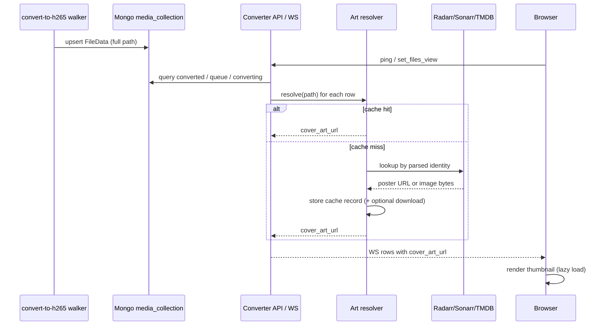

# Design: Cover Art for Converter Films & TV Shows

## 1. Goal

Show poster / cover art next to Converter UI entries (queue, converted list, and the live “Now converting” stage) so each file is visually identifiable as a film or TV episode — not just a basename and stats.

Cover art should:

- Appear for both **Films** and **TV**
- Stay **fast** on the websocket-driven dashboard (no per-row blocking lookups on every ping)
- Degrade gracefully when art is missing or lookup fails
- Reuse library identity already implied by `/Media/Films/...` and `/Media/TV/...` paths

Non-goals for v1:

- Editing metadata or replacing Plex/Radarr/Sonarr as the library of record
- Cover art on Media Manager (can follow the same pattern later)
- Perfect episode-level stills (season/show poster is enough for TV in v1)

---


## 2. Current state


### Converter role

Converter is a **read-mostly dashboard** over MongoDB `media.media_collection`. Conversion workers and the folder walker live in the sibling repo `convert-to-h265`. Website3 does not read video files from disk for Converter.

### What the UI knows today

Websocket payloads send **basename only** (`Path(filename).name`). Full POSIX paths exist in Mongo (`FileData.filename`) but are stripped before the client sees them.


| Surface                           | Shown today                      | Art slot |
| --------------------------------- | -------------------------------- | -------- |
| Activity rows (converted / queue) | Basename, sizes, codecs, % saved | None     |
| Now converting                    | Basename + live metrics          | None     |
| Statistics                        | Aggregates only                  | N/A      |


Relevant code:

- Models: `website/tools/converter/database/models.py`
- WS messages: `website/tools/converter/messages/messages.py`
- UI rows: `website/static/js/tools/converter/utils.js`
- WS loop: `website/static/js/tools/converter/websocket.js`


### Path conventions (already reliable)

Library roots scanned by the walker:

- `/Media/Films/...`
- `/Media/TV/...`

Typical shapes:

```text
/Media/Films/1917 (2019)/1917 (2019) Bluray-1080p.mkv
/Media/TV/100 Foot Wave/Season 1/100 Foot Wave - S01E01 - Chapter I – Sea Monsters WEBDL-1080p.mkv
```

Statistics already special-case Films via regex on path (`Films` in `filename`).

### Existing artwork infrastructure

**None** for film/TV posters in website3. Plex / Radarr / Sonarr / Overseerr are linked as private webapps but there are no API clients or poster caches in this monorepo. Sampled library folders often have **video only** (no `poster.jpg` / `folder.jpg` sidecars).

Closest loose patterns elsewhere: feed image URL extraction, football crest local caching under `/images/football/crests/`.

### Related surface

Media Manager (`/media`) already exposes full `filename`, `display_name`, and `parent_directory`. Useful reference for path-aware APIs. **Sharing the art service with Media Manager is deferred to a later project** (Converter-only for this work).

---


## 3. Options for art source


| Option                                  | Pros                                                                                       | Cons                                                                                             |
| --------------------------------------- | ------------------------------------------------------------------------------------------ | ------------------------------------------------------------------------------------------------ |
| **A. Radarr + Sonarr APIs**             | Already indexed against this library; posters match what you manage; no second metadata DB | Couples Converter to Arr availability; needs API keys; TV episode vs series poster choice        |
| **B. Plex API**                         | Same library, rich art, already running                                                    | Heavier API; auth token; library section IDs; more moving parts                                  |
| **C. TMDB (direct)**                    | Clean posters, well documented                                                             | Needs parsing + matching; rate limits; API key; may disagree with Arr naming                     |
| **D. Filesystem sidecars**              | Simple if present                                                                          | Often absent today; website has no media disk mount for serving; walker would need to copy/index |
| **E. Hybrid: Arr first, TMDB fallback** | Best hit rate                                                                              | More code paths                                                                                  |


**Decision: Option E (Radarr/Sonarr first, TMDB fallback).** Confirmed.

Rationale: the library is already curated in Arr. Path → Arr item is usually a direct match. TMDB covers items not yet in Arr or lookup misses. Avoid serving from NAS video mounts in the website container.

**TV art (v1):** use the **series poster only** (not season or episode stills).

---


## 4. Proposed architecture

```text
Mongo FileData.filename (full path)
        │
        ▼
┌───────────────────────┐
│ Media identity parse  │  kind=film|tv, title, year, series, season, episode
└──────────┬────────────┘
           │
           ▼
┌───────────────────────┐
│ Cover art resolver    │  cache → Radarr/Sonarr → TMDB → placeholder
└──────────┬────────────┘
           │
           ▼
┌───────────────────────┐
│ Art cache store       │  Mongo metadata + optional local image files
└──────────┬────────────┘
           │
           ▼
Converter WS payloads include cover_art_url (+ identity fields)
        │
        ▼
UI  in file rows / live stage (lazy, cached by browser)
```




### Design principles

1. **Parse once, cache forever (until invalidated)** — art lookup is not on the hot ping path after warm-up.
2. **Stable URLs for the browser** — prefer same-origin cached images (`/tools/converter/art/...`) over hotlinking third parties (Arr/TMDB URLs can change; CORS/referrer issues).
3. **Identity is derived from path**, not basename — WS must stop discarding parent folders before art can work well.
4. **UI never blocks on art** — missing art → neutral placeholder; rows still render immediately.

---


## 5. Media identity


### Parsed shape

```python
class MediaIdentity(BaseModel):
    kind: Literal["film", "tv", "unknown"]
    title: str                    # film title or show name
    year: int | None = None       # films; sometimes shows
    season: int | None = None
    episode: int | None = None
    episode_title: str | None = None
    source_path: str              # full Mongo filename
    display_title: str            # human label for UI
    cache_key: str                # stable key for art cache
```


### Parsing rules (v1)


| Path signal                       | Result                            |
| --------------------------------- | --------------------------------- |
| Contains `/Films/` (or `\Films\`) | `kind=film`                       |
| Contains `/TV/`                   | `kind=tv`                         |
| Else                              | `kind=unknown` → no remote lookup |


**Film**

1. Prefer parent folder name: `Title (Year)` → title + year
2. Else basename: strip extension, quality tokens (`Bluray-1080p`, `WEBDL-1080p`, …), then `Title (Year)` / `Title Year`

**TV**

1. Show = folder under `/TV/` (or parent of `Season N`)
2. Season from `Season N` folder or `Sxx` in basename
3. Episode from `SxxExx` in basename
4. Episode title = text between `SxxExx -`  and quality token when present


### Cache key

Examples:

- Film: `film:1917:2019`
- TV show poster (v1 default): `tvshow:100-foot-wave`
- Optional later episode key: `tvep:100-foot-wave:1:1`

Normalize with lowercase, trimmed punctuation, collapsed whitespace.

---


## 6. Art cache & serving


### Mongo collection (proposed)

DB: `media`  
Collection: `cover_art_cache`


| Field             | Purpose                                            |
| ----------------- | -------------------------------------------------- |
| `cache_key`       | Unique                                             |
| `kind`            | `film` / `tv`                                      |
| `provider`        | `radarr` / `sonarr` / `tmdb` / `none`              |
| `provider_id`     | Arr/TMDB id                                        |
| `remote_url`      | Original poster URL                                |
| `local_path`      | Path under website static/cache dir, if downloaded |
| `status`          | `ready` / `missing` / `error`                      |
| `last_attempt_at` | For backoff                                        |
| `updated_at`      |                                                    |


Negative cache (`status=missing`) with TTL (e.g. 7 days) avoids hammering APIs for unmatchable paths.

### HTTP surface


| Endpoint                                             | Purpose                                    |
| ---------------------------------------------------- | ------------------------------------------ |
| `GET /tools/converter/art/{cache_key}`               | Serve cached image (or 302 to placeholder) |
| (optional) `POST /tools/converter/art/refresh?path=` | Admin/debug re-resolve                     |


Websocket field for clients:

```json
"cover_art_url": "/tools/converter/art/film:1917:2019"
```

Use a content-hash or `updated_at` query param only when refreshing; default URL stays stable for browser cache.

### Download vs proxy

**v1 recommendation:** download poster once into a local cache directory (website volume), serve as static/authenticated file. Do not stream from Arr/TMDB on every dashboard open.

Config (settings / secrets):

- `SONARR_URL` — use LAN API host `http://steveds920:8989` (not `https://sonarr.schleising.net`; nginx tools auth blocks bare API key access on the public hostname)
- `RADARR_URL` — use LAN API host `http://steveds920:7878` (not `https://radarr.schleising.net`; same nginx constraint)
- API keys in `website/secrets/arr-keys.txt` (gitignored):

```text
sonarr_key=...
radarr_key=...
```

- `TMDB_API_KEY` (optional fallback; may remain env/secret later)
- `CONVERTER_ART_CACHE_DIR` — inside the FastAPI container, default `/var/cache/converter-art` (see Docker volume below)

Public Arr UIs remain useful for humans (`sonarr.schleising.net` / `radarr.schleising.net` after tools login). Converter art resolution and probe scripts must call the LAN ports above so only the Arr `X-Api-Key` is required.

### Docker Compose: persistent writable art cache

Today `fastapi` mounts the website tree **read-only**:

```yaml
# docker-compose.yaml (current)
fastapi:
  volumes:
    - ./website:/app:ro
```

Downloaded posters cannot be written under `/app` without changing that mount. Follow the same idea as the football crests **rw** overlay on `backend`, but use a **named Docker volume** so art survives image rebuilds and stays out of git.

#### Proposed `docker-compose.yaml` changes

```yaml
services:
  fastapi:
    build: fastapi
    depends_on:
      - mongodb
    env_file:
      - .env
    environment:
      - CONVERTER_ART_CACHE_DIR=/var/cache/converter-art
      # Arr API hosts are on another machine on the LAN (not this Docker host)
      - SONARR_URL=http://steveds920:8989
      - RADARR_URL=http://steveds920:7878
    volumes:
      - ./website:/app:ro
      - converter_art_cache:/var/cache/converter-art:rw
      # Optional: mount keys without baking into the image
      - ./website/secrets/arr-keys.txt:/run/secrets/arr-keys.txt:ro
    ports:
      - "8081:8080"
    restart: always
    # ... logging unchanged ...

volumes:
  db_volume:
  db_conf:
  converter_art_cache:
```

Apply the same `converter_art_cache` volume + `CONVERTER_ART_CACHE_DIR` to `docker-compose-test.yaml`’s `fastapi` service so local/test runs persist art the same way.

#### Why a named volume (not a bind under `./website`)


| Approach                                                 | Notes                                                                                                                                                |
| -------------------------------------------------------- | ---------------------------------------------------------------------------------------------------------------------------------------------------- |
| **Named volume** `converter_art_cache` **(recommended)** | Writable, persistent across `docker compose up --build`, not in git, no conflict with `./website:/app:ro`                                            |
| Bind mount `./website/static/.../art:rw`                 | Possible as an rw overlay on a ro parent (like crests), but puts binary cache next to source and risks accidental commit unless gitignored carefully |
| Writable `./website:/app:rw`                             | Avoid — weakens the intentional read-only app mount                                                                                                  |


#### Runtime expectations

- App writes posters as files under `$CONVERTER_ART_CACHE_DIR/{cache_key}.jpg` (or similar); Mongo `cover_art_cache.local_path` stores the container path.
- `GET /tools/converter/art/{cache_key}` reads from that directory (not from `/app/static`).
- Volume is owned by the container user that runs uvicorn; first deploy may need `makedirs` on startup.
- Disk growth: hundreds–thousands of images; monitor volume size; LRU/eviction can come later.
- Arr URLs from **inside** Docker must use `http://steveds920:8989` and `http://steveds920:7878` (Arr runs on that machine, not on the compose host). Ensure the FastAPI container can resolve/route to `steveds920` on the LAN. Do **not** use `host.docker.internal` for Arr.


#### Secrets in compose

Keep API keys out of the image:

- Prefer mounting `website/secrets/arr-keys.txt` read-only (as above), **or**
- Put `SONARR_API_KEY` / `RADARR_API_KEY` in `.env` (already referenced by `env_file`) and stop reading the plaintext file in production if desired.

Do not copy `arr-keys.txt` into the FastAPI build context.

### Obtaining Sonarr and Radarr API keys

Both apps expose a long-lived API key under **Settings → General**. You need tools login to open the Arr UIs on this network.

#### Sonarr

1. Open [https://sonarr.schleising.net](https://sonarr.schleising.net) and sign in (tools auth).
2. Go to **Settings** (left sidebar) → **General**.
3. If the page is locked, click the **unlock** padlock and enter your Sonarr UI password.
4. Scroll to **Security**.
5. Copy the **API Key** value (or click the copy control next to it).
6. Optional: click **Regenerate** only if you intend to rotate the key — that invalidates any existing integrations using the old key.
7. Click **Save** only if you changed other settings; copying the key does not require a save.


#### Radarr

1. Open [https://radarr.schleising.net](https://radarr.schleising.net) and sign in (tools auth).
2. Go to **Settings** (left sidebar) → **General**.
3. Unlock the page with the padlock if prompted.
4. Scroll to **Security**.
5. Copy the **API Key**.
6. Avoid **Regenerate** unless you are rotating credentials on purpose.
7. **Save** only if you edited settings.


#### Store keys locally

Write both keys to `website/secrets/arr-keys.txt` (directory is gitignored via `website/secrets/`):

```text
sonarr_key=paste_sonarr_api_key_here
radarr_key=paste_radarr_api_key_here
```


#### Notes

- Treat these keys like passwords: keep them only under `website/secrets/`, never commit them.
- The same key authenticates all `/api/v3/*` calls via the `X-Api-Key` header (query-string `apikey=` also works for some MediaCover URLs).
- Nginx tools auth gates the Arr **public web UI**. For API clients, use the LAN URLs (`http://steveds920:8989` / `http://steveds920:7878`) so requests are not challenged for website login cookies.
- To confirm Sonarr is usable for cover art before wiring Converter:

```bash
python3 scripts/probe_sonarr_cover_art.py
python3 scripts/probe_sonarr_cover_art.py \
  --tv-path "/Media/TV/100 Foot Wave/Season 1/100 Foot Wave - S01E01 - Chapter I.mkv" \
  --film-path "/Media/Films/1917 (2019)/1917 (2019) Bluray-1080p.mkv" \
  --download-dir /tmp/arr-posters
```

The probe defaults to LAN hosts (`http://steveds920:8989` / `http://steveds920:7878`) and reads `sonarr_key` / `radarr_key` from `website/secrets/arr-keys.txt`. Use `--only sonarr` or `--only radarr` to limit scope.

---


## 7. Resolver algorithm

For a full path:

1. Parse `MediaIdentity`. If `unknown` → placeholder, stop.
2. Lookup `cover_art_cache` by `cache_key`.
3. If `ready` → return local URL.
4. If `missing`/`error` and within backoff TTL → placeholder.
5. Else resolve:
  - **Film:** Radarr movie list/lookup by title+year (or path match if Arr exposes it) → poster  
  - **TV:** Sonarr series by title → series poster (v1)  
  - On Arr miss: TMDB search → poster
6. Persist cache row; download image bytes when URL found.
7. Return `/tools/converter/art/{cache_key}`.


### Warm-up strategies


| Strategy               | When                                                                      |
| ---------------------- | ------------------------------------------------------------------------- |
| **Lazy on WS build**   | First time a row is included in a payload; async queue so ping stays fast |
| **Background sweeper** | Periodic job over distinct cache keys from `media_collection`             |

**Decision:** keep all art logic in **website3**. Do **not** add walker/prefetch hooks in `convert-to-h265`.

**v1 recommendation:** lazy resolve from Converter when building list payloads, with an in-process/async queue and short timeout. Never await remote HTTP inside the WS send path — use cache only on the hot path; enqueue miss.

Pseudo-flow for list builder:

```text
for file in rows:
    identity = parse(file.filename)
    art = cache.get(identity.cache_key)
    if art is None:
        enqueue_resolve(identity)
    row.cover_art_url = art.url if art and art.ready else placeholder_url
```

Subsequent pings pick up art as cache fills (UI can update in place when URL changes).

---


## 8. Websocket / API contract changes


### Keep path server-side; send clean display fields to the client

There is a single Converter client (owned here), so the WS contract can change freely. The UI must **not** show filesystem paths.

Proposed fields:


| Field           | Meaning                                                                          |
| --------------- | -------------------------------------------------------------------------------- |
| `filename`      | Basename only (no directories) — for popup / secondary detail if needed           |
| `display_title` | Primary UI label, e.g. `1917 (2019)` or `100 Foot Wave · S01E01` (no path)       |
| `media_kind`    | `film` \| `tv` \| `unknown`                                                      |
| `cover_art_url` | Same-origin art URL or placeholder                                               |

Full Mongo path stays on the server for identity parse / art resolve only; it need not be sent to the browser unless useful for debug later.


Apply to:

- `ConvertingFileData`
- `ConvertedFileData`
- `FileToConvertData`

Update:

- `website/tools/converter/messages/messages.py`
- Converter DB query → message mapping (where `Path(...).name` is applied)
- `utils.js` row builder + live stage markup/CSS


### Placeholder

Single SVG/WebP asset, e.g. `/icons/tools/converter/art-placeholder.svg`, distinct for film vs TV if cheap (clapper vs screen), otherwise one neutral tile.

---


## 9. UI design

Fit the current Converter visual language (file rows, live stage), not a new card grid.

### Activity rows

```text
┌──────┬──────────────────────────────────────────┬────────┐
│ POST │ Converted · Show Name · S01E02           │  42%   │
│ ER   │ facts: sizes · duration · codecs         │ saved  │
│      │ ████████░░░░  4.2 GB → 2.4 GB            │        │
└──────┴──────────────────────────────────────────┴────────┘
```

- Poster: fixed aspect **2:3**, ~40–56px wide on desktop, slightly smaller on mobile
- `object-fit: cover`; rounded corner matching row radius
- `loading="lazy"`; `alt=""` if title is adjacent text (decorative), or `alt={display_title}`
- Missing art: placeholder with same box size (no layout shift)


### Now converting

Larger poster beside the filename (e.g. 64–80px) so the live job is instantly recognizable. Locked live stage stays put; art loads with the rest of the stage content.

### Display title

Prefer `display_title` as the row heading (never a full path). Basename may remain available via the existing filename popup if useful.

---


## 10. Security & ops

- Art endpoints sit behind the same **tools auth** as Converter (`converter.schleising.net`).
- Do not expose Arr/TMDB API keys to the browser.
- Cap download size and content-type (`image/jpeg`, `image/png`, `image/webp`).
- Rate-limit resolver workers; respect TMDB rate limits.
- Disk: expect hundreds–thousands of posters at ~50–300KB each — fine on a modest cache volume; add simple max-size / LRU later if needed.
- Logging: cache hit/miss/error counts for tuning.

---


## 11. Alternatives considered


| Idea                                      | Why not (for v1)                                                                 |
| ----------------------------------------- | -------------------------------------------------------------------------------- |
| Hotlink Arr/TMDB URLs in `img src`        | Fragile URLs, possible auth/CORS, no offline dashboard cache                     |
| Serve posters from `/Media/...` via nginx | Website/Converter hosts don’t consistently mount library; sidecars often missing |
| Only basename fuzzy match to TMDB         | High false positives without year/show folder context                            |
| Episode stills from TMDB                  | Extra lookups; series poster is enough for queue scanning                        |


---


## 12. Implementation phases


### Phase 0 — Identity without art

- [ ] Shared path parser module (unit tests for Films/TV fixtures)
- [ ] Add `media_kind`, `display_title` to WS payloads; keep `filename` as basename (no path in UI)
- [ ] UI shows `display_title` when present

### Phase 1 — Cache + placeholder UI

- [ ] `cover_art_cache` collection + local cache dir
- [ ] Add named volume `converter_art_cache` to `docker-compose.yaml` and `docker-compose-test.yaml` (`/var/cache/converter-art:rw`)
- [ ] Set `CONVERTER_ART_CACHE_DIR=/var/cache/converter-art` for `fastapi`
- [ ] Set `SONARR_URL` / `RADARR_URL` to `http://steveds920:8989` / `http://steveds920:7878` for `fastapi`
- [ ] `GET /tools/converter/art/{cache_key}`
- [ ] WS `cover_art_url` (placeholder until resolver exists)
- [ ] Row + live-stage thumbnail layout (no layout shift)

### Phase 2 — Arr resolver

- [ ] Radarr/Sonarr client config (keys from secrets file; LAN `steveds920` hosts)
- [ ] Async resolve queue; hot path cache-only
- [ ] TV: series poster only
- [ ] Download posters; mark `ready` / `missing`
- [ ] Verify against real `/Media/Films` and `/Media/TV` samples

### Phase 3 — TMDB fallback + polish

- [ ] TMDB search fallback
- [ ] Negative-cache TTL / manual refresh
- [ ] Optional sweeper for uncached keys (website3 only)

### Phase 4 — Optional enhancements (out of scope unless revisited)

- [ ] Season posters or episode stills
- [ ] Share art service with Media Manager
- [ ] Art in web push notification images for completed converts

---


## 13. Test plan

- Parser fixtures: film folder year, film basename-only year, TV `SxxExx`, multi-season paths, VR/excluded paths, unknown paths
- Obtain Arr API keys (see §6) and run `scripts/probe_sonarr_cover_art.py` (covers Sonarr + Radarr)
- Resolver: Arr hit, Arr miss → TMDB hit, total miss → placeholder
- WS: payloads include art URL without slowing ping when cache warm
- UI: lazy images, placeholder sizing, dark/light, mobile row density
- Auth: unauthenticated `GET /art/...` denied
- Failure: Arr down → backoff, dashboard still usable

---


## 14. Decisions

| Topic | Decision |
|---|---|
| Primary art source | **Arr first (Radarr/Sonarr), TMDB fallback** |
| TV art granularity (v1) | **Series poster only** |
| WS / UI filenames | Single client — contract may change. Show **`display_title`** (and basename if needed); **never show full paths** |
| Cache storage | **Named Docker volume** `converter_art_cache` → `/var/cache/converter-art` on `fastapi`; keep `./website:/app:ro` |
| Cross-repo prefetch | **No** — all art logic stays in **website3** |
| Media Manager | **Later** — not part of this project |
| Arr URL from Docker | **`http://steveds920:8989`** and **`http://steveds920:7878`** (Arr is on that machine, not `host.docker.internal`) |

---


## 15. Success criteria

- ≥90% of Films/TV rows in Converter show correct (or clearly matching) cover art after cache warm-up
- Ping/WS latency unchanged when cache is warm (no remote calls on hot path)
- Zero layout shift when images load
- Unknown/non-library paths never spam external APIs (negative cache)
- Dashboard remains usable when Arr/TMDB are down

