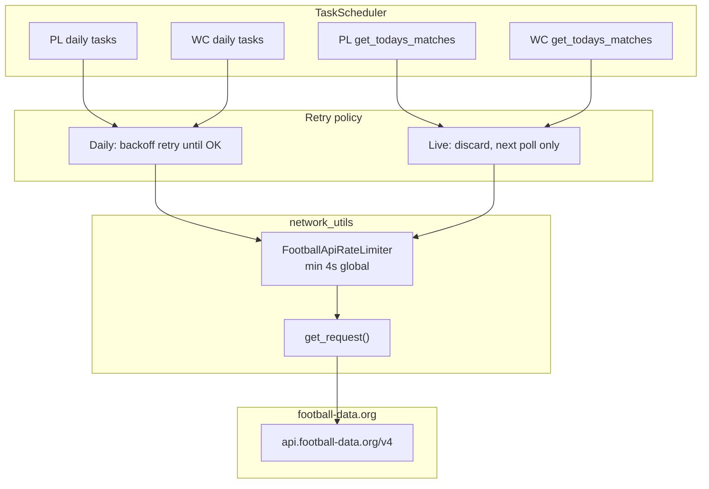

# Football API Rate Limiting — Design Proposal

Status: **Approved** — ready for implementation  
Date: 2026-05-27 (decisions locked 2026-05-27)  
Scope: Global rate limiting and retry policy for all football-data.org v4 traffic in the backend football worker (Premier League + World Cup)

## 1. Goal

Guarantee that **no two HTTP requests to football-data.org occur within 4 seconds of each other**, across the entire backend football worker. This enforces the upstream free-tier limit of **15 calls per minute** (60 ÷ 4 = 15).

Requirements:

1. **Global limiter** — PL and WC share one API token and one rate budget; limiting must not be per-competition.
2. **All traffic included** — spacing applies to initial calls, scheduled calls, and **every retry after any failure** (network error, timeout, non-200, 429, parse error after a successful download).
3. **Daily sync tasks** — retry until success, using exponential backoff (§6.2).
4. **Live match polls** — on failure, **discard the update** and rely on the already-scheduled next poll (typically 4 s later when matches are in play). No extra retry task.
5. **Logging** — at default log level, only **warnings and errors** are emitted; all API request detail is available at **DEBUG** (§9).

## 2. Problem Statement (Current Behaviour)

The football worker (`backend/src/football/football_main.py`) runs **Football** (PL) and **WorldCup** (WC) against the same `requests_session` and `get_request()` helper. Several behaviours violate the 4 s / 15-per-minute constraint today:


| Issue                         | Location                                                                                                                                                                                                                      | Effect                                                                                                         |
| ----------------------------- | ----------------------------------------------------------------------------------------------------------------------------------------------------------------------------------------------------------------------------- | -------------------------------------------------------------------------------------------------------------- |
| **Startup burst**             | `Football.__init__` calls `get_table()`, `get_season_matches()`, `get_todays_matches()` synchronously; `WorldCup.__init__` then calls `sync_matches()`, `sync_standings()`, `sync_teams_and_crests()`, `get_todays_matches()` | Up to **6 v4 API calls back-to-back** on worker start (after crest removal — see §3.1)                          |
| **urllib3 automatic retries** | `HTTPAdapter(max_retries=3)` on `requests_session`                                                                                                                                                                            | A single failed call can trigger **immediate hidden retries** with no 4 s gap                                  |
| **Live error retry**          | `schedule_live_updates(None)` in PL and WC                                                                                                                                                                                    | Failed live poll schedules another poll in 4 s — effectively a **retry on top of** the normal in-play schedule |
| **WC chained call**           | `get_todays_matches()` may call `sync_standings()` inline when a group match finishes                                                                                                                                         | **Two API calls in one task** with no spacing — **will be removed** (§6.3)                                     |
| **Legacy crest download**     | `sync_teams_and_crests()` / `_download_team_crest()`                                                                                                                                                                          | Obsolete — crests are stored locally; **remove** (§3.1)                                                        |
| **No central throttle**       | `get_request()` logs but does not wait                                                                                                                                                                                        | Sequential callers can fire as fast as the scheduler runs tasks                                                |
| **Verbose INFO logging**      | `get_request()` and response hook log every call at INFO                                                                                                                                                                      | Normal operation is noisy; request detail should be DEBUG-only (§9)                                            |


The live poll interval is already `UPDATE_DELTA = timedelta(seconds=4)` (PL) and `WC_UPDATE_DELTA = timedelta(seconds=4)` (WC), but that only spaces **successful** scheduling — not failures, retries, startup, or cross-competition overlap.

## 3. Call Inventory

All **v4 API** football-data.org HTTP entry points (the only traffic the worker should emit):


| #   | Caller                               | Method | Endpoint / URL                                          | Category     |
| --- | ------------------------------------ | ------ | ------------------------------------------------------- | ------------ |
| 1   | `Football.get_matches_between_dates` | GET    | `/v4/competitions/PL/matches?dateFrom=&dateTo=`         | Daily + live |
| 2   | `Football.get_table`                 | GET    | `/v4/competitions/PL/standings/?date=`                  | Daily        |
| 3   | `WorldCup.sync_matches`              | GET    | `/v4/competitions/WC/matches?dateFrom=&dateTo=&season=` | Daily        |
| 4   | `WorldCup.sync_standings`            | GET    | `/v4/competitions/WC/standings?season=&date=`           | Daily        |
| 5   | `WorldCup.get_todays_matches`        | GET    | `/v4/competitions/WC/matches?dateFrom=&dateTo=&season=` | Live         |


**Note:** Row 1 is used for both PL daily season sync and PL live polls (`get_todays_matches`). Row 5 is the WC live poll. Row 4 is daily only — inline invocation from live polls is **removed** (§6.3).

### 3.1 Crests — out of scope (remove from worker)

National-team flags/crests are **already stored locally** (under `/images/football/crests/wc/` and related paths). The website resolves them at render time; the backend only needs `_world_cup_team_crest()` to map `team.id` → local file path.

**Decision:** The worker must **not** download crests from football-data.org (or anywhere else). As part of this work:

- **Remove** `WorldCup.sync_teams_and_crests()` and its startup / scheduled invocation.
- **Remove** `_download_team_crest()` and the `get_football_data_http()` call path used only for crest assets.
- **Remove** `get_football_data_http()` from `network_utils.py` if nothing else uses it.
- **Keep** `_world_cup_team_crest()` — local filesystem lookup only, no HTTP.

This removes one startup API call (`/v4/competitions/WC/teams`) and all `crests.football-data.org` traffic from the worker entirely.

## 4. Task Classification

### 4.1 Live match update

A scheduled poll whose primary purpose is to refresh **today's** match state for live scores, notifications, and live tables.


| Competition | Entry point                   | Typical schedule                                                                         |
| ----------- | ----------------------------- | ---------------------------------------------------------------------------------------- |
| PL          | `Football.get_todays_matches` | Every 4 s while a match is `IN_PLAY` / `PAUSED` / `SUSPENDED`; otherwise at next kickoff |
| WC          | `WorldCup.get_todays_matches` | Same pattern during tournament window                                                    |


**Failure policy:** Log at WARNING or ERROR (§9), update live tables from Mongo if useful (existing behaviour), schedule the **normal** next poll only — **do not** add a dedicated retry. When matches are in play, the normal next poll is already `now + 4 s`.

**Failure when no match is in play (decided):** Schedule **one** catch-up poll at `now + 4 s`, then fall back to existing kickoff-based scheduling. Do **not** use daily-class backoff for live polls.

### 4.2 Daily sync update

Bulk or once-per-day work that should **eventually succeed**.


| Task                             | PL                   | WC               |
| -------------------------------- | -------------------- | ---------------- |
| Full-season / tournament matches | `get_season_matches` | `sync_matches`   |
| Standings snapshot               | `get_table`          | `sync_standings` |


**Failure policy:** Schedule a retry with **exponential backoff** until success (§6.2). Backoff delays are a *scheduling* concern; the actual HTTP call still goes through the global 4 s gate (§5).

## 5. Global Rate Limiter

### 5.1 Design

Introduce a **process-wide** gate used by every v4 API request:

```
┌─────────────────────────────────────────────────────────┐
│  Football worker process (single thread, TaskScheduler) │
│                                                         │
│  PL tasks ──┐                                           │
│             ├──► FootballApiRateLimiter.acquire() ──► HTTP
│  WC tasks ──┘         (global, one lock)                │
│                                                         │
│  get_request() ────────────────┘                        │
└─────────────────────────────────────────────────────────┘
```

**Module:** `backend/src/utils/network_utils.py` (avoids circular imports with `football/__init__.py`).

**Constants:**

```python
FOOTBALL_API_MIN_INTERVAL = timedelta(seconds=4)  # 15 calls/minute max
```

**Behaviour:**

1. Before any GET to `api.football-data.org`, call `FootballApiRateLimiter.acquire(url)`.
2. If `time.monotonic() - last_request < 4 s`, **sleep** until the interval has elapsed, then proceed.
3. Record `last_request` **immediately before** issuing the HTTP request (not after), so the window is measured call-start to call-start.
4. Thread-safe (`threading.Lock`) for correctness even though the worker is currently single-threaded.

**Single choke point:** All v4 API traffic must pass through `get_request()`. No direct `session.get()` to football-data.org elsewhere. Crest/asset downloads are not part of the worker (§3.1).

### 5.2 Disable urllib3 retries

Set `HTTPAdapter(max_retries=0)` on `requests_session`. Application code owns all retry timing via the scheduler + backoff (§6.2).

### 5.3 Relationship to live 4 s poll interval


| Mechanism                          | Role                                                |
| ---------------------------------- | --------------------------------------------------- |
| `UPDATE_DELTA` / `WC_UPDATE_DELTA` | **When** the next live poll is scheduled            |
| `FootballApiRateLimiter`           | **When** an HTTP request is allowed to hit the wire |


These are complementary. Example: a live poll is scheduled at T+4 s but a daily retry is also due at T+4 s — the limiter serialises the two HTTP calls so the second waits at least 4 s after the first, regardless of which task runs first.

### 5.4 Startup sequencing (decided)

**Do not** fire all startup syncs synchronously in `__init__`.

On worker start, enqueue tasks through the scheduler so each API call is separated by the limiter. **Confirmed order** (PL before WC):

1. PL `get_table`
2. (+≥4 s) PL `get_season_matches`
3. (+≥4 s) PL `get_todays_matches`
4. (+≥4 s) WC `sync_matches`
5. (+≥4 s) WC `sync_standings`
6. (+≥4 s) WC `get_todays_matches`

No teams/crests sync step (§3.1).

## 6. Retry and Failure Handling

### 6.1 Live match updates — discard, no retry

**PL — change `get_todays_matches`:**

```
matches = get_matches_between_dates(today, today)
if matches is None:
    if in_play_matches_exist_in_db_today():
        log warning; schedule now + 4 s only (normal in-play cadence)
    else:
        log warning; schedule one catch-up poll at now + 4 s,
                     then kickoff-based schedule on next success
    return
# success path unchanged
schedule_live_updates(matches)
```

**Remove** `schedule_live_updates(None)` error branch that unconditionally reschedules in 4 s.

**WC — same pattern** via `_schedule_failed_todays_match_update()`:

- If in-play matches exist today (Mongo query): log WARNING, schedule **only** the normal `now + WC_UPDATE_DELTA` in-play poll.
- Else: log WARNING, schedule **one** catch-up poll at `now + 4 s` (decided §10.1).

**HTTP 429 on live poll:** Discard the update; do **not** honour `Retry-After` with an extra retry — the next scheduled poll handles recovery (decided §10.2).

**Key principle:** A failed live poll never schedules **both** an error retry **and** an in-play poll. At most one next poll.

### 6.2 Daily sync — retry with backoff until success

Introduce `schedule_daily_api_retry(scheduler, callback, attempt=1, retry_after: int | None = None)`.

**Confirmed backoff** (delay before the *task* runs; HTTP still gated by §5):


| Attempt | Delay before retry |
| ------- | ------------------ |
| 1       | 4 s                |
| 2       | 8 s                |
| 3       | 16 s               |
| 4       | 32 s               |
| 5+      | 60 s (cap)         |


Reset `attempt` to 1 on success.

**HTTP 429 (decided):** For daily tasks, use `max(computed_backoff, Retry-After)` when the API returns 429 and a `Retry-After` header is present.

**Apply to:**


| Task                 | On failure                 |
| -------------------- | -------------------------- |
| `get_season_matches` | Retry `get_season_matches` |
| `get_table`          | Retry `get_table`          |
| `sync_matches`       | Retry `sync_matches`       |
| `sync_standings`     | Retry `sync_standings`     |


Parse failures (validation error after 200) count as failures — same retry policy.

**Periodic daily schedule:** Existing `schedule_task(..., interval=timedelta(days=1))` at 01:00 UTC (PL) / tournament midnight (WC) remains. Backoff retries are **additional** one-off tasks until that run succeeds (§6.4).

### 6.3 WC live poll — remove inline `sync_standings` (decided)

**Decision: Option A** — remove the inline `sync_standings()` call from `get_todays_matches()` when a group match finishes.

- Live group standings continue to update from match data via `update_live_standings`.
- Official standings snapshot is refreshed by the daily `sync_standings` task (and its backoff retry on failure).
- Eliminates a second API call inside a live poll task.

### 6.4 Avoiding duplicate retry tasks

If `sync_matches` fails three times quickly, we should not stack three retry tasks.

Each daily task stores a `_retry_scheduled: bool` on the class instance (or a small registry keyed by callback). On failure, schedule retry only if not already scheduled; clear flag when the task starts or succeeds.

## 7. Architecture Diagram



## 8. File Changes (Implementation Sketch)


| File                                    | Change                                                                                                                                                                         |
| --------------------------------------- | ------------------------------------------------------------------------------------------------------------------------------------------------------------------------------ |
| `backend/src/utils/network_utils.py`    | `FOOTBALL_API_MIN_INTERVAL`, `FootballApiRateLimiter`, integrate into `get_request()`; `schedule_daily_api_retry()` with backoff; remove `get_football_data_http()` and `FOOTBALL_API_ENABLED` kill switch; demote routine request logs to DEBUG (§9) |
| `backend/src/football/__init__.py`      | `HTTPAdapter(max_retries=0)`; remove `FOOTBALL_API_ENABLED` guard and startup warning; demote response-hook success logs to DEBUG (§9)                                       |
| `backend/src/football/football.py`      | Startup deferral; daily retry on failure; live discard policy; remove `schedule_live_updates(None)`; unify `UPDATE_DELTA` with shared constant                               |
| `backend/src/football/world_cup.py`     | Same; **remove** inline `sync_standings` from live poll; **remove** `sync_teams_and_crests`, `_download_team_crest`, and related crest-download code                         |
| `backend/src/football/football_main.py` | Optional: explicit bootstrap ordering if not handled in class `__init__`                                                                                                       |


**Out of scope:** Website frontend, Mongo schema, WebSocket push paths (no upstream API).

**Kill switch removal (decided):** Remove `FOOTBALL_API_ENABLED` and all related TODO/disable branches. The API is always enabled when the worker runs.

## 9. Logging and Observability

### 9.1 Log levels (decided)

The football worker is started via `football_loop(..., log_level=...)`. **Normal operation** uses a level of **WARNING** (or higher) so only warnings and errors appear in logs. **DEBUG** is used when investigating rate limiting or API behaviour.

| Level     | When emitted | Examples |
| --------- | ------------ | -------- |
| **DEBUG** | Always logged; visible only when log level is DEBUG | Every API request before send; response status, elapsed ms, rate-limit headers; limiter wait duration; daily retry scheduled (attempt, delay); task scheduling detail already at DEBUG in PL/WC |
| **WARNING** | Normal operation | Live poll discarded; HTTP 429 (include `Retry-After` and rate headers) |
| **ERROR** | Normal operation | Request failed (timeout, connection, non-200 except handled 429); parse failure; DB write failure; daily task will retry |

**Implementation changes:**

- Demote current `logging.info("Football API request: GET ...")` in `get_request()` to **DEBUG**.
- Demote successful response logging in `_log_football_api_response` to **DEBUG**.
- Demote `logging.info("Football API GET ... -> ...")` patterns to **DEBUG**.
- Keep failure paths at **ERROR**; keep 429 at **WARNING**.
- Log limiter waits at **DEBUG**: `Football API rate limit: waiting 2.3s before GET ...`
- Log daily retry scheduling at **DEBUG**: `scheduling sync_standings retry attempt=3 delay=16s`
- Log live poll discard at **WARNING**: `live match update failed; next poll at normal interval`

### 9.2 Verifying rate limiting

With log level set to DEBUG, grep for `Football API` and confirm timestamps of actual sends (after any limiter wait) are ≥4 s apart. At WARNING, routine traffic is silent unless something goes wrong.

## 10. Decisions (locked)

All open questions resolved before implementation:


| # | Topic | Decision |
| - | ----- | -------- |
| 10.1 | Live poll failure when no match is in play | **A** — schedule one catch-up poll at `now + 4 s`, then existing kickoff scheduling |
| 10.2 | HTTP 429 and `Retry-After` | Daily tasks: `max(computed_backoff, Retry-After)`. Live polls: discard, no extra retry |
| 10.3 | Daily backoff curve | **Confirmed** — 4 → 8 → 16 → 32 → 60 s cap |
| 10.4 | Startup task priority | **Confirmed** — PL before WC (§5.4 order) |
| 10.5 | Inline WC `sync_standings` on match finish | **A** — remove inline call (§6.3) |
| 10.6 | `FOOTBALL_API_ENABLED` kill switch | **Remove** — no disable flag; API always active when worker runs |
| 10.7 | Logging verbosity | **DEBUG** for all request/response detail; **WARNING+** only in normal operation (§9) |

## 11. Test Plan


| Scenario              | Expected                                                                 |
| --------------------- | ------------------------------------------------------------------------ |
| Worker cold start     | ≥4 s between each of the **6** startup API calls (timestamps in DEBUG logs) |
| PL live in-play       | Poll every ~4 s; no double request on failure                            |
| PL live failure       | One WARNING; next poll at T+4 s only; no third poll from error path      |
| Live failure pre-kickoff | One catch-up poll at T+4 s; no daily backoff                          |
| Daily task failure    | Backoff retries; success resets attempt counter; 429 uses max(backoff, Retry-After) |
| PL + WC tasks collide | Second HTTP waits ≥4 s after first                                       |
| urllib3               | No automatic retry bursts in logs                                        |
| Log level WARNING     | No routine API request lines; failures still visible                     |
| Log level DEBUG       | Every API request and response visible                                   |

Manual verification: run worker at DEBUG, grep `Football API` — send timestamps ≥4 s apart.

## 12. Success Criteria

1. Under normal and failure conditions, **no pair** of football-data.org v4 requests is less than 4 seconds apart (measured at HTTP send time, after limiter wait).
2. Daily syncs eventually succeed after transient outages without manual intervention.
3. Live polls never schedule redundant error retries on top of the in-play cadence.
4. PL and WC share one limiter; neither can starve the other beyond fair FIFO ordering at the limiter.
5. At default log level, logs contain only warnings and errors; at DEBUG, every API request is traceable.

---

**Next step:** Implement per §8.
