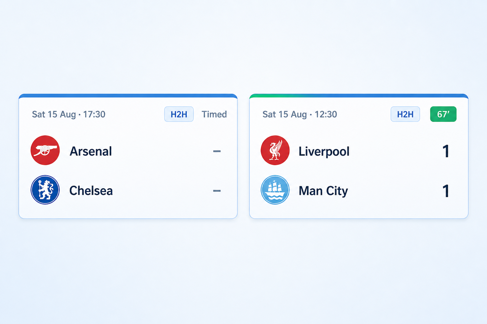
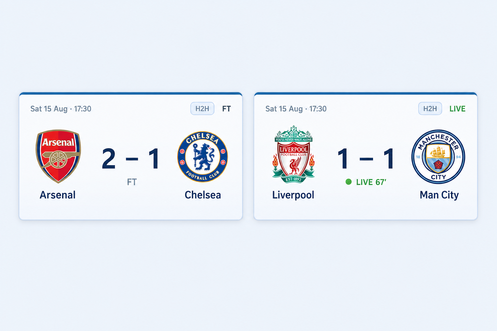
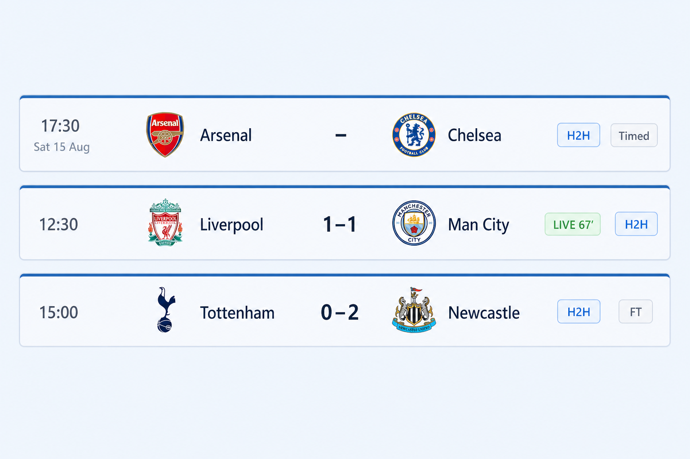
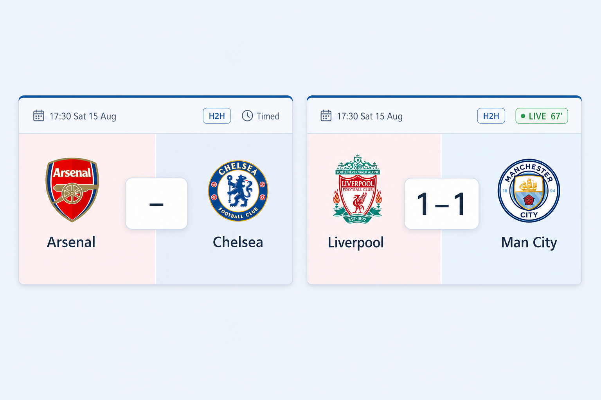
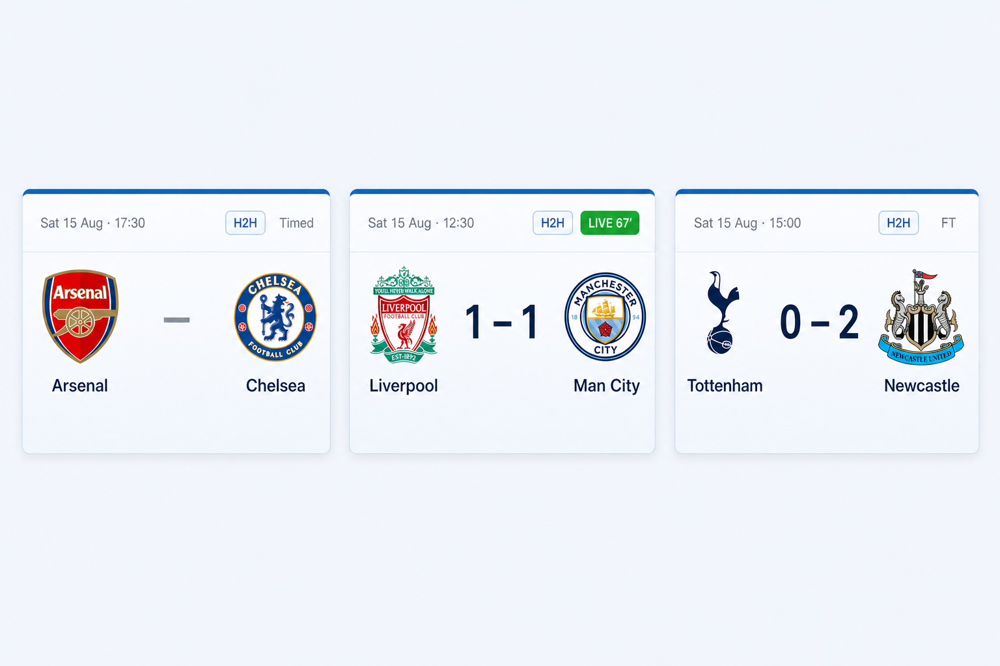
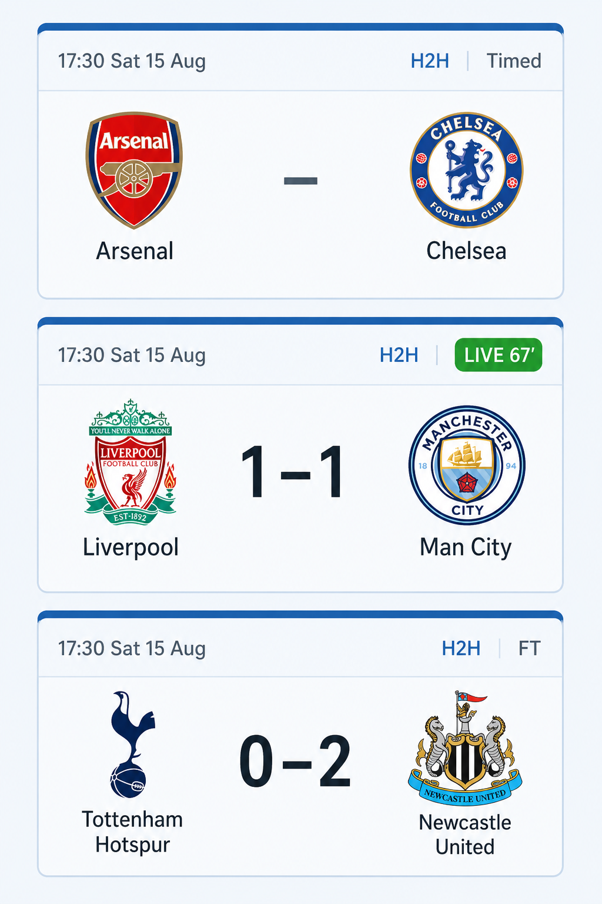
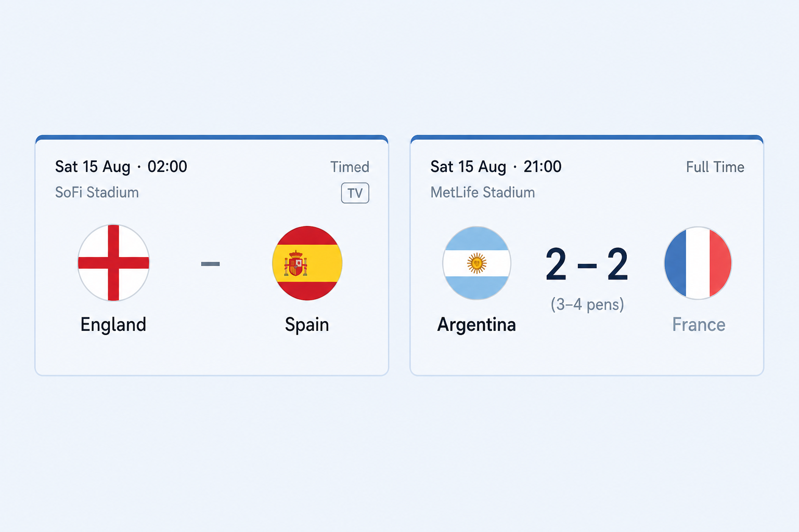

# Design: Football Match Card Refresh

Status: **Implemented — B Centre scoreboard** (2026-08-14)  
Date: 2026-08-14  
Scope: Premier League and World Cup `score-widget` cards (same visual family)

**How to use this doc**

- **§3.1** records the chosen layout.
- **§6** is the live iteration: states, mobile, World Cup extras. Comment there, not by reopening A/C/D.
- Mockups are concept art, not pixel-spec. Crests, type, and spacing will be rebuilt in CSS from site tokens.

Related:

- `website/templates/football/match_template.html` — PL card
- `website/templates/football/world-cup/_match_card.html` — WC card (no H2H pill)
- `website/static/css/football/football.css` — `.score-widget` / `.site-card`
- `website/static/css/base.css` — `--brand`, `--site-card-*`

---

## 1. Goal

Replace the current match card with a clearer, more scannable layout that still belongs on the main site (blue shell, `site-card` top accent, 2-column desktop grid / 1-column mobile).

The card must keep working for:

- Scheduled, live, and finished matches
- PL (H2H pill) and WC (no H2H; venue / TV / knockout extras)
- Live WebSocket score and status updates without layout jump

Non-goals for this choice:

- Changing match data or the football-data.org mapping
- A standalone “sports app” chrome that drops the site card language
- Per-competition card families (one family, WC extras layered on)

---

## 2. Current card

Stacked home-over-away rows inside a compact `site-card`. Kickoff and status sit on a header row; scores are right-aligned dashes or numbers.

```text
┌─────────────────────────────────────────┐
│ Sat 15 Aug 17:30          [H2H] Timed   │
│  [crest] Arsenal                     –  │
│  [crest] Chelsea                     –  │
└─────────────────────────────────────────┘
```

Strengths: dense in a 2-column grid; same skeleton for PL and WC; live JS already targets these nodes.

Weaknesses: score is a side note; live minute is easy to miss; header and team rows compete; little hierarchy between Timed / Live / FT.

---

## 3. Directions

Check **exactly one**.

### 3.1 Layout

- [ ] **A — Stacked refinement** *(closest to today)*
- [x] **B — Centre scoreboard**
- [ ] **C — Compact strip**
- [ ] **D — Split kit plates**

---

### A — Stacked refinement

Keep home-over-away rows. Larger crests, tabular scores, status as a pill (green live minute). Same grid density as today.

**Use if:** you want a polish pass, not a new reading pattern.



| Fits well | Watch-outs |
| --------- | ---------- |
| Drop-in for PL + WC templates | Score still secondary to names |
| Live updates stay row-local | Easy to under-space again |
| Bracket / overview grids | Live state is a chip, not a layout change |

---

### B — Centre scoreboard

Home and away as mirrored columns; the score is the hero in the middle. Kickoff + H2H stay on a thin header.

**Use if:** the first glance should answer “what’s the score?”



| Fits well | Watch-outs |
| --------- | ---------- |
| Live and FT pages | Taller than A in a 2-column grid |
| Long team names (wrap under crest) | WC bracket slots may need a compact variant |
| Winner/loser emphasis | Kickoff is demoted to the header |

---

### C — Compact strip

One horizontal row: time · home · score · away · status. A list, not a tile. Stacks as full-width rows rather than a 2-column card grid.

**Use if:** scanning a full matchday or All Matches page matters more than a big score.



| Fits well | Watch-outs |
| --------- | ---------- |
| All Matches, month lists | Narrow phones: names or H2H will wrap or hide |
| Many fixtures per day | Breaks the current 2-column `football-grid` |
| Keyboard / jump-to browsing | WC venue + TV logos need a second line |

---

### D — Split kit plates

Card body split into home / away washes from `pl_team_primary_colours` (WC flags/kits where we have colour). Score sits in a centre lozenge.

**Use if:** you want each fixture to be visually distinct at a distance.



| Fits well | Watch-outs |
| --------- | ---------- |
| Team identity, live pages | Contrast: red/blue washes vs navy type |
| Empty Timed state still readable | Missing colours need a fallback wash |
| Distinct from feeds/media cards | Heavier than A; WC historic teams may lack kit colour |

---

## 4. Shared constraints (all options)

These stay true whichever direction wins:

1. **Site card chrome** — `site-card` top accent, radius, pale blue fill, hover lift. No Converter teal, no betting-app dark plates.
2. **PL H2H pill** — keep on Premier League cards; omit on World Cup (existing rule).
3. **Live updates** — score, status, and live minute must update in place without the card changing height.
4. **Team names** — remain links (PL team matches / WC team fixtures).
5. **Crests** — local SVG/PNG, `object-fit: contain`, no layout shift when a crest is missing.
6. **States** — Timed (or equivalent), Live + minute, FT; WC also extra-time / pens annotation and knockout winner/loser.
7. **Grid** — A, B, D stay in the 2-column desktop grid. C is allowed to become a single-column list; call that out in implementation if C wins.
8. **WC extras** — venue, TV logos, round watermark, final treatment layer onto the chosen family rather than a second card.

---

## 5. After you choose

Locked: **B — Centre scoreboard**. Iteration 2 mockups are in §6. Next engineering step is §7.

---

## 6. Iteration 2 — B states

Rules taken from the first B mockup, cleaned up:

- Status appears **once**, in the header (not repeated under the score).
- Timed centre is a muted dash, never a fake `0–0`.
- Live is a green `LIVE 67′` pill in the header; score stays navy.
- WC uses the same skeleton: no H2H; venue under kickoff; pens/aet as a caption **under** the centre score; knockout loser faded.

```text
┌──────────────────────────────────────────────┐
│ Sat 15 Aug · 17:30              [H2H]  Timed │
│                                              │
│     [crest]           –            [crest]   │
│     Arsenal                      Chelsea     │
└──────────────────────────────────────────────┘
```

### Desktop — Timed / Live / FT



### Mobile — same three states, one-column width



### World Cup overlay — venue, no H2H, pens, winner/loser



TV channel marks in the WC mockup are placeholders. Real cards keep the existing local TV logo images beside kickoff.

---

## 7. Implementation (as built)

Centre-scoreboard cards are live in PL, H2H, World Cup, and the table live-match popup.

- Shared board markup: `website/templates/football/_score_widget.html`
- PL cards: `match_template.html` via `premier_league_match_card`
- WC extras (venue, TV, pens caption, winner/loser fade) stay on `_match_card.html`
- Knockout bracket uses `score-widget--compact`
- Live JS still writes `.home-team-score`, `.away-team-score`, and `.match-status`

### Out of this pass

- New match data or API fields
- Kit-colour washes (option D)
- Changing the 2-column `football-grid` to a list (option C)

