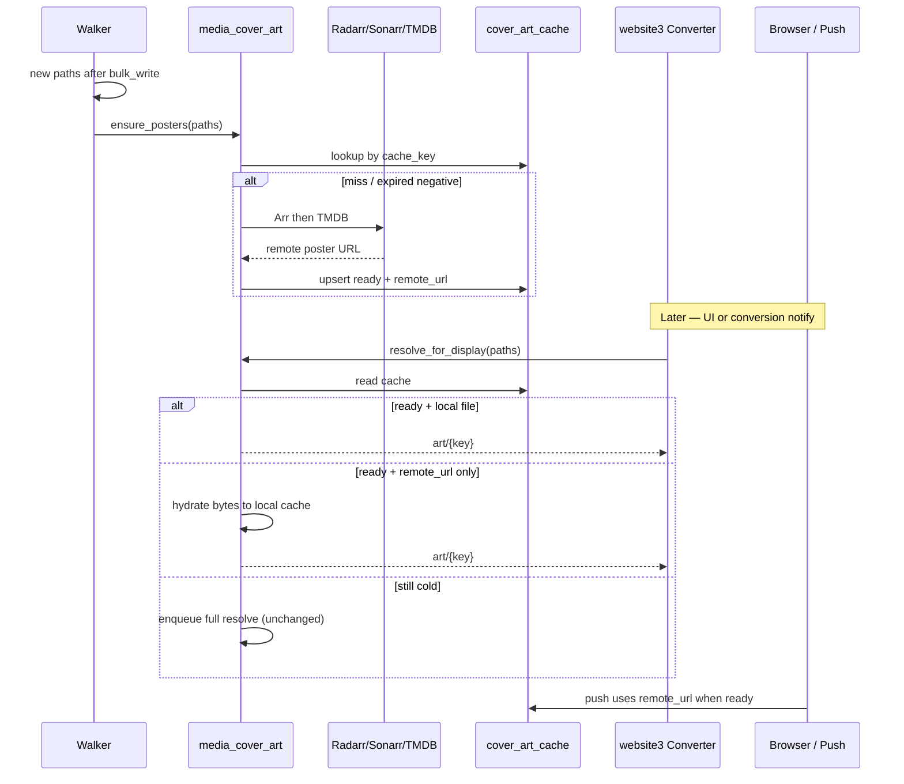

# Design: Media Cover Art as an Installable Package

**Status: Proposal** — extracts the Converter cover-art resolver from website3 into a new GitHub Python package, so `convert-to-h265`’s Walker can prefetch posters when it discovers new media, while website3 and push notifications keep sharing one Mongo cache.

Related as-built record: `[Converter-Cover-Art.md](./Converter-Cover-Art.md)`. This proposal **revises** that doc’s decision “Cross-repo prefetch = No.”

**How to use this doc**

- **§12 Decisions** — check one option per topic (your selections). Recommendations are marked but not pre-checked.
- **§8 Implementation** — agent checks these off as work lands.

---

## 1. Goal

Turn the existing cover-art subsystem (`website/tools/converter/art/`) into a **standalone, installable Python package** published as its own GitHub repository, such that:

1. `**convert-to-h265` Walker** can call it when new files are upserted into `media_collection`, so posters are warm before anyone opens the Converter UI.
2. **website3 Converter** continues to resolve / serve / purge art, but imports the shared library instead of owning the implementation.
3. `**convert-to-h265` converter** push notifications stop duplicating path→cache-key logic and read the same package helpers.
4. The package installs **directly from GitHub** (pip / requirements / Docker) without publishing to PyPI for v1.
5. The library is **fully documented** with **[MkDocs Material](https://squidfunk.github.io/mkdocs-material/)** (guides + API reference), shippable from the same repo.

### Non-goals (v1)

- PyPI publication
- Episode-level stills or season posters (series/film posters only — unchanged)
- Media Manager integration
- Changing Arr-first / TMDB-fallback source policy
- Sharing one filesystem cache volume across NAS Walker and website FastAPI hosts

---

## 2. Why now

Today:


| Consumer                        | Role today                                                          | Gap                                     |
| ------------------------------- | ------------------------------------------------------------------- | --------------------------------------- |
| website3 `art/`                 | Owns identity, Arr/TMDB, Mongo+disk cache, async worker, HTTP serve | Only warms cache when Converter UI asks |
| Walker (`FOLDER_WALKER=TRUE`)   | Discovers new paths; upserts `FileData`                             | No art hook (by prior design)           |
| Converter push (`cover_art.py`) | Duplicates identity/cache-key rules; reads `remote_url`             | Drift risk vs website3                  |


Consequence: new media often has no poster until the dashboard is opened; conversion-complete notifications often fall back to the default icon because the cache was never warmed.

Prefetch at discovery time fixes that — but only if the resolver is a **shared dependency**, not website3-private code.

---

## 3. Current state (code pointers)

### website3 (implementation to extract)


| Path                                             | Role                                      |
| ------------------------------------------------ | ----------------------------------------- |
| `website/tools/converter/art/identity.py`        | Path → `MediaIdentity` / `cache_key`      |
| `website/tools/converter/art/title_match.py`     | Policy C title ranking                    |
| `website/tools/converter/art/arr_client.py`      | Radarr / Sonarr lookup + image download   |
| `website/tools/converter/art/tmdb_client.py`     | TMDB search + image download              |
| `website/tools/converter/art/cache.py`           | Mongo + local disk (Motor async)          |
| `website/tools/converter/art/resolver.py`        | Async queue worker                        |
| `website/tools/converter/art/models.py`          | `CoverArtCacheRecord`, `ArtDisplayFields` |
| `website/tools/converter/art/config.py`          | Env / keys file / TTLs                    |
| `website/tests/test_converter_media_identity.py` | Identity tests                            |
| `website/tests/test_converter_title_match.py`    | Title-match tests                         |


### convert-to-h265 (consumers)


| Path                              | Role                                                           |
| --------------------------------- | -------------------------------------------------------------- |
| `src/converter/codec_detector.py` | **Hook point** — after successful bulk upsert of new paths     |
| `src/converter/cover_art.py`      | Sync cache-key + `remote_url` lookup for web push (to replace) |
| `walker/requirements.txt`         | Sync stack: `pymongo`, `aiohttp`, `pydantic`, …                |


### Runtime mismatch (must design for)


| Concern       | website3 FastAPI                                         | convert-to-h265 Walker                                   |
| ------------- | -------------------------------------------------------- | -------------------------------------------------------- |
| Process model | asyncio                                                  | sync loop + `sleep(1)`                                   |
| Mongo driver  | Motor (`AsyncIOMotorCollection`)                         | pymongo                                                  |
| HTTP          | aiohttp (async)                                          | can use aiohttp or requests                              |
| Disk cache    | Docker volume `/var/cache/converter-art` on website host | NAS container — **different host**, no shared art volume |
| Purpose       | Serve UI + hydrate cache                                 | Prefetch resolve into Mongo                              |


**Implication:** Mongo `cover_art_cache` (especially `remote_url` + status) is the **cross-host contract**. Local poster bytes are a **per-host** cache, not a shared artifact store.

---

## 4. Options (context for decisions)

Pros/cons for each decision topic. **Make selections in §12** — do not treat prose below as locked.

### 4.1 Packaging / distribution


| Option                                                                 | Pros                                                         | Cons                                                      |
| ---------------------------------------------------------------------- | ------------------------------------------------------------ | --------------------------------------------------------- |
| **A. New GitHub repo + `pyproject.toml`, install via `git+https://…`** | Clean ownership; version tags; both apps depend the same way | One more repo to CI/release                               |
| **B. Monorepo / git submodule inside website3**                        | No new remote                                                | Awkward for Walker Docker builds; couples release cadence |
| **C. Copy module into convert-to-h265**                                | Fast short-term                                              | Guaranteed drift (already happening with `cover_art.py`)  |
| **D. Publish to PyPI**                                                 | Standard install                                             | Overkill for private ops tooling in v1                    |


### 4.2 Sync vs async API surface


| Option                                                                 | Pros                          | Cons                                                  |
| ---------------------------------------------------------------------- | ----------------------------- | ----------------------------------------------------- |
| **A. Sync-only core; website3 wraps with `asyncio.to_thread` / queue** | One code path; matches Walker | Blocks threads if used naively on WS hot path         |
| **B. Async-only core; Walker runs `asyncio.run(...)` per batch**       | Matches current website3      | Awkward inside Walker’s sync loop; nested event loops |
| **C. Dual surface: sync `CoverArtClient` + thin async helpers**        | Each host uses natural style  | Slightly more API to maintain                         |


### 4.3 What Walker writes vs what website serves


| Option                                                                                                             | Pros                                 | Cons                                                     |
| ------------------------------------------------------------------------------------------------------------------ | ------------------------------------ | -------------------------------------------------------- |
| **A. Walker downloads bytes onto NAS disk**                                                                        | Local copy near media                | Website cannot serve those files; wasted I/O             |
| **B. Walker only writes Mongo metadata + `remote_url`**                                                            | Cheap; shared                        | First UI serve must hydrate local bytes                  |
| **C. Walker resolves fully (`ready` + bytes) into a shared volume**                                                | Instant serve                        | Requires new shared storage between NAS and website host |
| **D. Hybrid: Walker resolves Mongo to `ready` with `remote_url`; `local_path` optional; website hydrates on miss** | Prefetch for push + UI; no shared FS | Need clear hydrate path when `ready` but file missing    |


### 4.4 Repository / package naming


| Candidate                                     | Notes                                        |
| --------------------------------------------- | -------------------------------------------- |
| `media-cover-art` / `media_cover_art`         | Clear, matches collection/`cover_art` naming |
| `converter-cover-art` / `converter_cover_art` | Too tied to one UI                           |
| `poster-downloader` / `poster_downloader`     | Undersells identity + cache                  |


---

## 5. Target architecture

*(Assumes recommended choices in §12; adjust if you pick differently.)*

```text
┌─────────────────────────────────────────────────────────────┐
│  GitHub: media-cover-art (installable package)              │
│  identity · title_match · arr · tmdb · cache · client       │
└───────────────┬─────────────────────────────┬───────────────┘
                │ pip install git+https://…   │
                ▼                             ▼
┌───────────────────────────┐   ┌─────────────────────────────┐
│ convert-to-h265 Walker    │   │ website3 FastAPI            │
│ CodecDetector new paths   │   │ resolve_for_display / serve │
│ → client.ensure_many()    │   │ → hydrate local disk        │
│ Mongo metadata only       │   │ → purge loop                │
└─────────────┬─────────────┘   └──────────────┬──────────────┘
              │                                  │
              └──────────────┬───────────────────┘
                             ▼
                    MongoDB media.cover_art_cache
                    (shared contract: cache_key, status,
                     remote_url, provider, matched_title, …)
```




---

## 6. Package design

*(Sketch for the recommended path. Final shapes follow §12.)*

### 6.1 Suggested repo layout

```text
media-cover-art/
  pyproject.toml
  README.md
  LICENSE
  mkdocs.yml
  docs/
    index.md                 # overview + quick start
    install.md
    configuration.md
    usage/
      walker.md
      website3.md
      push-notifications.md
    architecture.md          # cache contract, Arr→TMDB, hydrate
    identity.md              # path parsing + cache keys + Policy C
    api/                     # mkdocstrings pages (or generated nav)
    changelog.md
  src/media_cover_art/
    __init__.py          # public exports
    models.py
    identity.py
    title_match.py
    config.py
    arr_client.py
    tmdb_client.py
    cache.py             # sync pymongo + optional disk
    client.py            # CoverArtClient (sync)
    async_api.py         # optional async wrappers for website3
    py.typed
  tests/
    test_identity.py
    test_title_match.py
    test_client_resolve.py   # mocked HTTP
  scripts/
    probe_cover_art.py       # move/adapt website3 probe script
```

### 6.2 Dependencies (`pyproject.toml`)

**Required:**

- `pydantic>=2`
- `pymongo>=4`
- HTTP client per §12 (httpx recommended)

**Optional extras:**

```toml
[project.optional-dependencies]
async = ["anyio"]          # if async_api helpers need it
dev = ["pytest", "pytest-cov", "respx", "basedpyright"]
docs = [
  "mkdocs-material",
  "mkdocstrings[python]",
  "mkdocs-gen-files",      # optional: auto API pages
  "mkdocs-literate-nav",   # optional: with gen-files
]
```

Do **not** depend on Motor, FastAPI, or website3.

### 6.2.1 Documentation (MkDocs Material)

Requirement: **full** library docs in-repo via MkDocs Material — not README-only.

**Stack (recommended):**


| Piece                                                   | Role                                              |
| ------------------------------------------------------- | ------------------------------------------------- |
| `mkdocs-material`                                       | Theme, nav, search, admonitions, versioning hooks |
| `mkdocstrings[python]`                                  | API reference from public package docstrings      |
| Google- or numpy-style docstrings on all public exports | Source of truth for API pages                     |


**Doc content (v1):**


| Page                   | Covers                                            |
| ---------------------- | ------------------------------------------------- |
| Overview / quick start | What it is; one Walker + one display example      |
| Install                | `git+https` pin, editable, Docker notes           |
| Configuration          | Settings, env names, keys file, TTLs, `cache_dir` |
| Usage — Walker         | `ensure_posters`, soft-fail, dedupe               |
| Usage — website3       | resolve/hydrate/serve/purge                       |
| Usage — push           | `get_ready_record` / `remote_url`                 |
| Architecture           | Arr→TMDB, Mongo contract, hybrid hydrate          |
| Identity & matching    | Path rules, `cache_key`, Policy C                 |
| API reference          | Every public symbol via mkdocstrings              |
| Changelog              | Tag-aligned notes                                 |


**Docstrings:** every public class/function in `__all__` gets a complete docstring (summary, params, returns, raises, examples where useful). Private modules may stay lightly documented.

**Local build:** `pip install -e ".[docs]" && mkdocs serve`. Publishing target is §12.

### 6.3 Configuration

Inject config explicitly (12-factor); do not hard-code website3 secret paths inside the library.

```python
@dataclass(frozen=True)
class CoverArtSettings:
    sonarr_url: str
    radarr_url: str
    sonarr_api_key: str | None
    radarr_api_key: str | None
    tmdb_api_key: str | None
    mongo_uri: str                 # or pass a Collection
    mongo_db: str = "media"
    mongo_collection: str = "cover_art_cache"
    cache_dir: Path | None = None  # None = metadata-only (Walker default)
    missing_ttl_seconds: int = 7 * 24 * 3600
    error_ttl_seconds: int = 120
    ready_retention_seconds: int = 14 * 24 * 3600
    max_poster_bytes: int = 5 * 1024 * 1024
    user_agent: str = "media-cover-art/1.0"
```

Helpers:

- `CoverArtSettings.from_env()` — env names per §12.
- `CoverArtSettings.from_keys_file(path)` — same `key=value` format as today’s `arr-keys.txt`.

### 6.4 Public API (v1)

```python
from media_cover_art import (
    CoverArtClient,
    CoverArtSettings,
    MediaIdentity,
    CoverArtCacheRecord,
    ArtDisplayFields,
    parse_media_identity,
    cache_key_for_path,
)

client = CoverArtClient(settings)

# Walker: fire-and-forget prefetch after discovery
results = client.ensure_posters(["/Media/Films/…/….mkv", …])
# → list of CoverArtCacheRecord / EnsureResult
# skips unknown kinds; respects negative-cache TTLs; no-op if ready+fresh

# website3 display path (may run in thread from async worker)
fields = client.resolve_for_display(path)
fields_many = client.resolve_for_display_many(paths)

# Force refresh (admin / mismatch repair)
client.refresh(path)

# Push helper (replace convert-to-h265 cover_art.py)
record = client.get_ready_record(path)
url = record.remote_url if record else None

# Maintenance (website host with cache_dir set)
client.purge_expired()
client.ensure_indexes()
```

`ensure_posters` behaviour:

1. Parse identities; drop `unknown`.
2. Dedupe by `cache_key` (many episodes → one series poster).
3. Skip keys already `ready` (and optionally still within retention).
4. Skip `missing`/`error` inside TTL.
5. Resolve Arr → TMDB; upsert Mongo; download to `cache_dir` only if configured.
6. Never raise into Walker’s discovery path for a single title failure — log + continue; return per-key status.

### 6.5 Cache record contract (unchanged fields)

Keep the existing Mongo schema so website3 and push keep working without a migration:


| Field                                        | Notes                                            |
| -------------------------------------------- | ------------------------------------------------ |
| `cache_key`                                  | Unique; same rules as today                      |
| `kind`                                       | `film` / `tv` / `unknown`                        |
| `provider` / `provider_id`                   | Arr/TMDB                                         |
| `remote_url`                                 | **Required for cross-host value**                |
| `local_path`                                 | Host-specific; may be null after Walker prefetch |
| `status`                                     | `ready` / `missing` / `error` / `pending`        |
| `matched_title`                              | Policy C audit                                   |
| timestamps / `content_type` / `error_detail` | as today                                         |


**Hydrate rule (website3, if hybrid chosen):** `status=ready` and (`local_path` missing or file absent) and `remote_url` present → download bytes → set `local_path` → serve. Do not flip status to `error` on hydrate failure without TTL; fall back to full resolve once.

Prefer keeping `ready` + nullable `local_path` over a new status enum in v1.

### 6.6 Install from GitHub

```text
# requirements / Docker
media-cover-art @ git+https://github.com/<org-or-user>/media-cover-art.git@v0.1.0

# editable for local dual-repo work
pip install -e ../media-cover-art
```

Pin to a **tag or commit SHA** in both `website3` and `convert-to-h265` requirement files so Walker and FastAPI cannot drift silently.

Private repo: use a deploy key / `GIT_ASKPASS` / BuildKit secret in Docker builds. Public repo: plain `git+https` is enough.

---

## 7. Integration plans

### 7.1 convert-to-h265 Walker

**Hook:** end of `CodecDetector.get_file_encoding`, after successful `bulk_write`, collect the new filenames from that batch and call:

```python
from media_cover_art import CoverArtClient, CoverArtSettings

# Construct once on TaskScheduler / CodecDetector init when FOLDER_WALKER=TRUE
art_client.ensure_posters(new_filenames)
```

Constraints:

- Must not block the walk longer than a modest budget (concurrency choice in §12).
- Deduplicate by `cache_key` before remote calls (100 new episodes of one show → one Sonarr lookup).
- Env on NAS compose: Arr URLs/keys, Mongo URI (already present); cache dir per storage decision.
- Failures are soft: discovery remains correct if art fails.

### 7.2 convert-to-h265 converter (push)

Replace duplicated identity helpers in `src/converter/cover_art.py` with package helpers (`get_ready_record` → `remote_url`).

Converter hosts still do **not** need Arr keys if they only read ready rows.

### 7.3 website3

- Depend on package; thin shim or direct imports from router/database.
- Keep HTTP `GET /art/{cache_key}`, placeholder asset, and WS field shaping in website3.
- Background worker calls package client (hydrate + resolve) from the existing asyncio queue.
- Purge loop on the website host (only host with durable `cache_dir` under hybrid).
- Move unit tests into the package; update `[Converter-Cover-Art.md](./Converter-Cover-Art.md)` when prefetch ships.

### 7.4 Docker / secrets


| Host               | Needs Arr/TMDB keys?       | Needs `cache_dir`?              |
| ------------------ | -------------------------- | ------------------------------- |
| Walker (NAS)       | Yes                        | No (under hybrid metadata-only) |
| website3 FastAPI   | Yes (UI-triggered refresh) | Yes                             |
| Mac Mini converter | No (read Mongo only)       | No                              |


---

## 8. Implementation

Agent checks these off as work completes. **Do not start Phase 2+ until §12 selections are filled in** (especially GitHub owner/visibility and Walker concurrency).

### Phase 0 — Repo skeleton

- [x] Create `media-cover-art` GitHub repo (owner/visibility per §12) — https://github.com/schleising/media-cover-art (public)
- [x] Add `pyproject.toml`, LICENSE, README, `py.typed`
- [x] Add CI (pytest + basedpyright)
- [x] Copy `identity` + `title_match` + `models` with **no** website imports
- [x] Port existing identity + title-match unit tests into package `tests/`
- [x] Prove install via `pip install git+https://…` (or editable local install) — verified with `pip install -e ".[dev,docs]"`
- [x] Scaffold MkDocs Material (`mkdocs.yml`, `docs/index.md`, `docs` optional-extra)
- [x] `mkdocs build` succeeds on skeleton (even if pages are stubs)

### Phase 1 — Sync client + HTTP/Mongo

- [x] Port Arr client to chosen HTTP library (sync)
- [x] Port TMDB client to chosen HTTP library (sync)
- [x] Port cache layer to sync pymongo + optional disk
- [x] Implement `CoverArtSettings` (`from_env` / `from_keys_file`, aliases per §12)
- [x] Implement `CoverArtClient.ensure_posters`
- [x] Implement `resolve_for_display` / `resolve_for_display_many`
- [x] Implement `refresh`, `get_ready_record`, `purge_expired`, `ensure_indexes`
- [x] Add async/thread helpers if dual-surface API selected
- [x] Contract tests against mocked Arr/TMDB
- [x] Tag pre-release or `v0.1.0-rc1` usable by consumers

### Phase 1b — Documentation (MkDocs Material)

- [x] Wire `mkdocstrings[python]` into `mkdocs.yml` (Material theme, nav, search)
- [x] Write guide pages: install, configuration, Walker / website3 / push usage
- [x] Write architecture + identity / Policy C pages
- [x] Document all public exports with complete docstrings
- [x] Generate / author API reference pages from those docstrings
- [x] Add changelog page aligned to tags
- [x] README links to the docs (local `mkdocs serve` and published URL if any)
- [x] CI job: `mkdocs build --strict` (fail on warnings)
- [x] Publish docs per §12.13 (Pages / RTD / local-only)

### Phase 2 — Walker integration

- [x] Add package dependency to `convert-to-h265` walker requirements / image
- [x] Wire Arr/TMDB + Mongo settings into NAS walker compose
- [x] Construct `CoverArtClient` when `FOLDER_WALKER=TRUE`
- [x] Call `ensure_posters` after successful new-file `bulk_write` (concurrency per §12)
- [x] Soft-fail / log per-title errors without failing discovery
- [ ] Smoke: new film/episode on disk → walk → `cover_art_cache` `ready` + `remote_url` without opening Converter
- [ ] Smoke: conversion push shows poster when convert runs before UI open

### Phase 3 — website3 cutover

- [x] Add package dependency to `fastapi/requirements.txt`
- [x] Implement hydrate-on-miss when `ready` + `remote_url` but local file absent (if hybrid)
- [x] Point Converter art resolve / worker / purge at package client
- [x] Keep `GET /art/{cache_key}`, placeholder, WS field shaping in website3
- [x] Delete or shrink in-tree `website/tools/converter/art/` to a thin shim
- [ ] Confirm purge, relative `art/{key}` URLs, and Policy C behaviour unchanged
- [x] Update `[Converter-Cover-Art.md](./Converter-Cover-Art.md)`: Cross-repo prefetch = Yes (via shared package)

### Phase 4 — Cleanup

- [x] Replace `convert-to-h265` `cover_art.py` identity duplication with package helpers
- [x] Retire or wrap `scripts/probe_sonarr_cover_art.py` with package script
- [x] Tag `v0.1.0`; pin **same** tag in website3 and convert-to-h265
- [x] Final docs pass for v0.1.0 (install pins, Docker secrets, hydrate behaviour)
- [ ] Final smoke: Walker prefetch → push poster → UI hydrate/serve

### Verification checklist

- [x] `pip install "…@v0.1.0"` works in Walker and FastAPI images
- [ ] New Walker media yields `cover_art_cache` `ready` + usable `remote_url` without Converter UI
- [ ] Web push can show that poster before any UI session
- [ ] website3 still serves `art/{cache_key}` with placeholders and purge
- [x] No duplicated path→cache-key logic remains in `convert-to-h265`
- [x] website3 in-tree art implementation deleted or reduced to thin shim
- [x] `mkdocs build --strict` passes; guides + API reference cover the public surface
- [x] Docs are reachable per §12.13 (published URL or documented local workflow)

---

## 9. Versioning & compatibility

- SemVer tags: `v0.1.0`, `v0.2.0`, …
- Breaking changes to `cache_key` rules or Mongo field meanings → **major** bump; coordinate website3 + convert-to-h265 pins in one change window.
- Additive API / new optional settings → minor.
- Both apps should pin the **same** tag in normal ops.

---

## 10. Testing


| Layer          | What                                                                |
| -------------- | ------------------------------------------------------------------- |
| Unit           | Identity parse, Policy C title match (port existing tests)          |
| Client         | Mocked Arr/TMDB HTTP; Mongo via mongomock or ephemeral Mongo        |
| Walker smoke   | Manual: drop file → walk → cache row                                |
| website3 smoke | Cold UI with pre-filled `remote_url` only → hydrate → `` loads |
| Push smoke     | Convert before opening UI → notification includes poster            |


Success bar carries over from Converter cover-art: ≥90% correct posters, no WS latency regression when warm, unknown paths don’t spam APIs.

---

## 11. Risks & mitigations


| Risk                                    | Mitigation                                                                  |
| --------------------------------------- | --------------------------------------------------------------------------- |
| Walker walk blocked by Arr              | Timeouts; dedupe by `cache_key`; concurrency choice in §12                  |
| Dual Mongo drivers diverge              | Package owns **sync** writes; website only uses package for cache mutations |
| `ready` without local file breaks serve | Explicit hydrate path before FileResponse                                   |
| Private GitHub install in Docker        | Deploy key / BuildKit secret; pin tags                                      |
| Accidental PyPI name clash later        | Namespace carefully if publishing; GitHub install avoids this for v1        |
| Secret sprawl (keys on NAS + website)   | Same `arr-keys.txt` format; document single source of truth for ops         |


---

## 12. Decisions

**Check exactly one option per topic.** Recommendations are labelled; nothing is pre-selected.

### 12.1 Packaging / distribution

- [x] **A — New GitHub repo + `pyproject.toml`, install via `git+https://…`** *(recommended)*
- [ ] **B — Monorepo / git submodule inside website3**
- [ ] **C — Copy module into convert-to-h265**
- [ ] **D — Publish to PyPI (also or instead of git install)**

### 12.2 Sync vs async API surface

- [ ] **A — Sync-only core; website3 uses `asyncio.to_thread` / queue**
- [ ] **B — Async-only core; Walker uses `asyncio.run` per batch**
- [x] **C — Dual surface: sync `CoverArtClient` + thin async helpers** *(recommended; sync core is source of truth)*

### 12.3 Cross-host storage / Walker write model

- [ ] **A — Walker downloads bytes onto NAS disk only**
- [ ] **B — Walker writes Mongo metadata + `remote_url` only (no local bytes ever on Walker)**
- [ ] **C — Shared volume for poster bytes between NAS and website host**
- [x] **D — Hybrid: Walker upserts `ready` + `remote_url`; `local_path` optional; website hydrates on miss** *(recommended)*

### 12.4 Repository / package naming

- [x] **A — Repo `media-cover-art`, import `media_cover_art`** *(recommended)*
- [ ] **B — Repo `converter-cover-art`, import `converter_cover_art`**
- [ ] **C — Repo `poster-downloader`, import `poster_downloader`**
- [ ] **D — Other** (note name here): ________________________________

### 12.5 HTTP library inside the package

- [x] **A — httpx (sync client)** *(recommended)*
- [ ] **B — Retain aiohttp (with sync wrapper or `asyncio.run` at edges)**
- [ ] **C — requests**

### 12.6 PyPI for v1

- [x] **A — Not in v1; GitHub install only** *(recommended)*
- [ ] **B — Publish to PyPI as well**

### 12.7 Prior “no walker hooks” decision (`[Converter-Cover-Art.md](./Converter-Cover-Art.md)`)

- [x] **A — Supersede: Walker may prefetch via the shared package** *(recommended)*
- [ ] **B — Keep: no Walker hooks; package is for website3 (+ optional push) only**

### 12.8 GitHub owner / visibility

- [x] **A — Personal account, public repo** — `schleising/media-cover-art`
- [ ] **B — Personal account, private repo** (Docker needs deploy key / secret)
- [ ] **C — Org account, public repo**
- [ ] **D — Org account, private repo**
- [ ] **E — Other** (note): ________________________________

Owner / org name: schleising

### 12.9 Walker concurrency

- [ ] **A — Inline batch in the walk** (timeouts + `cache_key` dedupe; simplest)
- [x] **B — Dedicated background thread / queue inside the walker process** *(recommended if Arr latency is a concern)*
- [ ] **C — Separate sidecar / cron that scans Mongo for paths missing art**

### 12.10 Environment variable naming

- [ ] **A — Keep `CONVERTER_ART_`* / existing Arr env names only**
- [x] **B — New `MEDIA_COVER_ART_*` names with aliases for `CONVERTER_ART_*` during migration** *(recommended)*
- [ ] **C — New `MEDIA_COVER_ART_`* names only (breaking cutover)**

### 12.11 website3 in-tree `art/` after cutover

- [x] **A — Delete modules; import `media_cover_art` directly from router/database** *(recommended)* — plus `cover_art_runtime.py` for async queue/HTTP serve
- [ ] **B — Keep thin shim package under `website/tools/converter/art/` that re-exports**

### 12.12 Optional: also prefetch on Walker renames (`_update_changed_files`)

- [ ] **A — Yes in v1**
- [x] **B — No in v1; new-file upserts only** *(recommended)*

### 12.13 Library documentation

MkDocs Material is required for v1. Choose how docs are published:

- [x] **A — MkDocs Material + mkdocstrings; publish to GitHub Pages** *(recommended for a public repo)*
- [ ] **B — MkDocs Material + mkdocstrings; publish to Read the Docs**
- [ ] **C — MkDocs Material + mkdocstrings; in-repo only** (`mkdocs serve` / artifacts; no hosted site in v1)
- [ ] **D — Other doc stack** (note): ________________________________

### 12.14 API docstring style (for mkdocstrings)

- [x] **A — Google style** *(recommended)*
- [ ] **B — NumPy style**
- [ ] **C — Sphinx/reST style**

---

## 13. Success criteria

Met when the §8 verification checklist is complete and the behaviours below hold in ops:

- Install from the chosen GitHub tag works in Walker and FastAPI images.
- New media from Walker produces `cover_art_cache` with `status=ready` and a usable `remote_url` without opening Converter (if §12.7 = A).
- Converter web push can show that poster before any UI session.
- website3 still serves `art/{cache_key}` with placeholders, purge, and Policy C matching.
- No duplicated path→cache-key logic remains in `convert-to-h265`.
- website3 in-tree `art/` implementation matches §12.11.
- Full MkDocs Material docs exist (guides + API reference); `mkdocs build --strict` passes; publishing matches §12.13.
)

