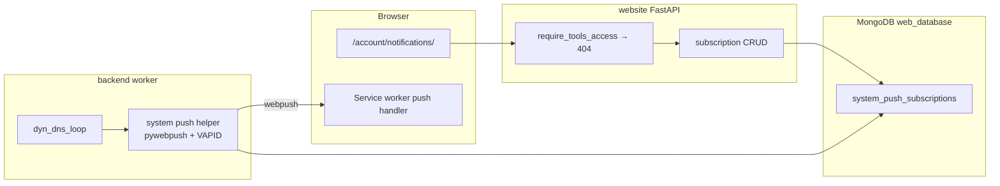

# Design: Replace notify-run with First-Party Web Push

Status: Proposed  
Date: 2026-08-08  
Scope: Remove the `notify-run` dependency from dyn DNS alerts; reuse the existing `pywebpush` + VAPID stack with a tools-only subscription page

## 1. Goal

Stop sending dyn DNS IP-change alerts through the third-party [notify.run](https://notify.run) channel. Send the same alerts with the site’s existing Web Push stack (`pywebpush` + VAPID keys already used for football).

Primary outcomes:

- Delete the `notify-run` Python client from `backend` and `fastapi` requirements.
- Stop reading `backend/src/secrets/notify_run_endpoint.txt`.
- Add a **tools-only** page where `can_use_tools` users can subscribe to system notification topics.
- Persist browser push subscriptions + chosen topics in MongoDB for the backend worker to read when an alert fires.

Non-goals for this change:

- Do not change football or converter push flows.
- Do not introduce a new privilege flag; gate on existing `User.can_use_tools`.
- Do not build a general notification preference centre for all site users.

## 2. Current state

### notify-run (to remove)

| Piece | Detail |
| ----- | ------ |
| Only caller | `backend/src/dyn_dns/dyn_dns.py` via `Notify(endpoint=…).send(text)` |
| Channel URL | `backend/src/secrets/notify_run_endpoint.txt` → `NOTIFY_RUN_ENDPOINT` in `dyn_dns/__init__.py` |
| Triggers | Cloudflare A-record update **succeeded** or **failed** after an external IP change |
| Subscribe UX | None in-repo; phones/browsers subscribe via the public notify.run channel |
| Dependency | Git pin of `notify-run` in `backend/requirements.txt` and unused copy in `fastapi/requirements.txt` |

```text
dyn_dns_loop → IP changed → Cloudflare PATCH
                         ├─ success → Notify.send("DNS Update Succeeded…")
                         └─ failure → Notify.send("DNS Update Failed…")
                                    → notify.run fans out to channel subscribers
```

### Web Push already in the project (reuse)

| Piece | Detail |
| ----- | ------ |
| Library | `pywebpush` + `py-vapid` (already in backend requirements) |
| VAPID secrets | `backend/src/secrets/private_key.pem`, `public_key.pem`, `claims.json` |
| Public key (frontend) | Same key already hardcoded in football / converter subscribe JS |
| Reference send path | `backend/src/football/push_notifications.py` → `webpush(...)`; delete 404/410 endpoints |
| Reference subscribe UX | Football `/football/subscriptions/` and converter Subscribe button |

Football filters by `team_ids`. System alerts will filter by **topic ids** instead, but the push envelope and VAPID usage stay the same.

## 3. Proposed architecture

```text
can_use_tools user
  → GET /account/notifications/  (404 if not tools)
  → choose topics + Enable push
  → PushManager.subscribe(VAPID public key)
  → PUT /account/notifications/subscriptions/
  → Mongo web_database.system_push_subscriptions

dyn_dns_loop
  → IP change + Cloudflare result
  → find docs where topics ∋ "dyn_dns_success" | "dyn_dns_failure"
  → pywebpush.webpush(...) with existing VAPID secrets
  → prune dead endpoints (404/410)
```



## 4. Notification topics (catalog)

The subscription page lists a fixed catalog of **potential subscriptions** (topics). Only topics that exist in code are offered; the page does not invent free-form channels.

| Topic id | Label | When sent | Initial phase |
| -------- | ----- | --------- | ------------- |
| `dyn_dns_success` | DNS update succeeded | Cloudflare A-record update succeeded after IP change | Yes |
| `dyn_dns_failure` | DNS update failed | Cloudflare A-record update failed after IP change | Yes |

Payload shape for the service worker (same general pattern as football):

```json
{
  "title": "DNS Update Succeeded",
  "body": "IP Address Changed from 1.2.3.4 to 5.6.7.8.",
  "url": "https://www.schleising.net/account/notifications/"
}
```

Extensibility: later system alerts (e.g. feed fetch health, disk / monitor thresholds) add a row to the catalog and a send call site. No schema change required beyond new topic string values.

## 5. Data model

**Collection:** `web_database.system_push_subscriptions`

Reuse the football subscription envelope; replace `team_ids` with `topics`.

```python
class SystemPushSubscriptionDocument(BaseModel):
    subscription: PushSubscription  # endpoint + keys (same as football)
    topics: list[str]               # subset of catalog topic ids
    username: str                   # from request.state.user
    client_id: str | None = None    # stable per-browser id (same pattern as football)
    created_at: datetime | None = None
    updated_at: datetime | None = None
```

**Indexes (ensure at startup / first use):**

| Index | Purpose |
| ----- | ------- |
| unique on `subscription.endpoint` | One doc per browser endpoint |
| `topics` | Query “who wants this alert?” |
| `username` + `client_id` | Upsert / list-for-user |

**Upsert key:** prefer `client_id` when present (football pattern), else `subscription.endpoint`. Always store the latest PushSubscription JSON and the selected `topics` list.

**Access rule:** only documents for the authenticated tools user are readable/writable via the website API. The backend worker reads the whole collection filtered by topic (no HTTP auth); it runs on the trusted host with Mongo access.

## 6. Tools-only subscription page

### Placement

In-site page under account (alongside Users), not a tools subdomain:

| Item | Choice |
| ---- | ------ |
| URL | `GET /account/notifications/` |
| Nav | Under Account when `request.state.user.can_use_tools` (next to Media / Users) |
| Gate | New helper mirroring media: `require_system_notifications_access` → **HTTP 404** if anonymous or `can_use_tools` is false |
| Why 404 | Same hide-the-surface pattern as `/media/` and `/account/users/` |

Do **not** put this only behind nginx `auth_request`; it lives on `www` and must be gated in FastAPI like Media.

### Page behaviour

One purpose: manage system push topics for the current browser.

1. Show the topic catalog as a checklist (default both dyn DNS topics checked for first-time subscribe).
2. Single primary control: **Enable notifications** / **Update preferences** / **Disable**.
3. On enable: register service worker (reuse or thin variant of `website/static/js/utils/subscribe.js`), `pushManager.subscribe` with the existing VAPID public key, `PUT` subscription + topics.
4. On load: `GET` current preferences for this `client_id` / endpoint and reflect checkbox + button state.
5. On disable: `PushManager.unsubscribe` + `DELETE` API (prune DB even if browser unsubscribe fails).

No cards-as-decoration; keep the layout consistent with existing account/tools pages.

### Service worker

Prefer extending an existing SW registration path on `www` (root `website/static/sw.js` already has push handling) rather than inventing a third worker tree. If root SW already shows `event.data.json()` notifications, the page only needs subscribe + preference APIs. Verify click → open `url` from the payload.

## 7. Website API

All routes call `require_system_notifications_access(request)` first. Mutating routes also use `Depends(validate_csrf)`.

| Method | Path | Behaviour |
| ------ | ---- | --------- |
| `GET` | `/account/notifications/` | HTML page + topic catalog |
| `GET` | `/account/notifications/catalog/` | JSON list of `{id, label, description}` (optional if catalog is embedded in the page) |
| `GET` | `/account/notifications/subscriptions/current/?client_id=` | Current topics + whether a stored subscription exists for this client |
| `PUT` | `/account/notifications/subscriptions/` | Body: `{ subscription, topics, client_id }` → upsert |
| `DELETE` | `/account/notifications/subscriptions/` | Body: `{ subscription? , client_id? }` → delete (same lookup rules as football) |

Validation:

- Reject unknown topic ids (must be ⊆ catalog).
- Reject empty `topics` on PUT (use DELETE to unsubscribe).
- Bind `username` from `request.state.user`; never trust client-supplied username.

## 8. Backend send path (dyn DNS)

Replace `Notify` usage in `DynDns`:

1. Remove `from notify_run import Notify` and `self.notify` init.
2. Remove `NOTIFY_RUN_ENDPOINT` load from `dyn_dns/__init__.py` and delete `notify_run_endpoint.txt` from deploy secrets once cut over.
3. Add a small helper (e.g. `backend/src/system_push/notifications.py`) that:
   - Opens/uses a Motor/PyMongo handle to `system_push_subscriptions` (mirror how football wire `football_push`).
   - Loads VAPID claims + private key the same way as football.
   - `find({"topics": topic_id})`, sends via `webpush`, dedupes by endpoint, deletes on 404/410.
4. Call sites in `update_dns`:

| Event | Call |
| ----- | ---- |
| Update succeeded | `send_system_push("dyn_dns_success", title=…, body=…)` |
| Update failed | `send_system_push("dyn_dns_failure", title=…, body=…)` |

If the collection is unset or empty, log at debug/info and continue (DNS update must not fail because nobody is subscribed).

Shared types: either duplicate the small `PushSubscription` Pydantic models in backend (as football already does) or extract a tiny shared module later. Prefer **copy the football-shaped models into a system_push package** for this change to avoid a cross-package refactor.

## 9. Access helper pattern

Copy Media:

```python
# website/account/system_notifications_access.py (name flexible)

def request_can_manage_system_notifications(request: Request) -> bool:
    user = getattr(request.state, "user", None)
    if user is None:
        return False
    return bool(getattr(user, "can_use_tools", False))

def require_system_notifications_access(request: Request) -> None:
    if request_can_manage_system_notifications(request):
        return
    raise HTTPException(status_code=status.HTTP_404_NOT_FOUND, detail="Not Found")
```

Call on every HTML and JSON handler for this feature. Add unit tests mirroring `website/tests/test_media_access.py`.

## 10. Dependency and secret cleanup

| Action | Target |
| ------ | ------ |
| Remove | `notify-run @ git+https://github.com/notify-run/...` from `backend/requirements.txt` |
| Remove | Same line from `fastapi/requirements.txt` (unused today) |
| Keep | `pywebpush` / `py-vapid` |
| Delete after cutover | `backend/src/secrets/notify_run_endpoint.txt` |
| Keep | Existing VAPID PEM + `claims.json` |

No new VAPID keypair is required unless rotating for other reasons.

## 11. Migration / cutover

1. Ship website page + APIs + Mongo collection (feature usable; dyn DNS still on notify-run).
2. Tools users open `/account/notifications/`, enable push, select topics; confirm a test send (optional `POST /account/notifications/test/` tools-only, or trigger a dry-run helper in backend) works on a phone/desktop.
3. Flip dyn DNS to `send_system_push`; leave notify-run code behind a short-lived flag **or** remove in the same deploy if step 2 is verified.
4. Remove `notify-run` dependency and `notify_run_endpoint.txt`.
5. Ask existing notify.run channel subscribers to use the new page (channel can be abandoned; no data import is possible from notify.run into Web Push endpoints).

There is no automatic migration of notify.run subscribers: Web Push endpoints are browser-specific and cannot be exported from notify.run.

## 12. Testing

| Layer | Coverage |
| ----- | -------- |
| Access | Anonymous / logged-in without tools → 404 on page + APIs; tools user → 200 |
| API | Upsert topics, reject unknown topics, delete by client_id, CSRF on PUT/DELETE |
| Backend helper | Empty collection no-op; sends only matching topic; removes 410 endpoints (mock `webpush`) |
| Dyn DNS | Success path calls `dyn_dns_success`; failure path calls `dyn_dns_failure`; DNS DB update still happens when push fails |
| Manual | Tools user on desktop + phone: subscribe, receive success/failure style test payload, unsubscribe |

## 13. File sketch (implementation guide)

| Area | Likely paths |
| ---- | ------------ |
| Access | `website/account/system_notifications_access.py` |
| Router | `website/account/router.py` (or `website/account/notifications_router.py` included from account) |
| Models / DB | `website/account/system_push_db.py` + Pydantic models |
| Template / JS | `website/templates/account/notifications.html`, `website/static/js/account/notifications.js` |
| Nav | `website/templates/base.html` (`can_use_tools` block) |
| Backend send | `backend/src/system_push/…`, wire collection in backend package init |
| Dyn DNS | Edit `backend/src/dyn_dns/dyn_dns.py` + `__init__.py` |
| Tests | `website/tests/test_system_notifications_access.py` (+ API tests as needed) |

## 14. Open decisions

Resolved in this proposal unless revisited during implementation:

| Decision | Choice |
| -------- | ------ |
| Privilege | `can_use_tools` only |
| Denied status | 404 (hide surface) |
| URL prefix | `/account/notifications/` |
| Collection name | `system_push_subscriptions` |
| Topics for dyn DNS | Separate success / failure topics |
| VAPID keys | Reuse football/converter pair |
| notify.run subscriber import | Not supported; re-subscribe on the new page |

Optional later:

- Tools-only “Send test notification” button.
- Admin list of all system endpoints (ops debugging) — out of scope unless needed.
- Shared `website`/`backend` package for push models — defer until a third caller appears.
