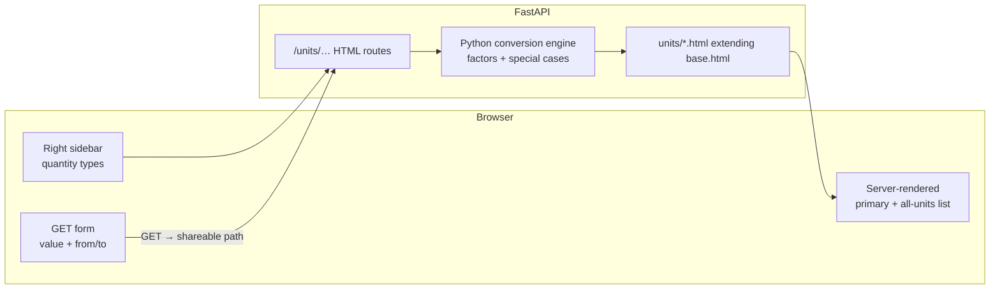

# Design: Unit Conversions

Status: Implemented  
Date: 2026-07-19  
Scope: Public unit-conversion page under the site chrome (no login)

## 1. Goal

Add a public, login-free **Unit Conversions** page where a visitor picks a quantity type from the **right sidebar**, enters a value and source unit, and sees the equivalent in every other unit of that type.

Primary goals:
- Useful pocket tool for everyday and technical conversions (distance, mass, time, temperature, plus compound quantities such as speed, acceleration, and fuel economy).
- No account, privilege flag, or nginx gate — same public tier as Blog, Aircraft, and Astronomy.
- **Server-side conversion** — all math runs in Python on the backend; the HTML response contains the computed results.
- **Every conversion has a shareable URL** — submitting or choosing a conversion navigates to a canonical path that fully encodes category, value, from-unit, and to-unit. Opening that URL (bookmark, chat, email) re-runs the conversion on the server and shows the same result with no client-side math required.

Non-goals for v1:
- Currency / FX (needs live rates).
- Historical unit systems beyond common modern / UK / US / SI sets.
- Dimensional analysis / free-form unit algebra (“N·m / kg”).
- Saving favourites to an account.
- Client-side conversion engines (no duplicate factor tables in JS).

## 2. Why This Fits The Current Project

- [Future-Development.md](Future-Development.md) already lists a **Unit / timezone / colour converter** under public-friendly utilities.
- Site chrome already supports a right sidebar of `sub-level-nav` links (`` in `base.html`) — ideal for quantity-type selection.
- Soft global auth (`get_current_active_user`) leaves anonymous users on public routes; no new privilege flag is required.
- Astronomy (`/tools/astronomy/`) is the closest existing public calculator; this feature should live in the **main site shell** (not a standalone tool HTML shell) so the right menu can drive category switching.

Name clash note: existing `/tools/converter/` is the **media/video conversion dashboard** (nginx `can_use_tools`). This feature must not reuse that path or name in nav. Prefer **Units** / **Unit Conversions** and URL prefix `/units/`.

## 3. High-Level Architecture



Conversion math runs **only on the server** from a Python factor table (plus special-case temperature and reciprocal fuel-economy). The browser submits a GET form (or follows links) to a canonical shareable URL; FastAPI computes and Jinja renders the results. Minimal JS is allowed for UX polish (e.g. “copy link”), not for calculating values.

## 4. Scope

### In scope (v1)

- Public page(s) under `/units/`.
- Left-nav entry visible to everyone (no login gate).
- Right-nav list of quantity types (sections below).
- One input value, from-unit and to-unit selectors; form submits via GET to a shareable result URL.
- Server-side Python engine; HTML response includes primary conversion and all-units list for the category.
- Canonical shareable URLs for every conversion (see §5.3).
- Exact inventory of units and conversion factors in §6.
- Mobile-usable layout within existing base chrome.

### Out of scope (v1)

- Timezone converter, colour picker (separate future tools).
- Separate JSON-only conversion microservice (optional thin JSON twin of the same Python engine may be added later; not required for v1).
- Client-side recalculation without a navigation / reload.
- User-defined custom units.
- Printing / PDF export.

## 5. UX & Navigation

### 5.1 Placement

| Surface | Behaviour |
|---------|-----------|
| Left nav | Always-visible link **Units** → `/units/` |
| Home / Webapps | Optional public card linking to `/units/` (same tier as Astronomy / Football) |
| Right nav | Quantity-type list (`sub-level-nav`); current type gets `is-current` + `aria-current="page"` |
| Auth | None — anonymous OK |

### 5.2 Page layout

Main column (one job: convert):
1. Category title (e.g. “Speed”).
2. GET form: value input, from-unit `<select>`, to-unit `<select>`, Convert submit.
3. Optional swap control (GET to the swapped shareable URL, or a submit that posts to the swapped path).
4. When a conversion URL is loaded: primary result — large converted value in the selected *to* unit (server-rendered).
5. Secondary list: same value in **every** other unit of the category; each row links to that unit as `to` on the same shareable path pattern (so sharing “60 mph as knots” is one click).
6. Visible **shareable URL** (current page URL) with an optional “Copy link” control.

Right column: quantity types grouped lightly (Basic / Compound) or a flat ordered list — flat is fine for v1 if the list stays short.

Category landing (`/units/speed/` with no value): show the empty form pre-filled with that category’s default from/to; no result block (or a muted prompt to convert).

### 5.3 URL shape — shareable by design

Category index paths (right-nav targets; no conversion yet):

| Path | Category |
|------|----------|
| `/units/` | Redirect to default category (`/units/length/`) |
| `/units/length/` | Length |
| `/units/area/` | Area |
| `/units/volume/` | Volume |
| `/units/mass/` | Mass |
| `/units/time/` | Time |
| `/units/temperature/` | Temperature |
| `/units/speed/` | Speed |
| `/units/acceleration/` | Acceleration |
| `/units/force/` | Force |
| `/units/pressure/` | Pressure |
| `/units/energy/` | Energy |
| `/units/power/` | Power |
| `/units/angle/` | Angle |
| `/units/frequency/` | Frequency |
| `/units/data/` | Digital storage |
| `/units/fuel-economy/` | Fuel economy |
| `/units/density/` | Density |
| `/units/torque/` | Torque |
| `/units/flow/` | Volumetric flow |

**Conversion result URLs** (canonical, shareable — every successful conversion lands here):

```
/units/{category}/{value}/{from_slug}/to/{to_slug}/
```

Examples:

| Meaning | URL |
|---------|-----|
| 60 mph → km/h | `/units/speed/60/mph/to/km-h/` |
| 1 inch → millimetres | `/units/length/1/in/to/mm/` |
| 100 °C → °F | `/units/temperature/100/c/to/f/` |
| 45 mpg (UK) → L/100km | `/units/fuel-economy/45/mpg-uk/to/l-100km/` |

Rules:
- `{value}` is a URL-safe decimal (and optional scientific form such as `1.5e3`). Normalise on redirect: strip redundant `+`, leading zeros where harmless, and prefer a single canonical string per numeric value so shared links stay stable.
- `{from_slug}` / `{to_slug}` are stable kebab-case IDs defined per unit in the engine (not display symbols). Examples: `km-h`, `m-s2`, `mpg-uk`, `gal-us`, `c`, `f`, `l-100km`.
- Form method is **GET**; the handler builds the canonical path and **302/303 redirects** to it when the request arrives as query params (e.g. `/units/speed/?v=60&from=mph&to=km-h` → canonical path). Prefer documenting the path form as the only public share format.
- Invalid category → 404. Unknown unit slug for the category → 404 (or 302 back to category index with a flash/query error — prefer 404 for bad shared links so they fail loudly).
- Unparseable value → re-render category form with an inline validation message (200) or 400; do not invent a result URL.
- Same from and to is allowed (identity conversion) and still gets a shareable URL.
- Right-nav category links go to the category index (not the previous conversion), so switching type starts clean.

Optional alternate (accept, then redirect to canonical):

```
/units/speed/?v=60&from=mph&to=km-h  →  302  /units/speed/60/mph/to/km-h/
```

### 5.4 Interaction rules

- Convert = navigate: submit (or follow a result-row link) loads a new shareable URL; the server renders the answer. No silent client-side recompute.
- Invalid / empty input → stay on category page with validation message; do not create a result URL.
- Temperature and fuel economy use the special formulas in §6 (not pure multiply-by-factor); still computed in Python.
- Display: sensible significant figures on the server (trim trailing zeros; very large/small → scientific notation in the template).
- “Copy link” copies `window.location.href` (the canonical path already in the address bar).

## 6. Conversion Inventory

Every conversion in v1 is defined here. Within a category, **any unit converts to any other unit** by going through the SI (or declared) base unit, except where a special formula is noted.

Notation:
- **Base** — internal reference unit for that category.
- **Factor** — multiply by this to convert *from this unit → base* (so `value_base = value_unit × factor`).
- Inverse: `value_unit = value_base / factor`.
- Factors use exact definitions where standards provide them (international yard/pound, etc.).
- **URL slug** — each unit also has a stable kebab-case path id used in shareable URLs (derived from the Symbol column: lowercase, `/` → `-`, spaces/parentheses folded, e.g. `km/h` → `km-h`, `mpg (UK)` → `mpg-uk`, `°C` → `c`, `L/100km` → `l-100km`, `m/s²` → `m-s2`). Exact slug map lives in `conversions.py` and must not change once published (broken bookmarks).

---

### 6.1 Length (base: metre, m)

| Unit | Symbol | Factor → m |
|------|--------|------------|
| kilometre | km | `1000` |
| metre | m | `1` |
| centimetre | cm | `0.01` |
| millimetre | mm | `0.001` |
| micrometre | µm | `1e-6` |
| nanometre | nm | `1e-9` |
| mile (international) | mi | `1609.344` |
| yard | yd | `0.9144` |
| foot | ft | `0.3048` |
| inch | in | `0.0254` |
| nautical mile | nmi | `1852` |
| light-year | ly | `9.4607304725808e15` |
| astronomical unit | au | `149597870700` |

**Conversions covered:** every ordered pair among the 13 units above (via metres).

Default from/to: `m` → `ft`.

---

### 6.2 Area (base: square metre, m²)

| Unit | Symbol | Factor → m² |
|------|--------|-------------|
| square kilometre | km² | `1e6` |
| hectare | ha | `10000` |
| square metre | m² | `1` |
| square centimetre | cm² | `1e-4` |
| square millimetre | mm² | `1e-6` |
| square mile | mi² | `2589988.110336` |
| acre | ac | `4046.8564224` |
| square yard | yd² | `0.83612736` |
| square foot | ft² | `0.09290304` |
| square inch | in² | `0.00064516` |

**Conversions covered:** every ordered pair among the 10 units above.

Default from/to: `m²` → `ft²`.

---

### 6.3 Volume (base: cubic metre, m³)

| Unit | Symbol | Factor → m³ |
|------|--------|-------------|
| cubic metre | m³ | `1` |
| litre | L | `0.001` |
| millilitre | mL | `1e-6` |
| cubic centimetre | cm³ | `1e-6` |
| cubic kilometre | km³ | `1e9` |
| cubic inch | in³ | `1.6387064e-5` |
| cubic foot | ft³ | `0.028316846592` |
| cubic yard | yd³ | `0.764554857984` |
| UK gallon | gal (UK) | `0.00454609` |
| US gallon | gal (US) | `0.003785411784` |
| UK pint | pt (UK) | `0.0005682615` |
| US liquid pint | pt (US) | `0.000473176473` |
| US fluid ounce | fl oz (US) | `2.95735295625e-5` |
| UK fluid ounce | fl oz (UK) | `2.84130625e-5` |
| tablespoon (US) | tbsp | `1.478676478125e-5` |
| teaspoon (US) | tsp | `4.92892159375e-6` |

**Conversions covered:** every ordered pair among the 16 units above.

Default from/to: `L` → `gal (UK)`.

---

### 6.4 Mass (base: kilogram, kg)

| Unit | Symbol | Factor → kg |
|------|--------|-------------|
| tonne (metric) | t | `1000` |
| kilogram | kg | `1` |
| gram | g | `0.001` |
| milligram | mg | `1e-6` |
| microgram | µg | `1e-9` |
| pound | lb | `0.45359237` |
| ounce | oz | `0.028349523125` |
| stone | st | `6.35029318` |
| short ton (US) | ton (US) | `907.18474` |
| long ton (UK) | ton (UK) | `1016.0469088` |
| grain | gr | `6.479891e-5` |

**Conversions covered:** every ordered pair among the 11 units above.

Default from/to: `kg` → `lb`.

---

### 6.5 Time (base: second, s)

| Unit | Symbol | Factor → s |
|------|--------|------------|
| year (Julian, 365.25 d) | yr | `31557600` |
| week | wk | `604800` |
| day | d | `86400` |
| hour | h | `3600` |
| minute | min | `60` |
| second | s | `1` |
| millisecond | ms | `0.001` |
| microsecond | µs | `1e-6` |
| nanosecond | ns | `1e-9` |

**Conversions covered:** every ordered pair among the 9 units above.

Note: calendar months/years are ambiguous; v1 uses a fixed Julian year only. No month unit.

Default from/to: `h` → `min`.

---

### 6.6 Temperature (base: kelvin, K) — special formulas

Temperature is **affine**, not a pure scale factor. Convert via kelvin:

| Unit | Symbol | To kelvin | From kelvin |
|------|--------|-----------|-------------|
| kelvin | K | `T` | `T` |
| Celsius | °C | `T + 273.15` | `T − 273.15` |
| Fahrenheit | °F | `(T + 459.67) × 5/9` | `T × 9/5 − 459.67` |
| Rankine | °R | `T × 5/9` | `T × 9/5` |

**Conversions covered (explicit pairs):**

| From → To | Formula |
|-----------|---------|
| °C → °F | `F = C × 9/5 + 32` |
| °F → °C | `C = (F − 32) × 5/9` |
| °C → K | `K = C + 273.15` |
| K → °C | `C = K − 273.15` |
| °F → K | `K = (F + 459.67) × 5/9` |
| K → °F | `F = K × 9/5 − 459.67` |
| °C → °R | `R = (C + 273.15) × 9/5` |
| °R → °C | `C = R × 5/9 − 273.15` |
| °F → °R | `R = F + 459.67` |
| °R → °F | `F = R − 459.67` |
| K → °R | `R = K × 9/5` |
| °R → K | `K = R × 5/9` |

(Implementation may always go via K; the table documents the intended equivalences.)

Default from/to: `°C` → `°F`.

---

### 6.7 Speed (base: metre per second, m/s)

| Unit | Symbol | Factor → m/s |
|------|--------|--------------|
| metre per second | m/s | `1` |
| kilometre per hour | km/h | `1/3.6` |
| mile per hour | mph | `0.44704` |
| foot per second | ft/s | `0.3048` |
| knot | kn | `1852/3600` |
| kilometre per second | km/s | `1000` |
| speed of light (exact) | c | `299792458` |
| mach (approx. at 15 °C sea level) | Ma | `340.3` |

**Conversions covered:** every ordered pair among the 8 units above.

Caveat (document in UI help text): Mach uses a fixed approximation; true Mach depends on local speed of sound.

Default from/to: `mph` → `km/h`.

---

### 6.8 Acceleration (base: metre per second squared, m/s²)

| Unit | Symbol | Factor → m/s² |
|------|--------|---------------|
| metre per second squared | m/s² | `1` |
| kilometre per hour per second | km/h/s | `1/3.6` |
| foot per second squared | ft/s² | `0.3048` |
| standard gravity | g₀ | `9.80665` |
| gal (cgs) | Gal | `0.01` |

**Conversions covered:** every ordered pair among the 5 units above.

Default from/to: `m/s²` → `g₀`.

---

### 6.9 Force (base: newton, N)

| Unit | Symbol | Factor → N |
|------|--------|------------|
| newton | N | `1` |
| kilonewton | kN | `1000` |
| dyne | dyn | `1e-5` |
| kilogram-force | kgf | `9.80665` |
| pound-force | lbf | `4.4482216152605` |
| poundal | pdl | `0.138254954376` |

**Conversions covered:** every ordered pair among the 6 units above.

Default from/to: `N` → `lbf`.

---

### 6.10 Pressure (base: pascal, Pa)

| Unit | Symbol | Factor → Pa |
|------|--------|-------------|
| pascal | Pa | `1` |
| kilopascal | kPa | `1000` |
| megapascal | MPa | `1e6` |
| bar | bar | `1e5` |
| millibar / hPa | mbar | `100` |
| atmosphere (standard) | atm | `101325` |
| torr | Torr | `101325/760` |
| mmHg (0 °C, conventional) | mmHg | `133.322387415` |
| psi | psi | `6894.757293168` |
| inches of mercury | inHg | `3386.389` |

**Conversions covered:** every ordered pair among the 10 units above.

Default from/to: `psi` → `bar`.

---

### 6.11 Energy (base: joule, J)

| Unit | Symbol | Factor → J |
|------|--------|------------|
| joule | J | `1` |
| kilojoule | kJ | `1000` |
| megajoule | MJ | `1e6` |
| calorie (thermochemical) | cal | `4.184` |
| kilocalorie | kcal | `4184` |
| watt-hour | Wh | `3600` |
| kilowatt-hour | kWh | `3.6e6` |
| electronvolt | eV | `1.602176634e-19` |
| British thermal unit (IT) | BTU | `1055.05585262` |
| foot-pound | ft·lbf | `1.3558179483314` |

**Conversions covered:** every ordered pair among the 10 units above.

Default from/to: `kWh` → `J`.

---

### 6.12 Power (base: watt, W)

| Unit | Symbol | Factor → W |
|------|--------|------------|
| watt | W | `1` |
| kilowatt | kW | `1000` |
| megawatt | MW | `1e6` |
| horsepower (metric) | PS | `735.49875` |
| horsepower (mechanical) | hp | `745.69987158227` |
| BTU per hour | BTU/h | `0.293071070172` |
| foot-pound per second | ft·lbf/s | `1.3558179483314` |

**Conversions covered:** every ordered pair among the 7 units above.

Default from/to: `kW` → `hp`.

---

### 6.13 Angle (base: radian, rad)

| Unit | Symbol | Factor → rad |
|------|--------|--------------|
| radian | rad | `1` |
| degree | ° | `π/180` |
| arcminute | ′ | `π/10800` |
| arcsecond | ″ | `π/648000` |
| gradian / gon | gon | `π/200` |
| turn / revolution | rev | `2π` |

**Conversions covered:** every ordered pair among the 6 units above.

Default from/to: `°` → `rad`.

---

### 6.14 Frequency (base: hertz, Hz)

| Unit | Symbol | Factor → Hz |
|------|--------|-------------|
| hertz | Hz | `1` |
| kilohertz | kHz | `1000` |
| megahertz | MHz | `1e6` |
| gigahertz | GHz | `1e9` |
| rpm | rpm | `1/60` |
| radian per second | rad/s | `1/(2π)` |

**Conversions covered:** every ordered pair among the 6 units above.

Note: `rad/s` ↔ `Hz` treats frequency as cycles per second (`f = ω / 2π`).

Default from/to: `rpm` → `Hz`.

---

### 6.15 Digital storage (base: byte, B)

Two factor families are supported; the UI should label them clearly (decimal SI vs binary IEC):

| Unit | Symbol | Factor → B |
|------|--------|------------|
| bit | bit | `0.125` |
| byte | B | `1` |
| kilobyte (decimal) | kB | `1000` |
| megabyte | MB | `1e6` |
| gigabyte | GB | `1e9` |
| terabyte | TB | `1e12` |
| petabyte | PB | `1e15` |
| kibibyte | KiB | `1024` |
| mebibyte | MiB | `1048576` |
| gibibyte | GiB | `1073741824` |
| tebibyte | TiB | `1099511627776` |
| pebibyte | PiB | `1125899906842624` |

**Conversions covered:** every ordered pair among the 12 units above.

Default from/to: `GB` → `GiB`.

---

### 6.16 Fuel economy — special (reciprocal + scale)

Fuel economy mixes “distance per volume” and “volume per distance”. Convert by normalising to **metres per cubic metre** (`m/m³` = `1/m²` dimensionally, but treat as a scalar economy measure), then invert when the target family is consumption.

Internal base: **kilometres per litre** (`km/L`).

| Unit | Symbol | To km/L | From km/L |
|------|--------|---------|-----------|
| kilometres per litre | km/L | identity | identity |
| miles per UK gallon | mpg (UK) | `× (1.609344 / 4.54609)` | inverse of to |
| miles per US gallon | mpg (US) | `× (1.609344 / 3.785411784)` | inverse of to |
| litres per 100 km | L/100km | `100 / x` (reciprocal) | `100 / x` |
| miles per litre | mi/L | `× 1.609344` | `/ 1.609344` |

**Explicit conversion paths (all pairs):**

| From | To | Method |
|------|-----|--------|
| km/L | mpg (UK) | `× 4.54609 / 1.609344` |
| km/L | mpg (US) | `× 3.785411784 / 1.609344` |
| km/L | L/100km | `100 / km/L` |
| km/L | mi/L | `/ 1.609344` |
| mpg (UK) | km/L | `× 1.609344 / 4.54609` |
| mpg (UK) | mpg (US) | via km/L |
| mpg (UK) | L/100km | via km/L then reciprocal |
| mpg (UK) | mi/L | via km/L |
| mpg (US) | km/L | `× 1.609344 / 3.785411784` |
| mpg (US) | mpg (UK) | via km/L |
| mpg (US) | L/100km | via km/L then reciprocal |
| mpg (US) | mi/L | via km/L |
| L/100km | km/L | `100 / L/100km` |
| L/100km | mpg (UK) | via km/L |
| L/100km | mpg (US) | via km/L |
| L/100km | mi/L | via km/L |
| mi/L | km/L | `× 1.609344` |
| mi/L | mpg (UK) | via km/L |
| mi/L | mpg (US) | via km/L |
| mi/L | L/100km | via km/L |

Zero / negative input: show empty or “—” (economy undefined).

Default from/to: `mpg (UK)` → `L/100km`.

---

### 6.17 Density (base: kilogram per cubic metre, kg/m³)

| Unit | Symbol | Factor → kg/m³ |
|------|--------|----------------|
| kilogram per cubic metre | kg/m³ | `1` |
| gram per cubic centimetre | g/cm³ | `1000` |
| gram per millilitre | g/mL | `1000` |
| kilogram per litre | kg/L | `1000` |
| pound per cubic foot | lb/ft³ | `16.01846337396` |
| pound per cubic inch | lb/in³ | `27679.90471019` |
| pound per US gallon | lb/gal (US) | `119.826427317` |
| ounce per cubic inch | oz/in³ | `1729.994044387` |

**Conversions covered:** every ordered pair among the 8 units above.

Default from/to: `kg/m³` → `g/cm³`.

---

### 6.18 Torque (base: newton-metre, N·m)

| Unit | Symbol | Factor → N·m |
|------|--------|--------------|
| newton-metre | N·m | `1` |
| newton-centimetre | N·cm | `0.01` |
| kilogram-force metre | kgf·m | `9.80665` |
| pound-force foot | lbf·ft | `1.3558179483314` |
| pound-force inch | lbf·in | `0.1129848290276` |
| ounce-force inch | ozf·in | `0.00706155183333` |

**Conversions covered:** every ordered pair among the 6 units above.

Default from/to: `N·m` → `lbf·ft`.

---

### 6.19 Volumetric flow (base: cubic metre per second, m³/s)

| Unit | Symbol | Factor → m³/s |
|------|--------|---------------|
| cubic metre per second | m³/s | `1` |
| litre per second | L/s | `0.001` |
| litre per minute | L/min | `1.6666666666667e-5` |
| litre per hour | L/h | `2.7777777777778e-7` |
| cubic foot per second | ft³/s | `0.028316846592` |
| cubic foot per minute | CFM | `4.719474432e-4` |
| US gallon per minute | GPM (US) | `6.30901964e-5` |
| UK gallon per minute | GPM (UK) | `7.5768166667e-5` |

**Conversions covered:** every ordered pair among the 8 units above.

Default from/to: `L/min` → `GPM (UK)`.

---

### 6.20 Category summary (right-nav order)

| # | Right-nav label | Path | Unit count | Style |
|---|-----------------|------|------------|-------|
| 1 | Length | `/units/length/` | 13 | Basic |
| 2 | Area | `/units/area/` | 10 | Basic |
| 3 | Volume | `/units/volume/` | 16 | Basic |
| 4 | Mass | `/units/mass/` | 11 | Basic |
| 5 | Time | `/units/time/` | 9 | Basic |
| 6 | Temperature | `/units/temperature/` | 4 | Basic (affine) |
| 7 | Speed | `/units/speed/` | 8 | Compound |
| 8 | Acceleration | `/units/acceleration/` | 5 | Compound |
| 9 | Force | `/units/force/` | 6 | Compound |
| 10 | Pressure | `/units/pressure/` | 10 | Compound |
| 11 | Energy | `/units/energy/` | 10 | Compound |
| 12 | Power | `/units/power/` | 7 | Compound |
| 13 | Angle | `/units/angle/` | 6 | Basic |
| 14 | Frequency | `/units/frequency/` | 6 | Compound |
| 15 | Data | `/units/data/` | 12 | Basic (IT) |
| 16 | Fuel economy | `/units/fuel-economy/` | 5 | Compound (reciprocal) |
| 17 | Density | `/units/density/` | 8 | Compound |
| 18 | Torque | `/units/torque/` | 6 | Compound |
| 19 | Flow | `/units/flow/` | 8 | Compound |

**Total:** 19 categories, **160 units**, all pairwise conversions within each category as defined above.

Right-nav grouping suggestion (visual separators only):

- **Basic:** Length, Area, Volume, Mass, Time, Temperature, Angle, Data  
- **Compound:** Speed, Acceleration, Force, Pressure, Energy, Power, Frequency, Fuel economy, Density, Torque, Flow  

## 7. Technical Design

### 7.1 Routing

- New package: `website/units/` with `router.py`, `APIRouter(prefix="/units")`, plus a pure Python `conversions.py` (or `engine.py`) holding the inventory and math.
- Register with `app.include_router(units_router)` in `website/index.py`.
- Dual `@router.get` decorators for trailing-slash twins, consistent with the rest of the site.

| Method | Path | Behaviour |
|--------|------|-----------|
| GET | `/units/` | 302 → `/units/length/` |
| GET | `/units/{category}/` | Category form (defaults); 404 if unknown category |
| GET | `/units/{category}/` with `?v=&from=&to=` | 302 → canonical result path |
| GET | `/units/{category}/{value}/{from_slug}/to/{to_slug}/` | Run conversion server-side; render results; 404 on bad slugs |

Form `action` may target the category path with query fields, relying on the redirect-to-canonical step so the address bar always ends on the shareable path.

### 7.2 Conversion engine (Python)

| Module | Role |
|--------|------|
| `website/units/conversions.py` | Single source of truth: categories, unit slugs, display labels/symbols, factors, defaults, `convert()`, `convert_all()` |
| `website/units/router.py` | Parse path/query, call engine, pass results into templates |

Engine responsibilities:
- Linear categories: `to_base` / `from_base` via factors in §6.
- Temperature: formulas in §6.6.
- Fuel economy: scale + reciprocal in §6.16.
- Formatting helpers for display strings (significant figures / scientific notation).
- Slug ↔ unit lookup; reject cross-category unit misuse.

No duplicate factor tables in JavaScript.

### 7.3 Templates

| File | Role |
|------|------|
| `templates/units/units-base.html` | Extends `base.html`; defines `` with all category links |
| `templates/units/convert.html` | Form + optional server-rendered primary result and all-units list |

Template context includes: category metadata, unit choices, submitted value/from/to (when present), primary result, list of `{unit, value, share_url}` for every unit in the category.

Keep right-nav markup in `units-base.html` so every category page highlights correctly.

### 7.4 Static assets

| Asset | Role |
|-------|------|
| `static/css/units/units.css` | Page-specific layout (results list, input row); reuse existing right-nav styles |
| `static/js/units/units-page.js` | Optional only: copy-shareable-URL button; no conversion math |

### 7.5 Auth & discovery

- No `Depends` beyond the global soft user injection.
- Left nav: always show Units (no ``).
- Do **not** add to nginx-auth tools lists.
- Home card links to `/units/` on www; Webapps card links to `https://units.schleising.net`.

### 7.6 Progressive Web App (installable)

Follow the **football/feeds** shell pattern (not astronomy’s standalone HTML shell):

| Piece | Detail |
|-------|--------|
| Host | `units.schleising.net` (public; no nginx-auth gate) |
| Detection | Host match **or** `x-is-web-app` header |
| Path mode | Web-app strips `/units` from public URLs (`/length/`, `/speed/60/mph/to/km-h/`); FastAPI still mounts at `/units` |
| Left nav | Hidden (`render_left_sidebar=False`); right category nav remains |
| Manifest | Served only in web-app mode: `GET /units/manifest.webmanifest` → `static/manifests/units/units.webmanifest` |
| Service worker | Served only in web-app mode: `GET /units/sw.js` → `static/units/sw.js` |
| Registration | `static/js/units/pwa.js` when `is_web_app` (reads `data-units-base-path`) |
| Icons | `static/icons/units/` (PNG + SVG, any + maskable) |

**Nginx (outside this repo):** proxy `units.schleising.net` to the website container with `/` rewritten to `/units/` (same pattern as feeds/football), optionally set `x-is-web-app: true`, and expose static `/icons`, `/css`, `/js` as usual. Do **not** attach `website-auth-tools.conf`.

### 7.7 Accessibility

- Associated `<label>`s for value and unit selects.
- Results in a list/table with unit name + value; primary result is ordinary server-rendered content (no live region required for navigation-based updates).
- Right-nav current page semantics already used site-wide.

## 8. Implementation Phases

### Phase 1 — Skeleton

- [x] Design doc accepted (this file)
- [x] Router + convert template shell
- [x] Right-nav category links + left-nav entry
- [x] `/units/` redirect

### Phase 2 — Engine + basic categories + shareable URLs

- [x] `conversions.py` with factors for Length, Area, Volume, Mass, Time, Temperature, Angle, Data
- [x] Canonical result route `/units/{category}/{value}/{from}/to/{to}/`
- [x] GET form → redirect to canonical URL → server-rendered primary + all-units list
- [x] Per-row share links for alternate `to` units

### Phase 3 — Compound categories

- [x] Speed, Acceleration, Force, Pressure, Energy, Power, Frequency, Density, Torque, Flow
- [x] Fuel economy reciprocal handling
- [x] Caveat copy for Mach / Julian year / SI vs IEC data units

### Phase 4 — Polish

- [x] Home / Webapps discovery link
- [x] Optional “Copy link” button
- [x] Mobile check in site chrome
- [x] Pytest spot-checks against the Python engine

## 9. Testing

| Check | Expectation |
|-------|-------------|
| Anonymous `GET /units/length/` | 200, no login redirect |
| Unknown category | 404 |
| `GET /units/length/1/in/to/mm/` | 200; body shows `25.4` (mm) |
| `GET /units/temperature/100/c/to/f/` | 200; body shows `212` |
| `GET /units/speed/60/mph/to/km-h/` | 200; body shows `96.56064` (subject to formatting) |
| `GET /units/fuel-economy/1/l-100km/to/km-l/` | 200; body shows `100` |
| `GET /units/data/1/gb/to/gib/` | 200; matches `1e9 / 2**30` |
| Query form `?v=60&from=mph&to=km-h` | 302 to canonical path |
| Bad unit slug | 404 |
| Logged-in user without tools | Same public access |
| Right nav | Current category marked `is-current` |
| Shared URL opened in a fresh private window | Same result, no login |

Prefer **pytest** unit tests on `conversions.py` for factor spot-checks; add a small set of FastAPI route tests for redirect + HTML result status. Full browser E2E optional.

## 10. Risks & Decisions

| Topic | Decision |
|-------|----------|
| Path vs media converter | `/units/` — never `/tools/converter/` |
| Login | Public |
| Where math runs | **Server-side Python only** |
| Shareable results | Canonical path `/units/{category}/{value}/{from}/to/{to}/` |
| Client JS | Optional copy-link only; no conversion math |
| Month as time unit | Omitted (ambiguous) |
| Mach | Included with fixed 340.3 m/s caveat |
| Data units | Both SI decimal and IEC binary |
| UK vs US volume/fuel | Both, clearly labelled |
| Currency | Out of scope |
| Timezone / colour | Separate future pages |

## 11. Success Criteria

- A visitor with no account can open Units from the left nav and convert within every category in §6.
- Right menu switches quantity type without leaving the Units section.
- Every conversion lands on a canonical URL that can be copied and reopened to the same server-rendered result.
- Documented spot-check conversions match expected values in the Python engine and in HTTP responses.
- No auth, nginx, or `can_use_tools` coupling.
- No client-side duplicate of the conversion tables.
