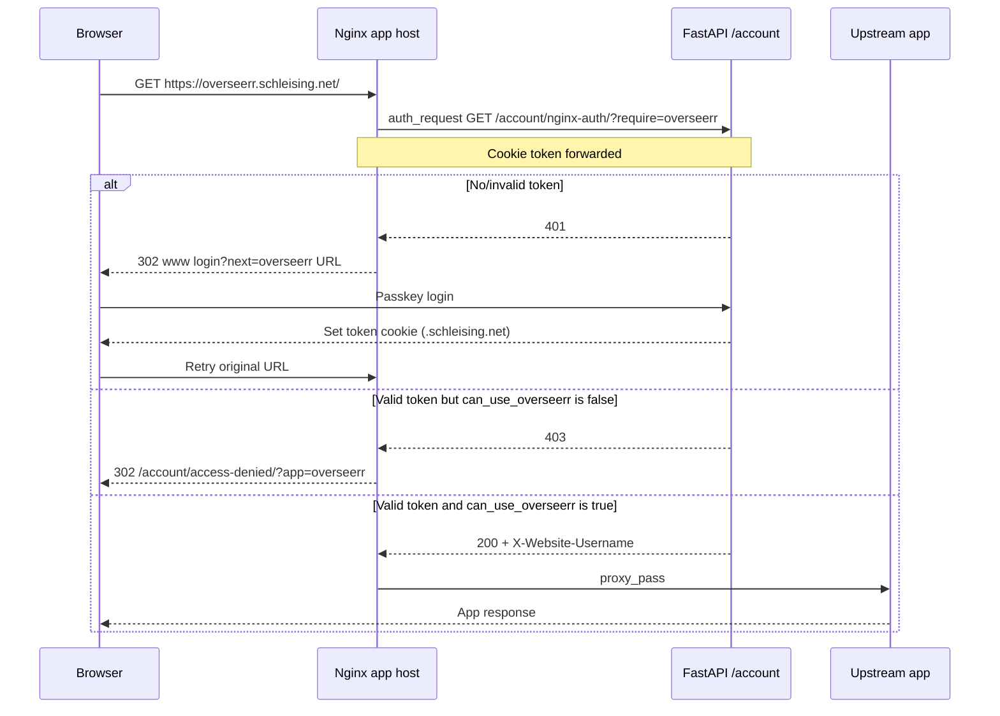

# Design: Replace Authentik with Website Login for Nginx-Gated Webapps

## 1. Goal

Replace Authentik forward-auth (`snippets/authentik.conf`) with the existing website account system (passkey login + JWT `token` cookie) for private webapps currently gated by nginx.

Unauthenticated users should be sent to `https://www.schleising.net/account/login/` with a safe `next` return URL, then return to the original app after login.

## 2. Current state

### Authentik gate (retired)

Former `snippets/authentik.conf` used nginx `auth_request` against the Authentik
outpost. That path is **retired**: snippets live under `snippets/archive/`, and
`auth.schleising.net` is no longer in `nginx.conf`.

Private apps are gated by website auth:


| Category                                   | Hosts                                                                                                      | Snippet                       |
| ------------------------------------------ | ---------------------------------------------------------------------------------------------------------- | ----------------------------- |
| Website tool subdomains                    | `monitor`, `converter`, `transcoder`, `logger`                                                             | `website-auth-tools.conf`     |
| External/private apps (tools-only)         | `pihole`, `plex`, `portainer`, `prowlarr`, `radarr`, `sonarr`, `tautulli`, `transmission`, `nas`, `router` | `website-auth-tools.conf`     |
| External/private app (explicit allow-list) | `overseerr`                                                                                                | `website-auth-overseerr.conf` |


### Website auth (already exists)


| Piece          | Detail                                                                       |
| -------------- | ---------------------------------------------------------------------------- |
| Session        | JWT in HTTP-only cookie `token`                                              |
| Domain         | `.schleising.net` (shared across subdomains)                                 |
| Login          | Passkeys via `/account/webauthn/...` on `www`                                |
| TTL            | ~3 days (`User.token_expiry`)                                                |
| Soft check     | `GET /account/protected/` → user JSON or `null` with **HTTP 200 either way** |
| Nginx gate     | `GET /account/nginx-auth/?require=tools                                      |
| Tool privilege | `User.can_use_tools`                                                         |
| Overseerr priv | `User.can_use_overseerr` (default false; not implied by tools)               |


### Apps already *not* using Authentik

- `feeds.schleising.net` / `football.schleising.net` — app-level login / public content
- `astronomy.schleising.net` — public tool surface
- `units.schleising.net` — public Units PWA (no auth gate; path-prefix like feeds/football)
- `bet.schleising.net` — separate upstream (leave ungated)
- `www.schleising.net` — site login only where routes require it


### Retired apps / infra

- `srm-monitor.schleising.net` — removed from `/webapps` (was not in `nginx.conf`)
- `auth.schleising.net` / Authentik stack — retired in Phase 5


## 3. Proposed architecture

Use the same nginx pattern as Authentik, but point `auth_request` at FastAPI:

```text
Browser → nginx (app host)
            │
            ├─ auth_request → GET /account/nginx-auth/?require=tools|overseerr
            │                 (forwards Cookie: token=...)
            │
            ├─ 401 → 302 https://www.schleising.net/account/login/?next=<original URL>
            ├─ 403 → 302 https://www.schleising.net/account/access-denied/
            │         (Overseerr: …/account/access-denied/?app=overseerr)
            │
            └─ 200 → proxy_pass $upstream
```




## 4. Scope


### In scope

1. New FastAPI endpoint for nginx `auth_request`
2. New user privilege flag `can_use_overseerr` (default `false` if absent)
3. User management UI checkbox to grant/revoke Overseerr access (parallel to `can_use_tools`)
4. New nginx snippets replacing `authentik.conf` includes:
  - tools-only gate (most private apps)
  - Overseerr gate (`require=overseerr`)
5. Access Denied page for authenticated-but-not-allowed users (`403` path)
6. Login redirect using existing `next` allowlist (`*.schleising.net`)
7. Access-log username via website identity header instead of `$authentik_username`
8. Update `/webapps` listing:
  - show Overseerr only when `can_use_overseerr` is true
  - remove SRM Monitor
  - remove Authentik (Phase 5)
9. Stop using Authentik outpost for these nginx hosts; retire Authentik (Phase 5)


### Out of scope

- Changing feeds/football/astronomy auth models
- Replacing each upstream’s *own* login (Plex/NAS/Overseerr may still have local accounts)
- Header-based SSO into upstream accounts (gate-only; no identity headers required by upstreams)
- Gating `bet.schleising.net` (leave as today)
- Deleting Authentik Docker volumes / backup history (optional later cleanup)


## 5. FastAPI / user model design


### New user field

Add to `User` / account documents (alongside `can_use_tools`):

```python
can_use_overseerr: bool = False
```

Rules:

- Missing field in MongoDB ⇒ treat as `false` (`bool(getattr(user, "can_use_overseerr", False))`)
- Independent of `can_use_tools` (tools users are not automatically granted Overseerr; grant explicitly)
- Editable only by users who can access user management (existing tools-gated `/account/users/` flow)


### User management UI

Mirror the existing `can_use_tools` checkbox pattern in `users.html` / user update form:

- Label e.g. **Overseerr access**
- Checkbox name `can_use_overseerr`
- Persist on user update the same way as tools access
- Optional badge on the users list (e.g. “Overseerr”) for visibility


### New auth endpoint

Suggested route:

```http
GET /account/nginx-auth/
```

Behaviour:


| Condition                               | Response                        |
| --------------------------------------- | ------------------------------- |
| Missing/invalid/expired `token` cookie  | `401 Unauthorized` (empty body) |
| Valid session but fails privilege check | `403 Forbidden`                 |
| Valid session and privilege satisfied   | `200 OK`                        |


Response headers on success (for nginx `auth_request_set` / access logs):


| Header                        | Source                      |
| ----------------------------- | --------------------------- |
| `X-Website-Username`          | JWT `sub` / `user.username` |
| `X-Website-Can-Use-Tools`     | `true` / `false`            |
| `X-Website-Can-Use-Overseerr` | `true` / `false`            |


Upstream apps do **not** need these headers for SSO; they are for nginx logging and optional future use.

### Privilege modes


| Mode        | Use for                                           | Rule                                  |
| ----------- | ------------------------------------------------- | ------------------------------------- |
| `tools`     | All Authentik-gated private apps except Overseerr | Valid JWT **and** `can_use_tools`     |
| `overseerr` | `overseerr.schleising.net` only                   | Valid JWT **and** `can_use_overseerr` |


Nginx subrequest targets:

- Tools-only: `/account/nginx-auth/?require=tools`
- Overseerr: `/account/nginx-auth/?require=overseerr`

Unknown/missing `require` values should fail closed (`403` or `400`), not default to open access.

### Overseerr special case

`overseerr.schleising.net` is the only external/private app shared with selected non-admin users.

- Gate with `require=overseerr`
- Requires a website account **and** explicit `can_use_overseerr=true`
- Anonymous users → login redirect
- Logged-in users without the flag → Access Denied page with Overseerr-specific copy
- `can_use_tools` alone is **not** sufficient
- After login, return to the Overseerr URL via `next=`

All other Authentik-gated hosts remain tools-only.

### Access Denied page

Add a dedicated page (recommended: `GET /account/access-denied/`) rather than sending denied users to `/webapps/`.

There is already a generic `403.html` (“Access Denied”); reuse its look-and-feel, but serve a route nginx can redirect to with optional app context.


| Case                     | Redirect target                         | Page message                                                                               |
| ------------------------ | --------------------------------------- | ------------------------------------------------------------------------------------------ |
| Tools / other gated apps | `/account/access-denied/`               | “You do not have access.”                                                                  |
| Overseerr                | `/account/access-denied/?app=overseerr` | Onboarding framing: account is ready; contact Steve via WhatsApp to finish access grant    |


Notes:

- Page requires a logged-in session (or at least can show the generic denial if anonymous)
- Keep actions like “Return Home” / “Browse Webapps”; do **not** send the user back into a login loop
- Overseerr WhatsApp contact details can be a hardcoded link/number in the template (or a small config constant)
- Optional: pass `next=` / original host for display only; do not auto-retry the gated app


### Security properties

- Endpoint must be **idempotent GET**, no CSRF
- Do **not** return user PII in body; headers only
- Validate JWT with existing `get_current_active_user` / cookie decode path
- Treat missing user as `401`, not redirect (nginx owns the redirect)
- Use `403` for authenticated-but-not-allowed so nginx can redirect to Access Denied without a login loop
- Bind checks to existing cookie domain policy (`.schleising.net`)
- Ensure FastAPI trusts `X-Forwarded-Host` / `X-Forwarded-Proto` from nginx (already required for cookie domain)


### Why not reuse `/account/protected/`

That endpoint returns `200` + `null` for anonymous users. nginx `auth_request` needs status-code gating (`2xx` allow, `401/403` deny). Keep `/account/protected/` for soft UI checks; add a dedicated gate.

## 6. Nginx design


### Snippets

Prefer two thin includes so each host is explicit:

1. `snippets/website-auth-tools.conf` — `require=tools`
2. `snippets/website-auth-overseerr.conf` — `require=overseerr`

Shared core can live in `snippets/website-auth-common.conf` if useful, with each include setting the require mode.

#### Tools-only (most hosts)

```nginx
auth_request /_website_auth;
error_page 401 = @website_signin;
error_page 403 = @website_no_access;

auth_request_set $website_username $upstream_http_x_website_username;

location = /_website_auth {
    internal;
    proxy_pass http://$macmini_ip:8081/account/nginx-auth/?require=tools;
    proxy_pass_request_body off;
    proxy_set_header Content-Length "";
    proxy_set_header Cookie $http_cookie;
    proxy_set_header Host www.schleising.net;
    proxy_set_header X-Original-URL $scheme://$host$request_uri;
    proxy_set_header X-Forwarded-Proto $scheme;
    proxy_set_header X-Real-IP $remote_addr;
}

location @website_signin {
    internal;
    return 302 https://www.schleising.net/account/login/?next=$scheme://$host$request_uri;
}

location @website_no_access {
    internal;
    return 302 https://www.schleising.net/account/access-denied/;
}
```


#### Overseerr allow-list

Same as above, but:

```nginx
proxy_pass http://$macmini_ip:8081/account/nginx-auth/?require=overseerr;
```

and the denial redirect:

```nginx
location @website_no_access {
    internal;
    return 302 https://www.schleising.net/account/access-denied/?app=overseerr;
}
```


### Include sites


| Host                                                                                                       | Include                       |
| ---------------------------------------------------------------------------------------------------------- | ----------------------------- |
| `monitor`, `converter`, `transcoder`, `logger`                                                             | `website-auth-tools.conf`     |
| `pihole`, `plex`, `portainer`, `prowlarr`, `radarr`, `sonarr`, `tautulli`, `transmission`, `nas`, `router` | `website-auth-tools.conf`     |
| `overseerr`                                                                                                | `website-auth-overseerr.conf` |


Replace each:

```nginx
include snippets/authentik.conf;
```

with the appropriate website-auth include.

### Logging

Update the `$log_user` map:

```nginx
map $website_username $log_user {
  ""      "-";
  default $website_username;
}
```

(legacy `$authentik_username` fallback removed once no host includes `authentik.conf`; nginx rejects unknown variables.)

### Cookie / Host notes

- Auth subrequest **must forward** `Cookie` (`token`)
- Setting `Host` to `www.schleising.net` keeps FastAPI on the main site origin; cookie domain `.schleising.net` still matches
- Login `next` must remain absolute app URL (`https://overseerr.schleising.net/...` etc.) so post-login return works (already supported)


### Static assets under gated hosts

For `standard-website.conf` hosts (`monitor`, etc.), `auth_request` at server/location level currently protects everything including static files — same as Authentik today. Keep that behaviour unless you intentionally open public assets later.

## 7. Login / logout UX


### Login

1. User hits gated app without cookie → 302 to www login with `next`
2. Passkey login sets `token` on `.schleising.net`
3. Redirect back to app → auth_request succeeds **only if** the required privilege flag is set


### Logout

`GET /account/logout/` already clears domain cookie. After logout, gated apps should fail auth_request until login again.

Optional improvement: after logout, redirect to `/webapps/` rather than leaving users on a private app URL that immediately bounces back to login.

### Authenticated but not allowed

**Decision:** `403` → Access Denied page (not login, not `/webapps/`), to avoid loops.


| Gate                                     | Redirect                                |
| ---------------------------------------- | --------------------------------------- |
| tools host + `can_use_tools == false`    | `/account/access-denied/`               |
| Overseerr + `can_use_overseerr == false` | `/account/access-denied/?app=overseerr` |


Default copy: **You do not have access.**

Overseerr copy: frame as the final onboarding step (account created/signed in successfully; Steve still needs to grant Overseerr), with WhatsApp as the primary CTA.

## 8. Application tiers after migration


| Tier                             | Auth                                     | Examples                                         |
| -------------------------------- | ---------------------------------------- | ------------------------------------------------ |
| Public                           | None                                     | astronomy, football (mostly), bet                |
| Site login (app-enforced)        | FastAPI route checks                     | feeds                                            |
| Nginx gate: Overseerr allow-list | `/account/nginx-auth/?require=overseerr` | **Overseerr** (`can_use_overseerr`)              |
| Nginx gate: tools                | `/account/nginx-auth/?require=tools`     | monitor/logger/… + *arr stack, NAS, router, etc. |
| Retired                          | Removed from webapps + infra             | SRM Monitor, Authentik                           |


## 9. Migration plan


### Phase 0 — Prep

Build and deploy the website-side pieces before changing any nginx auth includes.

#### Implementation checklist

- [x] Add `can_use_overseerr: bool = False` to the user model
- [x] Persist/load the field so missing MongoDB values are treated as `false`
- [x] Add Overseerr checkbox to `/account/users/` (parallel to tools access)
- [x] Wire user-update form save/load for `can_use_overseerr`
- [x] Optional: users-list badge for Overseerr access
- [x] Implement `GET /account/nginx-auth/` with `require=tools|overseerr`
- [x] Auth gate reads live user record (not JWT-only claims) for privilege checks
- [x] Fail closed on unknown/missing `require` values
- [x] Return `401` when unauthenticated; `403` when authenticated but denied
- [x] Emit `X-Website-Username` (and optional privilege headers) on `200`
- [x] Implement `GET /account/access-denied/`
- [x] Generic Access Denied copy: “You do not have access.”
- [x] Overseerr variant (`?app=overseerr`) includes WhatsApp contact instructions
- [x] Access Denied page does not redirect back into login loops
- [x] Unit/integration tests for auth gate:
  - [x] no cookie → 401 *(endpoint HTTP test still pending)*
  - [x] missing `can_use_overseerr` field → treated as false → 403 for Overseerr *(helper unit tests)*
  - [x] user without Overseerr flag + `require=overseerr` → 403 *(helper unit tests)*
  - [x] user with Overseerr flag + `require=overseerr` → 200 *(helper unit tests)*
  - [x] non-tools user + `require=tools` → 403 *(helper unit tests)*
  - [x] tools user + `require=tools` → 200 *(helper unit tests)*
- [x] Confirm login `next=` allowlist accepts all gated hosts *(existing* `*.schleising.net` *allowlist)*
- [x] Remove SRM Monitor from `/webapps`
- [x] Grant `can_use_overseerr` to intended users in production DB
- [x] Deploy website/FastAPI changes and verify endpoints on www


### Phase 1 — Shadow / canary

Cut over one low-risk tools subdomain first. **Canary host:** `converter.schleising.net`**.**

#### Implementation checklist

- [x] Add `snippets/website-auth-tools.conf` (and shared common snippet if used)
- [x] Add `snippets/website-auth-overseerr.conf` (ready, not necessarily enabled yet)
- [x] Update nginx `$log_user` map to prefer `$website_username`
- [x] Switch **one** canary host (`converter`) from `authentik.conf` to `website-auth-tools.conf`
- [x] Reload nginx
- [x] Anonymous visit → login redirect with correct `next`
- [x] Tools user login → returns to canary app
- [x] Non-tools logged-in user → Access Denied (generic copy)
- [x] Logout on www → canary requires login again
- [x] Access log shows website username for allowed requests
- [x] Confirm Authentik still works on non-migrated hosts
- [x] Keep `authentik.conf` available for quick rollback of the canary


### Phase 2 — Roll remaining website tool hosts

Migrate the remaining FastAPI tool subdomains.

#### Implementation checklist

- [x] Switch `monitor.schleising.net` to `website-auth-tools.conf`
- [x] Switch `converter.schleising.net` (if not canary) to `website-auth-tools.conf` *(done in Phase 1 canary)*
- [x] Switch `transcoder.schleising.net` to `website-auth-tools.conf`
- [x] Switch `logger.schleising.net` (if not canary) to `website-auth-tools.conf`
- [x] Reload nginx
- [x] Spot-check each host: anonymous → login; tools user → OK; non-tools → Access Denied
- [x] Confirm static assets under these hosts still load for allowed users
- [x] Confirm feeds/football/astronomy/bet unchanged


### Phase 3 — Roll external app proxies

Migrate private external apps, with Overseerr as the allow-list special case.

#### Implementation checklist

**Tools-gated external apps**

- [x] Switch `pihole` to `website-auth-tools.conf`
- [x] Switch `plex` to `website-auth-tools.conf` (confirm streaming still works)
- [x] Switch `portainer` to `website-auth-tools.conf`
- [x] Switch `prowlarr` to `website-auth-tools.conf`
- [x] Switch `radarr` to `website-auth-tools.conf`
- [x] Switch `sonarr` to `website-auth-tools.conf`
- [x] Switch `tautulli` to `website-auth-tools.conf`
- [x] Switch `transmission` to `website-auth-tools.conf`
- [x] Switch `nas` to `website-auth-tools.conf`
- [x] Switch `router` to `website-auth-tools.conf`
- [x] Reload nginx after batch or per-host as preferred
- [x] Spot-check each: anonymous → login; tools user → app loads; non-tools → Access Denied

**Overseerr allow-list**

- [x] Confirm intended users already have `can_use_overseerr=true`
- [x] Switch `overseerr` to `website-auth-overseerr.conf`
- [x] Reload nginx
- [x] Anonymous → login with Overseerr `next`
- [x] User **with** Overseerr flag → app loads
- [x] User **without** Overseerr flag (including tools-only) → Access Denied + WhatsApp message
- [x] Toggle flag off/on in user management and confirm gate follows without re-login (live user lookup)


### Phase 4 — Stop nginx Authentik usage

Remove Authentik from the migrated nginx path. (Phase 5 immediately retired the
stack; the intermediate “leave Authentik running” hold was skipped after
Phases 2–3 smoke OK.)

#### Implementation checklist

- [x] Confirm no migrated host still includes `authentik.conf`
- [x] Confirm no migrated host still depends on `/outpost.goauthentik.io`
- [x] Document rollback procedure (`snippets/archive/README.md`)
- [x] Phases 2–3 smoke OK (supersedes multi-day log watch before retirement)


### Phase 5 — Authentik retirement


#### Implementation checklist

- [x] Confirm no remaining nginx hosts use Authentik outpost auth
- [x] Confirm no other services require Authentik SSO for these gated apps
- [x] Remove Authentik from `/webapps`
- [x] Remove `auth.schleising.net` server block
- [x] Shut down Authentik container/stack (`docker compose down`; no containers were running on this host)
- [x] Archive unused `snippets/authentik.conf` and `security-params-authentik.conf` under `snippets/archive/`
- [x] Final smoke test of website-auth gated hosts after nginx reload (no Authentik)


### Rollback (emergency restore)

Archived under `config-files/nginx/snippets/archive/`. See that folder’s README.

#### Rollback checklist

- [ ] Copy archived snippets back into `snippets/`
- [ ] Restore `auth.schleising.net` server block from git history
- [ ] On affected hosts: `include snippets/authentik.conf;` instead of website-auth
- [ ] `docker compose up -d` in `docker-compose-files/authentik`
- [ ] Reload nginx; verify Authentik sign-in for that host


## 10. Risks and mitigations


| Risk                                  | Mitigation                                                            |
| ------------------------------------- | --------------------------------------------------------------------- |
| Auth subrequest misses cookies        | Explicitly forward `Cookie`; test cross-subdomain                     |
| Login loop for denied users           | Distinct `403` → Access Denied vs `401` → login                       |
| Overseerr open to all logged-in users | Explicit `can_use_overseerr`; default false; fail closed              |
| Existing users missing the new field  | Treat absent field as false; grant via user management before cutover |
| Tools users assume Overseerr access   | Keep flags independent; document in UI label                          |
| Upstream still has weak/local auth    | Nginx gate is perimeter only; keep upstream auth where needed         |
| JWT expiry mid-session                | Same 3-day TTL as site; 401 → login with `next`                       |
| Plex/large streaming + auth_request   | Same as Authentik today; keep buffering settings                      |
| Internal endpoint abuse               | Endpoint only returns auth status; no secrets; rate-limit optional    |
| Host header confusion                 | Pin auth subrequest Host to www; document why                         |


## 11. Testing checklist

- [ ] Anonymous visit to tools host → login redirect with correct `next`
- [ ] Login as tools user → return to original deep link
- [ ] Login as non-tools user on tools host → Access Denied (“You do not have access.”), no login loop
- [ ] Anonymous visit to Overseerr → login redirect with Overseerr `next`
- [ ] Login as user **without** `can_use_overseerr` → Access Denied with WhatsApp contact message
- [ ] Login as user **with** `can_use_overseerr` → access granted
- [ ] Tools-only user without Overseerr flag → Overseerr Access Denied (WhatsApp variant)
- [ ] User management: toggle Overseerr checkbox persists and takes effect on next request (or after re-login if JWT omits claims — prefer reading live user record in auth gate)
- [ ] Logout on www → gated hosts require login again
- [ ] Access log shows website username
- [x] Feeds/football/astronomy/bet unchanged
- [x] SRM Monitor removed from `/webapps`
- [x] Authentik removed from `/webapps`


## 12. Resolved decisions

1. **Privilege default:** tools-only for all current Authentik hosts **except Overseerr**.
2. **Overseerr access:** explicit `can_use_overseerr` boolean on the user record; default/`missing` ⇒ `false`; set only via user management UI; not implied by `can_use_tools`.
3. **403 UX:** redirect to Access Denied page (`/account/access-denied/`), not `/webapps/`.
4. **403 copy:** default “You do not have access.”; Overseerr uses onboarding framing + WhatsApp CTA (not a hard-error tone).
5. **Authentik:** retired after nginx migration (Phase 5); snippets archived for emergency restore.
6. **Identity headers:** gate-only; upstreams do not need username headers for SSO.
7. **Bet:** leave ungated.
8. **SRM Monitor:** retire completely (remove from webapps; not present in nginx config).


## 13. Suggested implementation order

1. [x] User model + user management UI for `can_use_overseerr`
2. [x] FastAPI `/account/nginx-auth/` (+ helper unit tests for `tools` and `overseerr`)
3. [x] FastAPI `/account/access-denied/` (generic + Overseerr WhatsApp variant)
4. [x] Grant Overseerr flag to intended users
5. [x] `snippets/website-auth-tools.conf` and `snippets/website-auth-overseerr.conf`
6. [x] Canary one tools host (`converter`; Phase 1 smoke OK)
7. [x] Replace remaining tools Authentik includes (Phase 2 + Phase 3 tools hosts)
8. [x] Migrate Overseerr with allow-list snippet
9. [x] Logging map + webapps cleanup (SRM Monitor + Authentik removed from `/webapps`)
10. [x] Authentik decommission (Phase 4–5): remove `auth` vhost, archive snippets, stop stack
11. [ ] Reload nginx; final smoke of website-auth gated hosts without Authentik


### Implementation note

The nginx auth gate should authorize from the **current user document** (or equivalent live lookup), not solely from JWT claims, so toggling `can_use_overseerr` in user management takes effect without forcing a re-login.