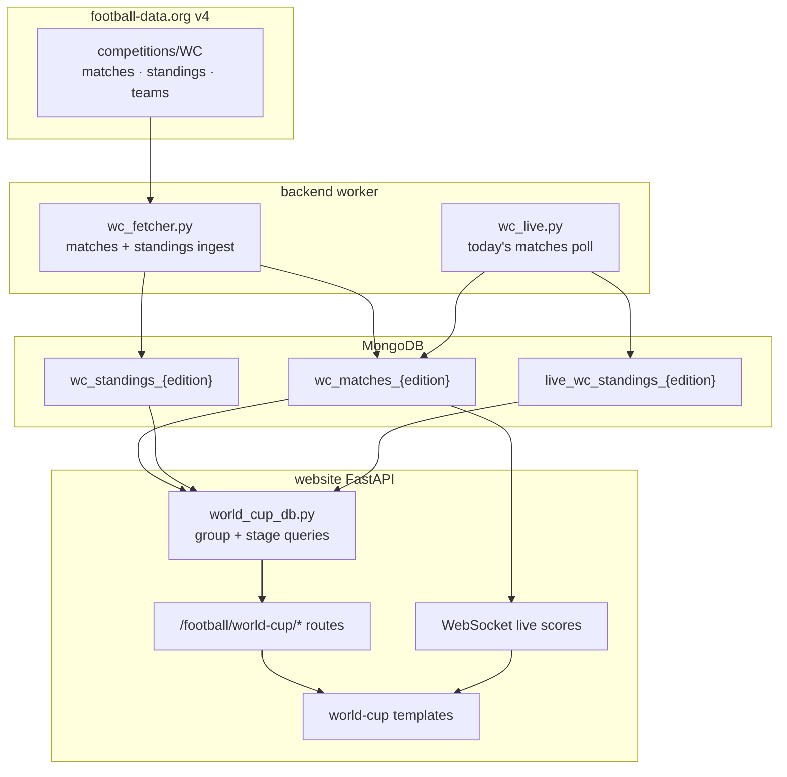

# World Cup Section — Design Proposal

Status: Implemented (2026 edition live — see §12). Historical editions planned (§15).
Date: 2026-05-27 (updated 2026-05-27)
Scope: World Cup area within the existing Football section

**Launch scope:** edition **2026** live via football-data.org. **Next:** one-off import of past editions into Mongo (static, like older PL seasons) and edition-pill switching between them (§15).

## 1. Goal

Add a World Cup section to the Football area of the website, using the same upstream data source as the Premier League (football-data.org) and the same general response shapes already modelled in `website/football/models.py` (`Match`, `Standing`, `Table`, `Team`, `Score`).

The section must cover:

- **Group stage** — one table and fixture list per group.
- **Knockout stage** — round-by-round fixtures with progression through the bracket.
- **Dedicated pages** — one page per group, one page per knockout round.
- **Tournament overview** — a single page that shows the full tournament: all groups in order at the bottom, with knockout rounds stacked above them as the tournament progresses, and the **Final at the top of the page** once that stage exists.

API details are documented in §8, verified against [football-data.org v4](https://docs.football-data.org/general/v4/competition.html) and live calls with the project's existing `X-Auth-Token`. Payload shapes match the existing PL `Match` and `Table` models.

## 2. Relationship to the Existing Football Area

The Premier League implementation is the template. Reuse:


| Existing piece        | Path / pattern                                           | World Cup reuse                                                                 |
| --------------------- | -------------------------------------------------------- | ------------------------------------------------------------------------------- |
| Base layout + sidebar | `templates/football/football-base.html`                  | Extend; add WC nav block                                                        |
| Match cards           | `score-widget` in `football.css`                         | Shared `world_cup_match_card` macro (`_match_card.html`); **no H2H pill** (see §13 #10) |
| League table grid     | `table.css`                                              | Per-group tables via `_group_table.html` / `_overview_standings.html`; no PL zone styling |
| Router module         | `website/football/world_cup_router.py`                   | Included from `router.py` at `/football/world-cup`                              |
| Team link hover       | `football.css` (`a.team-name`)                           | Animated underline on hover/focus — shared with PL match cards and tables       |
| Pydantic models       | `website/football/models.py`                             | Reuse `Match` (`stage`, `group` already present), `Standing`, `Table`           |
| Mongo upsert pattern  | `backend/src/football/football.py`                       | Parallel WC fetcher + collections                                               |
| Live scores WebSocket | `WS /football/ws/`                                       | Extend with `competition: "world-cup"` param (same endpoint)                    |
| Timezone display      | `football_utils.update_match_timezone()`                 | Unchanged                                                                       |


Do **not** reuse without adaptation:


| PL-specific piece                                  | Why                                                                  |
| -------------------------------------------------- | -------------------------------------------------------------------- |
| `pl_matches_{season}` / `pl_table_{season}` naming | WC uses tournament **edition** not Aug–May season                    |
| `ShortName` enum (club names)                      | National teams need a separate display-name strategy                 |
| UCL / UEL / relegation table zones                 | Not applicable to group or knockout tables                           |
| Season picker (`2025_2026`)                        | Replace with **edition** picker (`2026` at launch; extensible later) |
| Football PWA default route                         | Temporarily default to WC overview; revert to PL after tournament    |
| `live_pl_table` flat 20-team logic                 | Group-stage live tables are per-group                                |


## 3. Tournament Model

### 3.1 Edition (not season)

A World Cup edition is identified by the **calendar year of the tournament** (e.g. `2026`), not `YYYY_YYYY`.


| Concept              | PL convention          | WC convention                                                   |
| -------------------- | ---------------------- | --------------------------------------------------------------- |
| Edition key          | `2025_2026`            | `2026`                                                          |
| Match collection     | `pl_matches_2025_2026` | `wc_matches_2026`                                               |
| Standings collection | `pl_table_2026`        | `wc_standings_2026`                                             |
| Live standings       | `live_pl_table`        | `live_wc_standings_2026` (per edition)                          |
| Date window          | Aug–May                | Tournament window only (e.g. 2026: `2026-06-11` → `2026-07-19`) |
| API `season` filter  | N/A (uses `YYYY_YYYY`) | Calendar year, e.g. `?season=2026`                              |
| API season `id`      | N/A                    | Internal id per edition (2026 → `2398`)                         |


### 3.2 Stages

Map upstream `Match.stage` / `Standing.stage` values into two UI phases:

**Group phase**


| Stage value (expected) | UI label    |
| ---------------------- | ----------- |
| `GROUP_STAGE`          | Group Stage |


Matches also carry `Match.group` (e.g. `GROUP_A`, `GROUP_B`). Normalise to display labels `Group A`, `Group B`, …

**Knockout phase**

Knockout rounds are ordered for display. Exact round names depend on tournament format (32-team vs 48-team). Define a configurable ordered list per edition:


| Stage value (expected) | Display order (ascending = earliest round) | UI label             |
| ---------------------- | ------------------------------------------ | -------------------- |
| `LAST_32`              | 1                                          | Round of 32          |
| `LAST_16`              | 2                                          | Round of 16          |
| `QUARTER_FINALS`       | 3                                          | Quarter-finals       |
| `SEMI_FINALS`          | 4                                          | Semi-finals          |
| `THIRD_PLACE`          | 5                                          | Third-place play-off |
| `FINAL`                | 6                                          | Final                |


Only rounds that have at least one match in the dataset appear in the UI.

**Verified for FIFA World Cup 2026** (104 matches total):


| Stage            | Matches                                   |
| ---------------- | ----------------------------------------- |
| `GROUP_STAGE`    | 72 (12 groups × 6 matches; matchdays 1–3) |
| `LAST_32`        | 16                                        |
| `LAST_16`        | 8                                         |
| `QUARTER_FINALS` | 4                                         |
| `SEMI_FINALS`    | 2                                         |
| `THIRD_PLACE`    | 1                                         |
| `FINAL`          | 1                                         |


Knockout fixtures have `matchday: null`. The Final may list `homeTeam` / `awayTeam` as `null` until teams are known.

### 3.3 Group standings

The standings subresource returns one `Standing` per group in `Table.standings[]`. For WC 2026 there are **12 entries** (`Group A` … `Group L`), each with four teams.

Each group table uses the same columns as the PL table (Pos, Team, Pld, W, D, L, F, A, GD, Pts) without qualification-zone colouring. Standings use `stage: "ALL"` and `type: "TOTAL"` (not `GROUP_STAGE`).

**Important:** group identifiers differ between resources:


| Resource          | `group` field format | Example          |
| ----------------- | -------------------- | ---------------- |
| Match             | Enum slug            | `GROUP_A`        |
| Standings         | Display string       | `"Group A"`      |
| Match list filter | Enum slug            | `?group=GROUP_A` |


`world_cup_utils.py` must map between slug (`a`), match enum (`GROUP_A`), and standings label (`Group A`).

Tie-breaker and “teams to advance” indicators (e.g. top three qualify for 2026) can be added as static labels per group section, not as dynamic zone CSS.

### 3.4 Edition format — group stage vs knockout-only

Every World Cup edition has a **group stage** except **1934** and **1938**, which were **straight knockout** tournaments (no groups, no group standings). All other editions — including 1930, 1950, and every tournament from 1954 onward — include a group phase (format details vary by year).

Store a per-edition flag in `WC_EDITION_REGISTRY` (or derive from match data: no matches with `stage == GROUP_STAGE` and `group` set):


| Field | Type | Example |
| ----- | ---- | ------- |
| `has_group_stage` | `bool` | `False` for `1934`, `1938`; `True` for all others |
| `group_count` | `int \| null` | `8` for 2022; `null` when `has_group_stage` is false |
| `group_slugs` | `tuple[str, ...]` | `("a", …, "h")` or empty when no group stage |


**1934 / 1938 implications:**

- No `GROUP_STAGE` matches in Mongo; all matches are knockout rounds (map upstream `round` labels to `LAST_16`, `QUARTER_FINALS`, `SEMI_FINALS`, `FINAL`, etc.).
- `wc_standings_{year}` is **empty or omitted** — do not compute group tables.
- Overview page shows **knockout blocks only** (no `─── Group Stage ───` section, no group jump anchors).
- **Groups** sidebar link and `/groups/` routes are **unavailable** for that edition (hide in nav when `has_group_stage` is false; group URLs return 404 or redirect to overview).
- Knockout index, per-round pages, all-matches, and team fixtures work as today — the tournament is entirely knockout.
- Live standings WebSocket (`get_world_cup_standings`) is a no-op when there is no group stage.

**Implementation helpers** (in `world_cup_utils.py` / `world_cup_db.py`):

```python
def edition_has_group_stage(year: str) -> bool:
    return year not in {"1934", "1938"}  # or read from WC_EDITION_REGISTRY

def list_groups_for_edition(edition: str) -> list[str]:
    if not edition_has_group_stage(edition):
        return []
    ...
```

Do not assume group pages exist for every imported edition. The edition pill still switches between 1934/1938 and group-stage tournaments; only the available nav items and overview layout change.

## 4. Page Inventory

All routes live under `/football/world-cup/` (PWA mode: `/world-cup/` with existing `football_root_path` stripping).

### 4.1 Overview — full tournament (`GET /football/world-cup/`)

The flagship page. Vertical layout, **read top-to-bottom as the tournament climax**:

```
┌─────────────────────────────────────┐
│  FINAL                    (top)     │  ← appears when FINAL fixtures exist
├─────────────────────────────────────┤
│  Third-place play-off               │  ← between semi-finals and final
├─────────────────────────────────────┤
│  Semi-finals                        │  ← appears when stage has fixtures
├─────────────────────────────────────┤
│  Quarter-finals                     │
├─────────────────────────────────────┤
│  Round of 16                        │
├─────────────────────────────────────┤
│  Round of 32                        │  ← 48-team editions only
├─────────────────────────────────────┤
│  ─── Group Stage ───                │
│  Group A  (table + compact fixtures)│
│  Group B                            │
│  Group C                            │
│  … in alphabetical order            │
└─────────────────────────────────────┘
```

**Behaviour**

- Knockout sections are rendered in **reverse round order** (Final first, earliest knockout last among knockout blocks).
- A knockout section is **omitted until** the edition has at least one match for that stage (scheduled, live, or finished). As the tournament advances, new sections appear at the top; the Final section is always the uppermost block when it exists.
- Group sections are shown **only when the edition has a group stage** (`has_group_stage` — §3.4). Omitted entirely for **1934** and **1938** (knockout-only overview).
- When groups exist: sections in fixed order A → B → C → …, each with mini standings table and compact fixtures.
- Each knockout block contains:
  - Round heading with link to the dedicated round page.
  - Match cards for that round, grouped by matchday or date.
- Optional: anchor jump menu (like All Matches) — `Final`, `Third-place`, `Semi-finals`, …, and `Group A`, … **only when** the edition has groups.

**Template:** `templates/football/world-cup/overview.html`

### 4.2 Groups index (`GET /football/world-cup/groups/`)

Landing page listing all groups as cards. Each card shows:

- Group name.
- Current top two (or mini table).
- Next fixture or “complete”.

Links through to per-group pages. Can redirect to overview `#group-a` anchors if preferred; keep as a distinct route for sidebar nav clarity.

**Not available** for editions without a group stage (**1934**, **1938** — §3.4): hide the sidebar **Groups** link when `has_group_stage` is false; visiting `/groups/?edition=1934` returns 404 or redirects to the knockout/overview page.

**Template:** `templates/football/world-cup/groups_index.html`

### 4.3 Single group (`GET /football/world-cup/groups/{group}/`)

Example: `/football/world-cup/groups/a/?edition=2026`

**Not available** for **1934** / **1938** (404). Same guard for any `{group}` when the selected edition has no group stage.


| Section   | Content                                                                                                   |
| --------- | --------------------------------------------------------------------------------------------------------- |
| Header    | `Group A — FIFA World Cup 2026` + edition picker                                                          |
| Standings | Full group table (sticky on mobile — see §10.2)                                                           |
| Fixtures  | All group-stage matches for that group, grouped by matchday or date (scrolls beneath the table on mobile) |


`{group}` is a lowercase slug (`a`, `b`, …, `l` for a 12-group tournament). Map to API `GROUP_A`, etc.

Standings via `_group_table.html`; fixtures use `world_cup_match_card` in day groups (same pattern as PL `match_template.html`).

**Template:** `templates/football/world-cup/group.html`

### 4.4 Knockout index (`GET /football/world-cup/knockout/`)

Primary content is a **visual bracket diagram** at the top; a **Rounds** card list below links to per-round pages.

**Bracket diagram** (`_knockout_bracket.html`, data from `build_knockout_bracket_diagram()` in `world_cup_db.py`):

- Horizontally scrollable CSS grid aligned across all knockout rounds (R32 → Final).
- Sticky round headers (synced horizontal scroll via `world_cup_bracket.js`).
- Match slots reuse `world_cup_match_card` — same `score-widget` formatting as elsewhere (country flags, scores, status).
- Connector lines between rounds show winner progression (feed, join, and receive segments per parent match pair).
- **2026 feeder labels:** unseeded knockout slots show mapped labels (e.g. `Winner Group A`, `Runner-up Group B`) from `WC_2026_KNOCKOUT_FIXTURES` in `world_cup_utils.py`, not generic `TBD`.
- **Unknown teams:** placeholder flag `/images/football/crests/unknown_team.svg`; team names are plain text until a team id is known.
- **Zebra column backgrounds:** alternating subtle brand-tinted bands per round column.
- **Third-place play-off:** rendered in the **Final column**, a few grid rows below the Final card (label above the match card, not a separate panel).
- Fine-grained grid rows (`BRACKET_CARD_GRID_ROWS = 2`) keep Round-of-32 cards stacked tightly with a small gap.

**Rounds list:** cards for each stage that has fixtures (no empty-state message when the list is empty).

**Template:** `templates/football/world-cup/knockout_index.html`

### 4.5 Single knockout round (`GET /football/world-cup/knockout/{round}/`)

Example: `/football/world-cup/knockout/quarter-finals/?edition=2026`


| `{round}` slug   | Stage            |
| ---------------- | ---------------- |
| `round-of-32`    | `LAST_32`        |
| `round-of-16`    | `LAST_16`        |
| `quarter-finals` | `QUARTER_FINALS` |
| `semi-finals`    | `SEMI_FINALS`    |
| `third-place`    | `THIRD_PLACE`    |
| `final`          | `FINAL`          |


Shows all matches for that stage, grouped by date. Uses `world_cup_match_card` with winner highlight on finished knockout matches.

**Template:** `templates/football/world-cup/knockout_round.html`

### 4.6 All matches (`GET /football/world-cup/matches/`)

Season-long fixture list equivalent to `/football/matches/all/`. All WC matches for the edition in chronological order, with jump menu by stage or date.

Useful when the overview page is long.

**Template:** `templates/football/world-cup/all_matches.html`

### 4.7 Team fixtures (`GET /football/world-cup/teams/{team_id}/`)

Optional but consistent with PL `/football/matches/team/{team_id}/`. All matches for one national team across group and knockout stages.

**Template:** `templates/football/world-cup/team_fixtures.html`

### 4.8 Push notification subscriptions (`GET /football/world-cup/subscriptions/`)

National-team notification preferences for the current edition. Reuses PL `subscriptions.js` and storage; WC team selections merge with existing PL selections.

**Template:** `templates/football/world-cup/subscriptions.html`

## 5. Navigation

### 5.1 Football sidebar

Restructure the football sidebar under a collapsible **Competitions** heading with two blocks:

```
Competitions ▾
  Premier League
    Live League Table
    Latest Matches
    …

  World Cup                    ← only shown when a wc_matches_* collection exists
    Tournament Overview        → /football/world-cup/
    Groups                     → /football/world-cup/groups/  (hidden when edition has no group stage — §3.4)
    Knockout                   → /football/world-cup/knockout/
    All Matches                → /football/world-cup/matches/
    Notifications              → /football/world-cup/subscriptions/
```

The World Cup block is **hidden until** at least one `wc_matches_{edition}` collection exists in Mongo (see §13 #5).

When viewing a group or knockout sub-page, highlight the parent nav item and show secondary links (Group A … Group L, or round links) in the page header or a horizontal sub-nav — not duplicated in the global sidebar.

### 5.2 Edition picker

Mirror the **Premier League season pill** pattern:


| | Premier League | World Cup |
| - | -------------- | --------- |
| Pill label | `2024-25` (short season) | `2026` (edition year) |
| Query param | `?season=2025_2026` | `?edition=2026` |
| Available values | Seasons with `pl_matches_{season}` in Mongo | Editions with `wc_matches_{edition}` in Mongo |
| Default | Current season (`infer_current_season_key`) | Current edition (`infer_current_wc_edition`) |
| Live updates | Current season only (`is_current_season`) | Current edition only (`is_current_edition`) |
| Past values | Static DB snapshot — no API re-fetch | Static DB snapshot — one-off import (§15) |


**Behaviour (already implemented for 2026; extends automatically when more collections exist):**

- Button in page header shows the selected edition year (e.g. `2026`).
- Popup lists editions discovered from `wc_matches_{edition}` collections (newest first).
- Default when `?edition=` is missing or invalid: current edition (`WC_CURRENT_EDITION` / `infer_current_wc_edition()`).
- When only one edition exists in Mongo, show the year as a static pill (no popup) — same as a single-season PL view.
- Applying a new edition keeps the user on the same page type via per-route `edition_switch_path`.

### 5.3 PWA default route (temporary)

During the 2026 tournament, configure the Football PWA (`football.schleising.net` / `manifest.webmanifest`) so its `start_url` resolves to `/football/world-cup/` (overview), not the PL table.

- **When:** from WC launch until the tournament ends (after the Final).
- **Revert:** restore PL table as the PWA default once the tournament is over (manual config change).
- **Scope:** Football PWA only — no separate WC manifest (see §13 #4).

### 5.4 Cross-linking


| From                      | To                                         |
| ------------------------- | ------------------------------------------ |
| Group table team name     | `/football/world-cup/teams/{id}/?edition=` |
| Match card team name      | `/football/world-cup/teams/{id}/?edition=` (animated underline on hover — `a.team-name` in `football.css`) |
| Overview knockout heading | Dedicated round page                       |
| Overview group heading    | Single group page                          |
| Bracket round header      | Dedicated round page                       |


## 6. Architecture




### 6.1 Suggested new modules


| File                                          | Responsibility                                                          |
| --------------------------------------------- | ----------------------------------------------------------------------- |
| `website/football/world_cup_router.py`        | All `/football/world-cup/*` HTML routes + subscription API              |
| `website/football/world_cup_db.py`            | Queries, overview assembly, `build_knockout_bracket_diagram()`          |
| `website/football/world_cup_utils.py`         | Stage/group mapping, knockout ordering, 2026 fixture labels, flag URLs   |
| `backend/src/football/world_cup.py`           | Scheduled fetch + live poll for WC competition                          |
| `website/templates/football/world-cup/_match_card.html` | Shared `world_cup_match_card` macro for all WC fixture lists    |
| `website/templates/football/world-cup/_team_link.html`  | Team badge + link/display helpers (`world_cup_team_badge`, etc.) |
| `website/templates/football/world-cup/_knockout_bracket.html` | Bracket grid macro                                      |
| `website/templates/football/world-cup/*.html` | Page templates + partials (`_group_table.html`, `_overview_standings.html`, …) |
| `website/static/css/football/world-cup.css`   | Overview layout, group pages, bracket grid, zebra round columns         |
| `website/static/js/football/world_cup_bracket.js` | Sticky header ↔ body horizontal scroll sync                      |
| `website/static/js/football/world_cup_live.js`    | Live score updates for `score-widget` elements by `match.id`     |

Router: `world_cup_router` included from `website/football/router.py` with `prefix="/world-cup"`.

### 6.2 Overview page assembly (server-side)

Pseudocode for the main layout logic:

```python
def build_overview_context(edition: str) -> dict:
    group_blocks = []
    if edition_has_group_stage(edition):
        groups = list_groups_for_edition(edition)      # ordered A..L; [] for 1934/1938
        group_blocks = [
            {
                "slug": group.slug,
                "label": group.label,
                "standings": get_group_standings(edition, group),
                "matches": get_group_matches(edition, group),
            }
            for group in groups
        ]

    knockout_rounds = get_knockout_rounds_for_edition(edition)  # ordered earliest→latest
    knockout_blocks = []
    for round in reversed(knockout_rounds):                     # render latest first
        matches = get_matches_by_stage(edition, round.stage)
        if matches:
            knockout_blocks.append({
                "slug": round.slug,
                "label": round.label,
                "matches": matches,
            })

    return {
        "knockout_blocks": knockout_blocks,   # Final first
        "group_blocks": group_blocks,         # A..L at bottom
        "edition": edition,
    }
```

## 7. Data Shapes (verified — same models as PL)

Reuse existing Pydantic models without schema changes for v1. JSON field names use camelCase from the API (`utcDate`, `homeTeam`, `fullTime`, etc.); models already alias these.

### 7.1 Match (existing)

Relevant fields (2026 group-stage example: Mexico vs South Africa, id `537327`):

```python
class Match:
    id: int
    utc_date: datetime
    status: MatchStatus   # SCHEDULED | TIMED | IN_PLAY | PAUSED | EXTRA_TIME |
                          # PENALTY_SHOOTOUT | FINISHED | POSTPONED | CANCELLED | AWARDED
    stage: str            # GROUP_STAGE | LAST_32 | LAST_16 | QUARTER_FINALS |
                          # SEMI_FINALS | THIRD_PLACE | FINAL
    group: str | None     # GROUP_A … GROUP_L (group stage only; null in knockout)
    matchday: int | None  # 1–3 in group stage; null in knockout
    home_team: Team       # may be null in unseeded knockout slots
    away_team: Team
    score: Score          # duration: REGULAR | EXTRA_TIME | PENALTY_SHOOTOUT
```

### 7.2 Standings (existing)

```python
class Standing:
    stage: str            # "ALL" for WC group tables (not GROUP_STAGE)
    type: str             # "TOTAL"
    group: str | None     # "Group A" … "Group L" (display string, not GROUP_A)
    table: list[TableItem]
```

`Table.standings` contains one `Standing` per group. The PL code currently reads `standings[0]` only; WC must index by `group`. Snapshot standings to Mongo after the tournament — football-data.org removes deducted-point adjustments from past seasons and documents that past standings may not remain available indefinitely.

### 7.3 Team badges (country flags)

National teams use football-data.org team IDs in match data (`Team.type`: `MEN_NATIONAL`). **Visual badges are country flags, not football association crests** — distinct from PL club crests.

**Flag strategy:** cache locally under `/images/football/crests/wc/` as **SVG** files (resolved by `resolve_world_cup_crest_url()`). Prefer **SVG** for sharp rendering at badge size in match cards and tables.

**Source:** [Wikimedia Commons](https://commons.wikimedia.org/) flag images — not football-data.org crest URLs. Maintain a checked-in **country → flag file** registry (e.g. `wc_flag_registry.json`) mapping:

- football-data.org `team.id` and/or canonical country name (e.g. `Argentina`, `West Germany`)
- Wikimedia Commons file name or stable Commons URL for the correct historical flag where relevant
- local filename under `/images/football/crests/wc/` (e.g. `{team_id}.svg` or `{country_slug}.svg`)

Download flags once via an operator script (`scripts/fetch_wc_flags.py` or as part of the historical import). Re-run only when adding a new nation or correcting a mapping — not on every live match sync.

**SVG preference:** use Commons `.svg` flag files where available (most national flags exist as vector assets). Fall back to PNG from Commons only when no suitable SVG exists.

**Historical nations:** editions before 2026 may include teams that no longer exist under the same name (e.g. `West Germany`, `Soviet Union`, `FR Yugoslavia`). The registry must map these to the **flag that was correct for that tournament**, using historical flag files on Wikimedia Commons where applicable.

**Placeholder:** unseeded or unknown teams use `/images/football/crests/unknown_team.svg` via `Team.world_cup_local_crest`.

**Match cards:** every team row shows a flag badge (or placeholder). Badges are always rendered; there is no conditional hide when `team.id` is `null`.

**Attribution:** Wikimedia content may require attribution depending on licence per file. Add a note on the Football area or site credits page (e.g. “National flags from [Wikimedia Commons](https://commons.wikimedia.org/)”).

Do not extend the club `ShortName` enum. Display via `Team.display_name` (falls back to `name` / `tla` / `TBD`).

## 8. API & Ingestion

Source: [football-data.org API v4](https://docs.football-data.org/general/v4/competition.html). Base URL: `https://api.football-data.org/v4/`.

Verified live with the project token (May 2026). See also [lookup tables](https://docs.football-data.org/general/v4/lookup_tables.html) for enum values.

### 8.1 Competition identifier


| Field          | Value                                                                                |
| -------------- | ------------------------------------------------------------------------------------ |
| Competition id | `2000`                                                                               |
| League code    | `WC`                                                                                 |
| Name           | `FIFA World Cup`                                                                     |
| Type           | `CUP`                                                                                |
| Area           | World (`code: INT`)                                                                  |
| Emblem         | `https://crests.football-data.org/wm26.png` (edition-specific)                       |
| Free tier      | Yes — listed on [football-data.org/coverage](https://www.football-data.org/coverage) |


**Available editions** (from `GET /competitions/WC` → `seasons[]`):


| Edition        | Season id | Start      | End        | Winner (if known) |
| -------------- | --------- | ---------- | ---------- | ----------------- |
| 2026 (current) | 2398      | 2026-06-11 | 2026-07-19 | —                 |
| 2022           | 1382      | 2022-11-20 | 2022-12-18 | Argentina         |
| 2018           | 1         | 2018-06-14 | 2018-07-15 | France            |
| 2014           | 464       | 2014-06-11 | 2014-07-12 | Germany           |
| …              | …         | …          | …          | back to 1960      |


### 8.2 Endpoints

All requests require `X-Auth-Token` (same token as PL: `backend/src/secrets/football_api_token.txt`).


| Purpose                   | Method | Endpoint                                                             | Notes                                                             |
| ------------------------- | ------ | -------------------------------------------------------------------- | ----------------------------------------------------------------- |
| Competition metadata      | GET    | `/competitions/WC`                                                   | Edition list, current season, winners                             |
| All matches               | GET    | `/competitions/WC/matches`                                           | Defaults to current edition (`season=2026`)                       |
| Matches (edition)         | GET    | `/competitions/WC/matches?season={year}`                             | Full tournament fixture list                                      |
| Matches (date range)      | GET    | `/competitions/WC/matches?dateFrom={yyyy-MM-dd}&dateTo={yyyy-MM-dd}` | Same pattern as PL ingest                                         |
| Matches (group)           | GET    | `/competitions/WC/matches?group=GROUP_A`                             | Combine with `stage=GROUP_STAGE`                                  |
| Matches (knockout round)  | GET    | `/competitions/WC/matches?stage=QUARTER_FINALS`                      | Stage enum filter                                                 |
| Matches (matchday)        | GET    | `/competitions/WC/matches?matchday=2`                                | Group stage only                                                  |
| Group standings           | GET    | `/competitions/WC/standings`                                         | Returns all groups in one response                                |
| Standings (edition)       | GET    | `/competitions/WC/standings?season={year}`                           | Optional `date={yyyy-MM-dd}` filter                               |
| Teams                     | GET    | `/competitions/WC/teams`                                             | 48 teams for 2026; team metadata only — **flags** come from Wikimedia (§7.3), not API crest URLs |
| Teams (edition)           | GET    | `/competitions/WC/teams?season={year}`                               |                                                                   |
| Single match (live)       | GET    | `/matches/{id}`                                                      | For polling individual live scores                                |
| Cross-competition matches | GET    | `/matches?competitions=WC&dateFrom=…&dateTo=…`                       | Alternative to competition subresource                            |


**Example calls** (mirror PL style in `backend/src/football/football.py`):

```
GET https://api.football-data.org/v4/competitions/WC/matches?dateFrom=2026-06-11&dateTo=2026-07-19
GET https://api.football-data.org/v4/competitions/WC/standings
GET https://api.football-data.org/v4/competitions/WC/matches?stage=GROUP_STAGE&group=GROUP_A
GET https://api.football-data.org/v4/matches/537327
```

### 8.3 Match filters (competition subresource)


| Filter                | Format       | Example            |
| --------------------- | ------------ | ------------------ |
| `season`              | 4-digit year | `?season=2026`     |
| `stage`               | Stage enum   | `?stage=LAST_16`   |
| `group`               | Group enum   | `?group=GROUP_F`   |
| `matchday`            | Integer      | `?matchday=1`      |
| `status`              | Status enum  | `?status=FINISHED` |
| `dateFrom` / `dateTo` | `yyyy-MM-dd` | Inclusive range    |
| `limit` / `offset`    | 1–500        | Pagination         |


**Stage enum** (full list): `FINAL` | `THIRD_PLACE` | `SEMI_FINALS` | `QUARTER_FINALS` | `LAST_16` | `LAST_32` | `LAST_64` | `ROUND_4` | `ROUND_3` | `ROUND_2` | `ROUND_1` | `GROUP_STAGE` | … (see [lookup tables](https://docs.football-data.org/general/v4/lookup_tables.html))

**Group enum**: `GROUP_A` | `GROUP_B` | … | `GROUP_L` (12 groups supported)

### 8.4 Standings behaviour

Official docs state standings return **404 for `CUP` and `PLAYOFFS` types** and return per-group lists only for `LEAGUE_CUP`. In practice:


| Competition | `type` | `/standings` result (verified)     |
| ----------- | ------ | ---------------------------------- |
| WC 2026     | `CUP`  | **200** — 12 group tables returned |
| EC 2024     | `CUP`  | **404**                            |


Treat WC standings as **available for the running edition** but implement a **fallback** to compute group tables from finished `GROUP_STAGE` matches if the endpoint returns 404 (useful for other tournaments or plan changes).

Standings response shape matches PL (`Table` model). Each standing entry:

```json
{
  "stage": "ALL",
  "type": "TOTAL",
  "group": "Group A",
  "table": [{ "position": 1, "team": { ... }, "playedGames": 0, "points": 0, ... }]
}
```

### 8.5 Subscription and rate limits

Verified with the project token:


| Request                                      | Result                                            |
| -------------------------------------------- | ------------------------------------------------- |
| `/competitions/WC`                           | 200                                               |
| `/competitions/WC/matches` (current edition) | 200 — 104 matches                                 |
| `/competitions/WC/standings`                 | 200 — 12 groups                                   |
| `/competitions/WC/teams`                     | 200 — 48 teams                                    |
| `/competitions/WC/matches?season=2022`       | **403** — past edition restricted on current plan |
| `/competitions/EC/standings?season=2024`     | **404**                                           |


Response headers to monitor: `X-RequestsAvailable`, `X-RequestCounter-Reset`, `X-API-Version` (v4).

**Implication:** football-data.org is used for the **current edition only** (live ingest). Past editions return 403 and are **not** fetched from this API — they are loaded once from an external dataset into Mongo and never updated (§15).

### 8.6 Ingestion schedule

**Current edition only** — mirror the PL worker in `backend/src/football/football.py`. Past editions are not synced; see §15.


| Job                      | Frequency                            | Endpoint(s)                                              | Notes                                                        |
| ------------------------ | ------------------------------------ | -------------------------------------------------------- | ------------------------------------------------------------ |
| Full tournament sync     | Daily + on deploy                    | `/competitions/WC/matches?dateFrom={start}&dateTo={end}` | Current edition only; use season `startDate` / `endDate`     |
| Group standings sync     | Daily; more often during group stage | `/competitions/WC/standings`                             | Current edition only; upsert all groups                       |
| Teams sync               | Weekly / on deploy                   | `/competitions/WC/teams`                                 | Current edition only; team ids/names — no flag download from API |
| Live match poll          | Every 4s while any match is in play  | Re-fetch today's matches or `/matches/{id}`              | Current edition only                                         |
| Flag cache               | On demand (operator script)          | Wikimedia Commons                                        | Download missing SVG flags per `wc_flag_registry` (§7.3)     |
| Standings refresh (live) | After live group matches             | `/competitions/WC/standings`                             | Current edition only, during group stage                     |


Suggested tournament window for 2026 ingest: `2026-06-11` to `2026-07-19`.

When 2026 ends, stop the live worker for that edition; the final Mongo snapshot becomes static (same as a finished PL season). The next current edition (`2030`, etc.) picks up live ingest against football-data.org.

### 8.7 Auth and attribution

- **Auth:** `X-Auth-Token: {token}` — reuse existing secret file.
- **Optional headers:** `X-Unfold-Goals`, `X-Unfold-Bookings`, etc. (see [lookup tables](https://docs.football-data.org/general/v4/lookup_tables.html)) — not required for v1.
- **Attribution:** Keep footer: “Data sourced from [football-data.org](https://www.football-data.org/)”.

## 9. Live Updates

Use the **existing** `/football/ws/` endpoint extended with a competition parameter (see §13 #6). No separate WC WebSocket.

### 9.1 Match scores

Extend the existing WebSocket pattern:

```javascript
{ "messageType": "get_scores", "competition": "world-cup", "edition": "2026" }
```

Server returns `MatchList` filtered to the edition’s live/recent matches. Client updates `score-widget` elements by `match.id`, reusing `football.js` where possible.

### 9.2 Group standings

During group stage, live standings updates are **per group**:

- WebSocket message: `{ "messageType": "get_world_cup_standings", "edition": "2026" }`
- Response: map of `group → table rows`
- Overview page updates each mini group table independently.

Knockout rounds do not need live table updates (no standings table).

## 10. UI Notes

### 10.1 Overview stacking

- Use a clear visual separator between knockout and group phases (`─── Group Stage ───`).
- Knockout blocks use `world_cup_match_card` (same `score-widget` shell as PL; no H2H pill).
- Overview knockout sections only list matches where **both teams are confirmed** (`knockout_match_has_confirmed_teams`); the bracket diagram shows all scheduled slots including feeder labels.
- Sticky jump nav at top on long pages: `Final · Third-place · Semi-finals · … · Group A · …`

### 10.2 Group pages

- Standings table full width.
- Fixtures below, grouped by `matchday` (World Cup group games are labelled Matchday 1–3).
- **Mobile layout:** pin the standings table at the top (four rows — minimal height); fixture list scrolls independently beneath it. On desktop, table and fixtures can share a single scroll context.

### 10.3 Knockout pages

- No standings table on per-round pages.
- Emphasise winner progression: finished matches highlight the advancing team (`world-cup-team-winner` — brand colour on team name, not bold).
- Knockout index bracket: see §4.4.

### 10.4 Match cards and team links

- **Component:** `world_cup_match_card` in `_match_card.html` — used on overview, groups, knockout (round pages and bracket), all matches, and team fixtures.
- **Formatting:** matches PL `score-widget` layout (normal-weight team names, country flag on every row).
- **Clickable teams:** `a.team-name` links (WC → team fixtures page; PL → club page). Non-clickable placeholders use `<span class="team-name">` (feeder labels, TBD).
- **Hover:** animated left-to-right underline over 250ms on `a.team-name` — defined in `football.css`, shared across PL and WC match cards and tables.

### 10.5 CSS

- `world-cup.css` loaded from `world-cup-base.html` (extends `football-base.html`).
- Reuse `table.css` for all group/standings tables.
- PL zone classes (`table-zone-ucl`, etc.) are not applied.
- Bracket-specific layout vars: `--world-cup-bracket-row-size`, `--world-cup-bracket-round-width`, zebra `--0` / `--1` round bands.

### 10.6 Responsive

- Overview group blocks: two columns on wide screens, one on narrow.
- Knockout match cards: same responsive grid as `football-grid`.

## 11. Route Summary


| Method | Route                                   | Page                                               |
| ------ | --------------------------------------- | -------------------------------------------------- |
| GET    | `/football/world-cup/`                  | Tournament overview                                |
| GET    | `/football/world-cup/groups/`           | Groups index                                       |
| GET    | `/football/world-cup/groups/{group}/`   | Single group                                       |
| GET    | `/football/world-cup/knockout/`         | Knockout index                                     |
| GET    | `/football/world-cup/knockout/{round}/` | Single knockout round                              |
| GET    | `/football/world-cup/matches/`          | All matches                                        |
| GET    | `/football/world-cup/teams/{team_id}/`  | Team fixtures                                      |
| GET    | `/football/world-cup/subscriptions/`    | National-team push notification preferences        |
| PUT    | `/football/world-cup/subscriptions/`    | Save notification preferences (API)                |
| WS     | `/football/ws/` (extended)              | Live scores                                        |
| GET    | `/football/world-cup/api/`              | Optional simplified JSON (mirror `/football/api/`) |


Query param on all HTML routes: `?edition={year}` (default = current edition via `infer_current_wc_edition()`).

## 12. Implementation Phases

### Phase 1 — Data + group stage (read-only)

- [x] WC ingestion worker for edition **2026** → `wc_matches_2026` / `wc_standings_2026`
- [x] National team badges under `/images/football/crests/wc/` (migrate to Wikimedia SVG flags per §7.3)
- [x] `world_cup_db.py` query helpers
- [x] Edition picker (single edition at launch)
- [x] Groups index + single group pages (sticky table mobile layout)
- [x] Sidebar: collapsible Competitions heading; WC block gated on `wc_matches_`* presence

### Phase 2 — Overview + knockout pages

- [x] Overview page with group blocks (bottom) and knockout stacking (top, including third-place)
- [x] Knockout index + per-round pages
- [x] Knockout visibility rules (show round only when fixtures exist)
- [x] PWA `start_url` → `/football/world-cup/` (temporary — see §5.3)

### Phase 3 — Live + polish

- [x] Extend `/football/ws/` with `competition: "world-cup"` for live scores
- [x] Live group standings on overview and group pages (`get_world_cup_standings` message)
- [x] All matches + team fixture pages

### Phase 4 — Optional enhancements

- [x] Visual bracket diagram on knockout index (connectors, feeder labels, zebra columns, tight R32 stacking, third-place in Final column)
- [x] Push notifications for selected national teams (`/football/world-cup/subscriptions/`)

### Phase 5 — Historical editions (static backfill)

See §15. Summary:

- [ ] `WC_EDITION_REGISTRY` including `has_group_stage` (§3.4)
- [ ] `wc_flag_registry` + Wikimedia SVG flag fetch (§7.3); migrate current 2026 badges off API crests
- [ ] One-off import script: external dataset → `wc_matches_{year}` / `wc_standings_{year}` (standings step skipped for 1934/1938)
- [ ] Pilot editions: **2022**, **2018** (then earlier tournaments as datasets allow)
- [ ] Edition pill lists all imported years; live ingest + WebSocket remain **current edition only**

## 13. Decisions


| #   | Decision                | Resolution                                                                                                         | Detailed in                   |
| --- | ----------------------- | ------------------------------------------------------------------------------------------------------------------ | ----------------------------- |
| 1   | Current vs past editions | **Current** (`2026`) live via football-data.org; **past** editions one-off static import (§15) — same model as PL seasons | §5.2, §8.5, §8.6, §15 |
| 2   | Tournament format       | Per-edition config; **1934** and **1938** knockout-only (no groups nav/standings); all other editions have a group stage — §3.4 | §3.2, §3.4, §4.1, §4.2        |
| 3   | Third-place on overview | Yes — between semi-finals and final in the knockout stack                                                          | §4.1, §10.1                   |
| 4   | PWA                     | No separate manifest; temporarily set Football PWA `start_url` to WC overview; revert to PL after tournament       | §5.3, §12 Phase 2             |
| 5   | WC sidebar visibility   | Show World Cup nav when any `wc_matches_{edition}` collection exists                                               | §5.1                          |
| 6   | Live updates transport  | Extend existing `/football/ws/` with `competition` param                                                           | §9                            |
| 7   | Sidebar structure       | Collapsible **Competitions** heading grouping PL and WC                                                            | §5.1                          |
| 8   | National team badges    | **Country flags** — SVG from Wikimedia Commons, local cache at `/images/football/crests/wc/`                       | §7.3, §8.6                    |
| 9   | Group page mobile UX    | Sticky standings table; scrollable fixtures beneath                                                                | §4.3, §10.2                   |
| 10  | Head-to-head            | **Out of scope** — single-tournament data only; no H2H page or match-card pill                                     | §2, §5.4                      |
| 11  | WC match card           | Dedicated `world_cup_match_card` macro — PL `score-widget` format, shared team-link hover                          | §4.4, §10.4                   |
| 12  | Bracket feeder labels   | **2026:** static `WC_2026_KNOCKOUT_FIXTURES` map for R32+ slots; `bracket_team_label()` at render time             | §4.4                          |
| 13  | Third-place on bracket  | In Final column below Final match, not a separate footer block                                                     | §4.4                          |


## 15. Historical Editions — Static Backfill

### 15.1 Goal

Load **past World Cups** into Mongo as **immutable snapshots**, exactly like older Premier League seasons: the website reads from `wc_matches_{year}` / `wc_standings_{year}` and never calls an external API for those years again.

The **current competition** (`2026` today) stays **live** via football-data.org (§8.6). When the tournament ends, that edition’s collections become static too — same as a completed PL season.

The **edition pill** (§5.2) switches between years already in Mongo. No UI redesign required: `get_available_wc_editions()` discovers collections; `show_edition_selector` enables the popup when more than one exists; `is_current_edition` gates live features.

### 15.2 PL parallel


| | Premier League | World Cup |
| - | -------------- | --------- |
| Live upstream | football-data.org | football-data.org (current edition only) |
| Live collections | `pl_matches_{season}`, `pl_table_{season}`, `live_pl_table` | `wc_matches_{year}`, `wc_standings_{year}`, `live_wc_standings_{year}` |
| Historical load | Ingested while season ran; now frozen in Mongo | **One-off import** from external dataset (below) |
| Historical API calls | None | None |
| Picker | Season pill | Edition pill |
| Default selection | Current season | Current edition |

### 15.3 Recommended source: [openfootball/worldcup.json](https://github.com/openfootball/worldcup.json)

**Why this source**

- **Public domain** (stated in repo) — suitable for permanent storage on the site.
- **No API key** — download JSON once per edition from GitHub raw URLs.
- **Complete results** for recent tournaments — e.g. [2022](https://raw.githubusercontent.com/openfootball/worldcup.json/master/2022/worldcup.json) and [2018](https://raw.githubusercontent.com/openfootball/worldcup.json/master/2018/worldcup.json) include group stage and knockout scores.
- **Same site, same models** — import normalises into existing `Match` / `Standing` documents; pages and the edition pill work unchanged.

**Example fetch (one-off per edition):**

```
https://raw.githubusercontent.com/openfootball/worldcup.json/master/2022/worldcup.json
https://raw.githubusercontent.com/openfootball/worldcup.json/master/2018/worldcup.json
```

**openfootball match shape:** `team1`, `team2`, `date`, `time`, `round`, `group`, `score` (`ft`, `ht`, `et`, `p`), `ground`. Map `round` values (`Matchday 1`, `Round of 16`, `Final`, …) to internal `stage` / `matchday` enums. Derive group standings from finished group-stage matches (openfootball does not ship standings tables).

**Older tournaments (pre-2018):** Source datasets live in [openfootball/worldcup](https://github.com/openfootball/worldcup) (football.txt format) and can be converted to JSON with the repo’s `fbtxt2json` tool, or supplemented from [jfjelstul/worldcup](https://github.com/jfjelstul/worldcup) (`data-json/`, 1930–2022) if an edition is missing from worldcup.json. Import v1 can target **1998–2022** (32-team era) first; earlier editions need per-edition config (§3.4). Remember **1934** and **1938** have no group field on matches — import as knockout-only.

**Not used for history:** football-data.org `?season={year}` (403 on current plan — §8.5).

### 15.4 One-off import pipeline

Single operator-run script (not a scheduled job):


| Step | Action |
| ---- | ------ |
| 1 | Download edition JSON (pin a commit SHA for reproducibility) |
| 2 | Map country names → `Team` records (football-data.org team ids where available; resolve flag SVG via `wc_flag_registry` — §7.3) |
| 3 | Assign stable `match.id` per edition (synthetic int; consistent across re-runs of the same import) |
| 4 | Upsert all matches → `wc_matches_{year}` |
| 5 | If `has_group_stage` (§3.4): compute group standings → `wc_standings_{year}`; else skip (1934, 1938) |
| 6 | Verify match counts and spot-check Final score; **do not schedule re-fetch** |


**Suggested module:** `scripts/import_wc_historical_edition.py --year 2022` (or under `backend/src/football/`).

Idempotent upsert so the script can be re-run safely while developing; once deployed to production, treat the collection as read-only.

**Flags:** Historical teams use the same Wikimedia-sourced flag cache as 2026. When the import encounters a new country name, add a Commons mapping and run the flag fetch script — including historical nations (e.g. `West Germany`).

### 15.5 Runtime behaviour after import


| Edition | Data source | Live WebSocket | Standings live | Subscriptions |
| ------- | ----------- | -------------- | -------------- | ------------- |
| Current (`2026`) | football-data.org worker | Yes | Yes (group stage) | Yes |
| Historical (e.g. `2022`) | Mongo only | No | No | No |


`enable_live_updates` is already `False` when `selected_edition != current_edition` (`world_cup_router.py`).

### 15.6 Implementation checklist

1. `WC_EDITION_REGISTRY` with `has_group_stage` per year (`False` for 1934, 1938).
2. `wc_flag_registry` — country name / team id → Wikimedia Commons SVG; flag fetch script.
3. openfootball → `Match` normaliser (stage, score, status=`FINISHED` for played games).
4. Group standings computer — **skip** when `has_group_stage` is false.
5. `edition_has_group_stage()` guards in router, sidebar, overview, and `list_groups_for_edition()`.
6. Import CLI; run for **2022** and **2018**; confirm group-stage pages.
7. Import **1934** or **1938** as knockout-only smoke test (no groups nav, overview without group blocks).
8. Confirm edition pill lists new years and defaults to **2026** on `/football/world-cup/`.
9. Extend to earlier editions as needed.

### 15.7 Acceptance criteria

- [ ] **2022** and **2018** fully browsable from Mongo with no football-data.org calls.
- [ ] **2026** still live via football-data.org; switching to 2022 via the pill shows frozen data.
- [ ] Edition pill behaviour matches the PL season pill (default = current, popup when multiple editions exist).
- [ ] Historical collections are never updated by the live worker.
- [ ] All teams show the correct country flag SVG (including historical nations in past editions).
- [ ] **1934** and **1938**: knockout-only overview, no Groups sidebar link, `/groups/` returns 404; knockout and all-matches work.

## 14. References


| Resource             | Path                                                                                                                         |
| -------------------- | ---------------------------------------------------------------------------------------------------------------------------- |
| WC router            | `website/football/world_cup_router.py`                                                                                       |
| WC DB / bracket      | `website/football/world_cup_db.py`                                                                                           |
| WC utils / fixtures  | `website/football/world_cup_utils.py`                                                                                        |
| Match card macro     | `website/templates/football/world-cup/_match_card.html`                                                                      |
| Bracket partial      | `website/templates/football/world-cup/_knockout_bracket.html`                                                                |
| WC base template     | `website/templates/football/world-cup/world-cup-base.html`                                                                   |
| WC CSS               | `website/static/css/football/world-cup.css`                                                                                  |
| PL router            | `website/football/router.py`                                                                                                 |
| PL models            | `website/football/models.py`                                                                                                 |
| PL ingestion         | `backend/src/football/football.py`                                                                                           |
| Match template (PL)  | `website/templates/football/match_template.html`                                                                               |
| Table template (PL)  | `website/templates/football/table_template.html`                                                                               |
| Football base / nav  | `website/templates/football/football-base.html`                                                                              |
| Team link styles     | `website/static/css/football/football.css` (`a.team-name` hover underline)                                                   |
| Live scores JS       | `website/static/js/football/football.js`                                                                                     |
| WC live JS           | `website/static/js/football/world_cup_live.js`                                                                               |
| Bracket scroll JS    | `website/static/js/football/world_cup_bracket.js`                                                                            |
| Table live JS        | `website/static/js/football/table_live.js`                                                                                   |
| API docs             | [https://docs.football-data.org/general/v4/competition.html](https://docs.football-data.org/general/v4/competition.html)     |
| Lookup tables        | [https://docs.football-data.org/general/v4/lookup_tables.html](https://docs.football-data.org/general/v4/lookup_tables.html) |
| Coverage / free tier | [https://www.football-data.org/coverage](https://www.football-data.org/coverage)                                             |
| Historical WC JSON   | [https://github.com/openfootball/worldcup.json](https://github.com/openfootball/worldcup.json) (one-off static import — §15) |
| Historical WC txt    | [https://github.com/openfootball/worldcup](https://github.com/openfootball/worldcup) (older editions via `fbtxt2json`)       |
| Fjelstul WC DB       | [https://github.com/jfjelstul/worldcup](https://github.com/jfjelstul/worldcup) (`data-json/` — optional gap-fill)             |
| National flags       | [https://commons.wikimedia.org/](https://commons.wikimedia.org/) — SVG country flags for WC badges (§7.3)                    |


---

*Phases 1–4 (§12) are complete for the 2026 live edition. **Next:** Phase 5 — one-off static import of past World Cups (§15); edition pill switches between them like the PL season pill.*