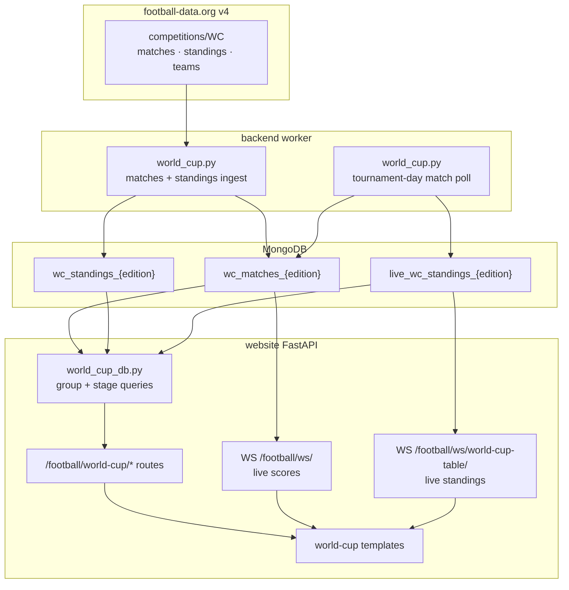

# World Cup Section — Design Proposal

Status: Implemented — **2026** live via football-data.org; **1930–2022** static in Mongo (§15); historic **Summary** page (§4.10); tie-breaker / play-off / replay rules (§16); live standings + tournament timezone (§3.6, §9).
Date: 2026-05-27 (updated 2026-06-21 — live poll scheduling via `schedule_earlier_task`, §9.6)
Scope: World Cup area within the existing Football section

**Launch scope:** edition **2026** live via football-data.org. **Historic editions** **1930–2022** imported from openfootball (§15); edition pill switches between all years in Mongo. **Summary** nav and page for every edition except **2026** (§4.10).

## 1. Goal

Add a World Cup section to the Football area of the website, using the same upstream data source as the Premier League (football-data.org) and the same general response shapes already modelled in `website/football/models.py` (`Match`, `Standing`, `Table`, `Team`, `Score`).

The section must cover:

- **Group stage** — one table and fixture list per group.
- **Knockout stage** — round-by-round fixtures with progression through the bracket.
- **Dedicated pages** — one page per group, one page per knockout round.
- **Tournament overview** — a single page that shows the full tournament: all groups in order at the bottom, with knockout rounds stacked above them as the tournament progresses, and the **Final at the top of the page** once that stage exists.

API details are documented in §8, verified against [football-data.org v4](https://docs.football-data.org/general/v4/competition.html) and live calls with the project's existing `X-Auth-Token`. Payload shapes match the existing PL `Match` and `Table` models.

## 2. Relationship to the Existing Football Area

The Premier League implementation is the template. Reuse:


| Existing piece        | Path / pattern                                           | World Cup reuse                                                                 |
| --------------------- | -------------------------------------------------------- | ------------------------------------------------------------------------------- |
| Base layout + sidebar | `templates/football/football-base.html`                  | Extend; add WC nav block                                                        |
| Match cards           | `score-widget` in `football.css`                         | Shared `world_cup_match_card` macro (`_match_card.html`); **no H2H pill** (see §13 #10) |
| League table grid     | `table.css`                                              | Per-group tables via `_group_table.html` / `_overview_standings.html`; no PL zone styling |
| Router module         | `website/football/world_cup_router.py`                   | Included from `router.py` at `/football/world-cup`                              |
| Team link hover       | `football.css` (`a.team-name`)                           | Animated underline on hover/focus — shared with PL match cards and tables       |
| Pydantic models       | `website/football/models.py`                             | Reuse `Match` (`stage`, `group` already present), `Standing`, `Table`           |
| Mongo upsert pattern  | `backend/src/football/football.py`                       | Parallel WC fetcher + collections                                               |
| Live scores WebSocket | `WS /football/ws/`                                       | Extend with `competition: "world-cup"` param (same endpoint)                    |
| Live standings WebSocket | `WS /football/ws/world-cup-table/`                    | Dedicated endpoint; message `get_world_cup_standings` (§9.2)                    |
| Kickoff display timezone | `football_utils.update_match_timezone()` → `Europe/London` | Unchanged — UK-local times in templates                                         |
| Tournament day timezone | `shared/football/world_cup_tournament.py` (`WC_TOURNAMENT_TZ`) | `America/Los_Angeles` — westernmost host TZ for “today” cutoffs (§3.6)          |


Do **not** reuse without adaptation:


| PL-specific piece                                  | Why                                                                  |
| -------------------------------------------------- | -------------------------------------------------------------------- |
| `pl_matches_{season}` / `pl_table_{season}` naming | WC uses tournament **edition** not Aug–May season                    |
| `ShortName` enum (club names)                      | National teams need a separate display-name strategy                 |
| UCL / UEL / relegation table zones                 | Not applicable to group or knockout tables                           |
| Season picker (`2025_2026`)                        | Replace with **edition** picker (`2026` at launch; extensible later) |
| Football PWA default route                         | Temporarily default to WC overview; revert to PL after tournament    |
| `live_pl_table` flat 20-team logic                 | Group-stage live tables are per-group                                |


## 3. Tournament Model

### 3.1 Edition (not season)

A World Cup edition is identified by the **calendar year of the tournament** (e.g. `2026`), not `YYYY_YYYY`.


| Concept              | PL convention          | WC convention                                                   |
| -------------------- | ---------------------- | --------------------------------------------------------------- |
| Edition key          | `2025_2026`            | `2026`                                                          |
| Match collection     | `pl_matches_2025_2026` | `wc_matches_2026`                                               |
| Standings collection | `pl_table_2026`        | `wc_standings_2026`                                             |
| Live standings       | `live_pl_table`        | `live_wc_standings_2026` (per edition)                          |
| Date window          | Aug–May                | Tournament window only (e.g. 2026: `2026-06-11` → `2026-07-19`) |
| API `season` filter  | N/A (uses `YYYY_YYYY`) | Calendar year, e.g. `?season=2026`                              |
| API season `id`      | N/A                    | Internal id per edition (2026 → `2398`)                         |


### 3.2 Stages

Map upstream `Match.stage` / `Standing.stage` values into two UI phases:

**Group phase**


| Stage value (expected) | UI label    |
| ---------------------- | ----------- |
| `GROUP_STAGE`          | Group Stage |


Matches also carry `Match.group` (e.g. `GROUP_A`, `GROUP_B`). Normalise to display labels `Group A`, `Group B`, …

**Knockout phase**

Knockout rounds are ordered for display. Exact round names depend on tournament format (32-team vs 48-team). Define a configurable ordered list per edition:


| Stage value (expected) | Display order (ascending = earliest round) | UI label             |
| ---------------------- | ------------------------------------------ | -------------------- |
| `LAST_32`              | 1                                          | Round of 32          |
| `LAST_16`              | 2                                          | Round of 16          |
| `QUARTER_FINALS`       | 3                                          | Quarter-finals       |
| `SEMI_FINALS`          | 4                                          | Semi-finals          |
| `THIRD_PLACE`          | 5                                          | Third-place play-off |
| `FINAL`                | 6                                          | Final                |


Only rounds that have at least one match in the dataset appear in the UI.

**Verified for FIFA World Cup 2026** (104 matches total):


| Stage            | Matches                                   |
| ---------------- | ----------------------------------------- |
| `GROUP_STAGE`    | 72 (12 groups × 6 matches; matchdays 1–3) |
| `LAST_32`        | 16                                        |
| `LAST_16`        | 8                                         |
| `QUARTER_FINALS` | 4                                         |
| `SEMI_FINALS`    | 2                                         |
| `THIRD_PLACE`    | 1                                         |
| `FINAL`          | 1                                         |


Knockout fixtures have `matchday: null`. The Final may list `homeTeam` / `awayTeam` as `null` until teams are known.

### 3.3 Group standings

The standings subresource returns one `Standing` per group in `Table.standings[]`. For WC 2026 there are **12 entries** (`Group A` … `Group L`), each with four teams.

Each group table uses the same columns as the PL table (Pos, Team, Pld, W, D, L, F, A, GD, Pts) without qualification-zone colouring. Standings use `stage: "ALL"` and `type: "TOTAL"` (not `GROUP_STAGE`).

**Important:** group identifiers differ between resources:


| Resource          | `group` field format | Example          |
| ----------------- | -------------------- | ---------------- |
| Match             | Enum slug            | `GROUP_A`        |
| Standings         | Display string       | `"Group A"`      |
| Match list filter | Enum slug            | `?group=GROUP_A` |


`world_cup_utils.py` must map between slug (`a`), match enum (`GROUP_A`), and standings label (`Group A`).

Position outcome labels (**Q**, **P**, **C**) and tie-breaker columns (**GD** vs **GA**) are applied at display time — see **§16** for the full per-edition rules.

### 3.4 Edition format — group stage vs knockout-only

Every World Cup edition has a **group stage** except **1934** and **1938**, which were **straight knockout** tournaments (no groups, no group standings). All other editions — including 1930, 1950, and every tournament from 1954 onward — include a group phase (format details vary by year).

Store a per-edition flag in `WC_EDITION_REGISTRY` (or derive from match data: no matches with `stage == GROUP_STAGE` and `group` set):


| Field | Type | Example |
| ----- | ---- | ------- |
| `has_group_stage` | `bool` | `False` for `1934`, `1938`; `True` for all others |
| `group_count` | `int \| null` | `8` for 2022; `null` when `has_group_stage` is false |
| `group_slugs` | `tuple[str, ...]` | `("a", …, "h")` or empty when no group stage |


**1934 / 1938 implications:**

- No `GROUP_STAGE` matches in Mongo; all matches are knockout rounds (map upstream `round` labels to `LAST_16`, `QUARTER_FINALS`, `SEMI_FINALS`, `FINAL`, etc.).
- `wc_standings_{year}` is **empty or omitted** — do not compute group tables.
- Overview page shows **knockout blocks only** (no `─── Group Stage ───` section, no group jump anchors).
- **Groups** sidebar link and `/groups/` routes are **unavailable** for that edition (hide in nav when `has_group_stage` is false; group URLs redirect to overview — §5.5).
- Knockout index, per-round pages, all-matches, and team fixtures work as today — the tournament is entirely knockout.
- Live standings WebSocket (`get_world_cup_standings`) is a no-op when there is no group stage.

**Implementation helpers** (in `world_cup_utils.py` / `world_cup_db.py`):

```python
def edition_has_group_stage(year: str) -> bool:
    return year not in {"1934", "1938"}  # or read from WC_EDITION_REGISTRY

def list_groups_for_edition(edition: str) -> list[str]:
    if not edition_has_group_stage(edition):
        return []
    ...
```

Do not assume group pages exist for every imported edition. The edition pill still switches between 1934/1938 and group-stage tournaments; only the available nav items and overview layout change.

### 3.5 Multi-stage group formats

Some editions use **more than one group phase** before the knockout stage. These are configured in `WC_EDITION_REGISTRY` via `group_stages` and `group_stage_labels`:


| Edition | Stages | Notes |
| ------- | ------ | ----- |
| **1950** | First round (groups 1–4) → Final round (`final`) | No knockout stage — winner decided in the final group (§16.5) |
| **1974**, **1978** | First group stage (1–4) → Second group stage (A–B) | Top teams from stage 1 feed stage 2 |
| **1982** | First group stage (1–6) → Second group stage (A–D) | Six groups then four |


Overview and groups index show **stage dividers** when multiple phases exist. Overview lists later phases **above** earlier ones (top-down toward the opening group stage). Group prev/next navigation cycles **within the same stage only**.

### 3.6 Tournament day timezone

The 2026 tournament is played across **US, Canada, and Mexico**. Kickoffs are shown to users in **UK local time** (`update_match_timezone()` → `Europe/London`), but **standings cutoffs and live polling** must use a host-region calendar — not UK/UTC — or late West Coast matches are assigned to the wrong day and live tables double-count results.

**Canonical timezone:** `America/Los_Angeles` (`WC_TOURNAMENT_TZ` in `shared/football/world_cup_tournament.py`). Pacific is the **westernmost** host offset, so “tournament today” only advances at West Coast midnight; a late LA kickoff stays on the same tournament day as an earlier Mexico City or Eastern US game.

**Helpers** (`shared/football/world_cup_tournament.py`; re-exported from `website/football/world_cup_utils.py`):

| Function | Purpose |
| -------- | ------- |
| `wc_tournament_today()` | Current calendar date in `WC_TOURNAMENT_TZ` |
| `wc_tournament_day_start_utc()` / `wc_tournament_day_end_utc()` | UTC bounds for a tournament day (live score windows) |
| `match_on_wc_tournament_day(match, day)` | Whether a match kickoff falls on that tournament day |
| `next_wc_tournament_midnight_utc()` | Next daily sync boundary for the backend worker |

**Used by:**

- **Backend** (`backend/src/football/world_cup.py`) — `get_todays_matches` `dateFrom`/`dateTo`, `sync_standings` `date=` filter, daily job schedule at Pacific midnight
- **Website** (`world_cup_db.py`) — `_wc_today_scores_window()` / `_wc_live_scores_window()`
- **Client** (`world_cup_live.js`) — `data-wc-tournament-tz` on `.football-content-pad`; `isWorldCupTodayMatch()` compares dates in that zone

**Do not** use `Europe/London` or UTC midnight for WC “today” in standings or live ingest.

**Kickoff times from the API:** WC match ingest uses football-data.org `utcDate` **as returned** — there is **no** midnight→15:00 `Europe/London` placeholder fix. That normalisation applies to **Premier League only** (`Football.get_matches_between_dates()` in `football.py`). WC host venues span multiple time zones; rewriting midnight UTC kickoffs would mis-assign games to the wrong tournament day (e.g. early-window group fixtures).

All routes live under `/football/world-cup/` (PWA mode: `/world-cup/` with existing `football_root_path` stripping).

### 4.1 Overview — full tournament (`GET /football/world-cup/`)

The flagship page. Vertical layout, **read top-to-bottom as the tournament climax**:

```
┌─────────────────────────────────────┐
│  FINAL                    (top)     │  ← appears when FINAL fixtures exist
├─────────────────────────────────────┤
│  Third-place play-off               │  ← between semi-finals and final
├─────────────────────────────────────┤
│  Semi-finals                        │  ← appears when stage has fixtures
├─────────────────────────────────────┤
│  Quarter-finals                     │
├─────────────────────────────────────┤
│  Round of 16                        │
├─────────────────────────────────────┤
│  Round of 32                        │  ← 48-team editions only
├─────────────────────────────────────┤
│  ─── Group play-offs ───            │  ← 1954, 1958, … when play-offs exist (§16.4)
│  Group N play-off (per tie)         │
├─────────────────────────────────────┤
│  ─── Group Stage ───                │
│  Group A  (table + compact fixtures)│
│  Group B                            │
│  Group C                            │
│  … in alphabetical order            │
└─────────────────────────────────────┘
```

**Behaviour**

- Knockout sections are rendered in **reverse round order** (Final first, earliest knockout last among knockout blocks).
- A knockout section is **omitted until** the edition has at least one match for that stage (scheduled, live, or finished). As the tournament advances, new sections appear at the top; the Final section is always the uppermost block when it exists.
- Group sections are shown **only when the edition has a group stage** (`has_group_stage` — §3.4). Omitted entirely for **1934** and **1938** (knockout-only overview).
- When groups exist: sections in fixed order A → B → C → …, each with mini standings table, standings rules **?** help beside the group heading (§10.5), and compact fixtures.
- Each knockout block contains:
  - Round heading with link to the dedicated round page.
  - Match cards for that round, grouped by matchday or date.
- Optional: anchor jump menu (like All Matches) — `Final`, `Third-place`, `Semi-finals`, …, and `Group A`, … **only when** the edition has groups.

**Template:** `templates/football/world-cup/overview.html`

### 4.2 Groups index (`GET /football/world-cup/groups/`)

Landing page listing all groups as cards. Each card shows:

- Group name.
- Current top two (or mini table).
- Next fixture or “complete”.

Links through to per-group pages. Can redirect to overview `#group-a` anchors if preferred; keep as a distinct route for sidebar nav clarity.

**Not available** for editions without a group stage (**1934**, **1938** — §3.4): hide the sidebar **Groups** link when `has_group_stage` is false; visiting `/groups/?edition=1934` **redirects** to the tournament overview (§5.5).

**Template:** `templates/football/world-cup/groups_index.html`

### 4.3 Single group (`GET /football/world-cup/groups/{group}/`)

Example: `/football/world-cup/groups/a/?edition=2026`

**Not available** for **1934** / **1938** (redirect to overview). Same guard for any invalid `{group}` slug or edition without a group stage (§5.5).


| Section   | Content                                                                                                   |
| --------- | --------------------------------------------------------------------------------------------------------- |
| Header    | `Group A — FIFA World Cup 2026` + edition picker                                                          |
| Nav       | Prev/next group links; standings rules **?** help (left of next-group button — §10.5)                       |
| Standings | Full group table (sticky on mobile — see §10.2)                                                           |
| Fixtures  | All group-stage matches for that group, grouped by matchday or date (scrolls beneath the table on mobile) |


`{group}` is a lowercase slug (`a`, `b`, …, `l` for a 12-group tournament). Map to API `GROUP_A`, etc.

Standings via `_group_table.html`; fixtures use `world_cup_match_card` in day groups (same pattern as PL `match_template.html`).

**Template:** `templates/football/world-cup/group.html`

### 4.4 Knockout index (`GET /football/world-cup/knockout/`)

Primary content is the **visual bracket diagram** only — no separate **Rounds** shortcut list below the bracket.

**Bracket diagram** (`_knockout_bracket.html`, data from `build_knockout_bracket_diagram()` in `world_cup_db.py`):

- Horizontally scrollable CSS grid aligned across all knockout rounds (R32 → Final).
- Sticky round headers (synced horizontal scroll via `world_cup_bracket.js`). Headers are **plain text labels**, not links to per-round pages.
- Match slots reuse `world_cup_match_card` — same `score-widget` formatting as elsewhere (country flags, scores, status).
- Connector lines between rounds show winner progression (feed, join, and receive segments per parent match pair).
- **2026 feeder labels:** unseeded knockout slots show mapped labels (e.g. `Winner Group A`, `Runner-up Group B`) from `WC_2026_KNOCKOUT_FIXTURES` in `world_cup_utils.py`, not generic `TBD`.
- **Unknown teams:** placeholder flag `/images/football/crests/unknown_team.svg`; team names are plain text until a team id is known.
- **Zebra column backgrounds:** alternating subtle brand-tinted bands per round column.
- **Third-place play-off:** rendered in the **Final column**, a few grid rows below the Final card (label above the match card, not a separate panel).
- Fine-grained grid rows (`BRACKET_CARD_GRID_ROWS = 2`) keep Round-of-32 cards stacked tightly with a small gap.

Per-round detail pages remain at `/knockout/{round}/` (§4.5) but are reached from overview headings and direct URLs, not from a rounds list on the knockout index.

**Template:** `templates/football/world-cup/knockout_index.html`

### 4.5 Single knockout round (`GET /football/world-cup/knockout/{round}/`)

Example: `/football/world-cup/knockout/quarter-finals/?edition=2026`


| `{round}` slug   | Stage            |
| ---------------- | ---------------- |
| `round-of-32`    | `LAST_32`        |
| `round-of-16`    | `LAST_16`        |
| `quarter-finals` | `QUARTER_FINALS` |
| `semi-finals`    | `SEMI_FINALS`    |
| `third-place`    | `THIRD_PLACE`    |
| `final`          | `FINAL`          |


Shows all matches for that stage, grouped by date. Uses `world_cup_match_card` with winner highlight on finished knockout matches.

**Template:** `templates/football/world-cup/knockout_round.html`

### 4.6 All matches (`GET /football/world-cup/matches/`)

Season-long fixture list equivalent to `/football/matches/all/`. All WC matches for the edition in chronological order, with jump menu by stage or date.

Useful when the overview page is long.

**Template:** `templates/football/world-cup/all_matches.html`

### 4.7 Team fixtures (`GET /football/world-cup/teams/{team_id}/`)

Optional but consistent with PL `/football/matches/team/{team_id}/`. All matches for one national team across group and knockout stages.

**Template:** `templates/football/world-cup/team_fixtures.html`

### 4.8 Group play-offs (`GET /football/world-cup/playoffs/`)

Dedicated page listing **group-stage play-off** ties (not knockout replays — §16.6). Shown in sidebar **Play-offs** only when the selected edition has at least one `GROUP_PLAYOFF` match in Mongo.

Each section is one group play-off (e.g. `Group 3 play-off`), with match cards and winner highlight. Overview shows the same ties under a **Group play-offs** divider with a **Play-off** badge; play-offs do **not** appear in the knockout index, bracket, or per-round knockout pages.

**Template:** `templates/football/world-cup/playoffs.html`

### 4.9 Push notification subscriptions (`GET /football/world-cup/subscriptions/`)

National-team notification preferences for the current edition. Reuses PL `subscriptions.js` and storage; WC team selections merge with existing PL selections. Visiting with a non-current `?edition=` **redirects** to `/football/world-cup/subscriptions/` (current edition).

**Save API:** `PUT /football/world-cup/subscription/preferences/` (page URL remains `/subscriptions/`).

**Template:** `templates/football/world-cup/subscriptions.html`

### 4.10 Summary — historic editions (`GET /football/world-cup/summary/`)

Context page for every **historic** edition (`edition_is_historic()` — all years except **2026**). Not shown in the sidebar for the live tournament.

**Content (top to bottom):**

| Section | Source |
| ------- | ------ |
| **Teams** | Distinct national teams in `wc_matches_{year}` (`retrieve_distinct_teams`) — crest + link to team fixtures |
| **Rules for this edition** | `edition_summary_rules_sections()` — tournament format, group standings, group play-offs (only **1954** and **1958** when play-off data exists), knockout ties |
| **Tournament synopsis** | `wc_edition_summaries.json` — host, dates, winner, runner-up, top scorer, intro, highlights, round-by-round narrative |

**Behaviour**

- Sidebar **Summary** link visible when `show_summary_nav` (`edition != WC_CURRENT_EDITION`).
- Visiting `/summary/?edition=2026` **redirects** to the tournament overview.
- Edition picker uses per-route `edition_switch_path` → `/summary/?edition=`.

**Template:** `templates/football/world-cup/summary.html`

## 5. Navigation

### 5.1 Football sidebar

Restructure the football sidebar under a collapsible **Competitions** heading with two blocks:

```
Competitions ▾
  Premier League
    Live League Table
    Latest Matches
    …

  World Cup                    ← only shown when a wc_matches_* collection exists
    Tournament Overview        → /football/world-cup/
    Groups                     → /football/world-cup/groups/  (hidden when edition has no group stage — §3.4)
    Play-offs                  → /football/world-cup/playoffs/  (only when edition has group play-offs — §16.4)
    Knockout                   → /football/world-cup/knockout/  (hidden when edition has no knockout stage — §16.5)
    All Matches                → /football/world-cup/matches/
    Summary                    → /football/world-cup/summary/  (historic editions only — §4.10)
    Notifications              → /football/world-cup/subscriptions/  (current edition only)
```

The World Cup block is **hidden until** at least one `wc_matches_{edition}` collection exists in Mongo (see §13 #5).

When viewing a group or knockout sub-page, highlight the parent nav item and show secondary links (Group A … Group L, or round links) in the page header or a horizontal sub-nav — not duplicated in the global sidebar.

### 5.2 Edition picker

Mirror the **Premier League season pill** pattern:


| | Premier League | World Cup |
| - | -------------- | --------- |
| Pill label | `2024-25` (short season) | `2026` (edition year) |
| Query param | `?season=2025_2026` | `?edition=2026` |
| Available values | Seasons with `pl_matches_{season}` in Mongo | Editions with `wc_matches_{edition}` in Mongo |
| Default | Current season (`infer_current_season_key`) | Current edition (`infer_current_wc_edition`) |
| Live updates | Current season only (`is_current_season`) | Current edition only (`is_current_edition`) |
| Past values | Static DB snapshot — no API re-fetch | Static DB snapshot — one-off import (§15) |


**Behaviour:**

- Button in page header shows the selected edition year (e.g. `2026`).
- Popup lists editions discovered from `wc_matches_{edition}` collections (newest first).
- Default when `?edition=` is missing or invalid: current edition (`WC_CURRENT_EDITION` / `infer_current_wc_edition()`).
- When only one edition exists in Mongo, show the year as a static pill (no popup) — same as a single-season PL view.
- **Apply** submits the popup form to per-route `edition_switch_path` (overview, groups, summary, matches, etc.) with `?edition=` from the select.
- **Current Edition** / **Current Season** button (right-aligned in the popup actions row) appears when the selected value is not current; links to `current_edition_url` / `season_switch_path?season={current}` on the **same page type**. Hidden on the current edition/season.
- Shared popup partial: `templates/football/world-cup/_edition_picker.html`. JS: `world_cup_edition_picker.js`. PL season popup in `football-base.html` sidebar block.

**Premier League parallel:** season picker popup includes the same **Current Season** button pattern (`football-season-current-btn` in `football.css`); `season_switch_path` is set per route (table, all matches, month, team fixtures).

### 5.3 PWA default route (temporary)

During the 2026 tournament, configure the Football PWA (`football.schleising.net` / `manifest.webmanifest`) so its `start_url` resolves to `/football/world-cup/` (overview), not the PL table.

- **When:** from WC launch until the tournament ends (after the Final).
- **Revert:** restore PL table as the PWA default once the tournament is over (manual config change).
- **Scope:** Football PWA only — no separate WC manifest (see §13 #4).

### 5.4 Cross-linking


| From                      | To                                         |
| ------------------------- | ------------------------------------------ |
| Group table team name     | `/football/world-cup/teams/{id}/?edition=` |
| Match card team name      | `/football/world-cup/teams/{id}/?edition=` (animated underline on hover — `a.team-name` in `football.css`) |
| Overview knockout heading | Dedicated round page                       |
| Overview group heading    | Single group page                          |
| Bracket round header      | *(none — labels are not links)*             |
| Summary team name         | Team fixtures page                         |


### 5.5 Edition switching and redirects

When the user changes edition (picker **Apply** or **Current Edition**) the site keeps the same page type via `edition_switch_path`. If that page does not exist for the target edition, `_redirect_to_world_cup_overview()` sends a **302** to `/football/world-cup/?edition=` instead of a 404.

**Redirect triggers (examples):**

| Situation | Redirect |
| --------- | -------- |
| Edition has no group stage → `/groups/` or `/groups/{slug}/` | Overview |
| Invalid or missing group slug | Overview |
| Edition has no knockout stage → `/knockout/` | Overview |
| Invalid round slug or empty knockout round | Overview |
| Edition has no group play-offs → `/playoffs/` | Overview |
| Historic-only **Summary** with `edition=2026` | Overview |
| Team with no matches in selected edition | Overview |

## 6. Architecture




### 6.1 Suggested new modules


| File                                          | Responsibility                                                          |
| --------------------------------------------- | ----------------------------------------------------------------------- |
| `website/football/world_cup_router.py`        | All `/football/world-cup/*` HTML routes + subscription API              |
| `website/football/world_cup_db.py`            | Queries, overview assembly, `build_knockout_bracket_diagram()`          |
| `website/football/world_cup_utils.py`         | Stage/group mapping, knockout ordering, 2026 fixture labels, flag URLs   |
| `backend/src/football/world_cup.py`           | Scheduled fetch + live poll for WC competition                          |
| `backend/src/football/football_main.py`       | Spaced bootstrap queue; shared `DailyApiRetryScheduler` for PL + WC     |
| `backend/src/task_scheduler/task_scheduler.py` | Worker task queue; **`schedule_earlier_task()`** for live polls (§9.6)  |
| `backend/src/utils/network_utils.py`          | Global 4 s limiter, `get_request()`, live-period logging                |
| `website/templates/football/world-cup/_match_card.html` | Shared `world_cup_match_card` macro for all WC fixture lists    |
| `website/templates/football/world-cup/_team_link.html`  | Team badge + link/display helpers (`world_cup_team_badge`, etc.) |
| `website/templates/football/world-cup/_knockout_bracket.html` | Bracket grid macro                                      |
| `website/templates/football/world-cup/*.html` | Page templates + partials (`_group_table.html`, `_overview_standings.html`, …) |
| `website/static/css/football/world-cup.css`   | Overview layout, group pages, bracket grid, zebra round columns         |
| `website/static/js/football/world_cup_bracket.js` | Sticky header ↔ body horizontal scroll sync                      |
| `website/static/js/football/world_cup_live.js`    | Live score updates for `score-widget` elements by `match.id` (tournament-day “today”) |
| `website/static/js/football/world_cup_standings_live.js` | Live group standings via `/ws/world-cup-table/` (overview + group pages)        |

Router: `world_cup_router` included from `website/football/router.py` with `prefix="/world-cup"`.

### 6.2 Overview page assembly (server-side)

Pseudocode for the main layout logic:

```python
def build_overview_context(edition: str) -> dict:
    group_blocks = []
    if edition_has_group_stage(edition):
        groups = list_groups_for_edition(edition)      # ordered A..L; [] for 1934/1938
        group_blocks = [
            {
                "slug": group.slug,
                "label": group.label,
                "standings": get_group_standings(edition, group),
                "matches": get_group_matches(edition, group),
            }
            for group in groups
        ]

    knockout_rounds = get_knockout_rounds_for_edition(edition)  # ordered earliest→latest
    knockout_blocks = []
    for round in reversed(knockout_rounds):                     # render latest first
        matches = get_matches_by_stage(edition, round.stage)
        if matches:
            knockout_blocks.append({
                "slug": round.slug,
                "label": round.label,
                "matches": matches,
            })

    return {
        "knockout_blocks": knockout_blocks,   # Final first
        "group_blocks": group_blocks,         # A..L at bottom
        "edition": edition,
    }
```

## 7. Data Shapes (verified — same models as PL)

Reuse existing Pydantic models without schema changes for v1. JSON field names use camelCase from the API (`utcDate`, `homeTeam`, `fullTime`, etc.); models already alias these.

### 7.1 Match (existing)

Relevant fields (2026 group-stage example: Mexico vs South Africa, id `537327`):

```python
class Match:
    id: int
    utc_date: datetime
    status: MatchStatus   # SCHEDULED | TIMED | IN_PLAY | PAUSED | EXTRA_TIME |
                          # PENALTY_SHOOTOUT | FINISHED | POSTPONED | CANCELLED | AWARDED
    stage: str            # GROUP_STAGE | LAST_32 | LAST_16 | QUARTER_FINALS |
                          # SEMI_FINALS | THIRD_PLACE | FINAL
    group: str | None     # GROUP_A … GROUP_L (group stage only; null in knockout)
    matchday: int | None  # 1–3 in group stage; null in knockout
    home_team: Team       # may be null in unseeded knockout slots
    away_team: Team
    score: Score          # duration: REGULAR | EXTRA_TIME | PENALTY_SHOOTOUT
                          # extraTime + penalties on Score (API + openfootball import)
```

**Displayed scoreline** (match cards, live tables): after extra time when applicable; **never** penalty-shootout goals in the main score. Penalties appear only in `world_cup_score_annotation()` — e.g. `(4-2 pens)`. Implemented by `world_cup_score_display_scoreline()` / `world_cup_display_score()` in `world_cup_utils.py` (openfootball `et` is cumulative post-ET; API may put post-ET result in `fullTime` when `extraTime` is null).

### 7.2 Standings (existing)

```python
class Standing:
    stage: str            # "ALL" for WC group tables (not GROUP_STAGE)
    type: str             # "TOTAL"
    group: str | None     # "Group A" … "Group L" (display string, not GROUP_A)
    table: list[TableItem]
```

`Table.standings` contains one `Standing` per group. The PL code currently reads `standings[0]` only; WC must index by `group`. Snapshot standings to Mongo after the tournament — football-data.org removes deducted-point adjustments from past seasons and documents that past standings may not remain available indefinitely.

### 7.3 Team badges (country flags)

National teams use `Team.id` in match data. **Visual badges are country flags, not football association crests** — distinct from PL club crests.

Flags are **never** taken from football-data.org crest URLs. They are downloaded once from [Wikimedia Commons](https://commons.wikimedia.org/), cached locally as SVG under `/images/football/crests/wc/`, and resolved at render time by `resolve_world_cup_crest_url(team_id)` → `/images/football/crests/wc/{team_id}.svg?v={version}`. The `version` comes from `wc_flag_cache_version.json` and is bumped automatically when flags are re-downloaded or team ids change, so browsers do not keep stale SVGs keyed by the same `team_id` filename.

**Placeholder:** unseeded or unknown teams use `/images/football/crests/unknown_team.svg` via `Team.world_cup_local_crest`.

**Match cards:** every team row shows a flag badge (or placeholder). Badges are always rendered; there is no conditional hide when `team.id` is `null`.

**Attribution:** Wikimedia content may require attribution depending on licence per file. Add a note on the Football area or site credits page (e.g. “National flags from [Wikimedia Commons](https://commons.wikimedia.org/)”).

Do not extend the club `ShortName` enum. Display via `Team.display_name` (falls back to `name` / `tla` / `TBD`).

#### 7.3.1 Team ID strategy (two tiers)

**Problem:** A single global `team.id` drives both Mongo match data and the flag filename. If historical imports use different IDs than the live 2026 worker (e.g. Argentina `764` in 1930 vs `762` in 2026), the same country shows the wrong flag across editions. Guessing football-data.org IDs from other competitions, edition years, or stale registries makes this worse.

**Resolution — two tiers, one namespace:**

| Tier | Who | `Team.id` source | Used where |
| ---- | --- | ---------------- | ---------- |
| **A — 2026 squad** | All 48 nations in the current WC competition | football-data.org `team.id` from live ingest (`GET /competitions/WC/teams`, stored in `wc_matches_2026`) | Live **2026** matches **and** every historical edition when that nation appears (e.g. Argentina always `762`) |
| **B — project-assigned** | Every other nation name encountered in historical data | Stable synthetic integer allocated by this project | Historical imports only (e.g. `Italy`, `West Germany`, `Soviet Union`, `Czechoslovakia`) |

This mirrors historic Premier League seasons: clubs in the live PL catalogue keep their football-data.org `team.id` and crest mapping, while teams outside that catalogue (relegated, renamed, or defunct) use **project-owned identifiers** and locally cached assets under `/images/football/crests/`. For World Cup, the same principle applies, but IDs stay numeric and flags always live under `crests/wc/{team_id}.svg`.

**Rules:**

1. **2026 squad is canonical for tier A.** Refresh from live Mongo or `GET /competitions/WC/teams` when verifying mappings. Do not infer tier-A IDs from Euro squads, area lookups, or other competitions.
2. **Tier B IDs are synthetic and stable.** Allocate from a dedicated range (e.g. `9100`–`9199`). Once assigned to a country name in `wc_team_registry.json`, never reuse or renumber — the ID is baked into imported Mongo documents and flag filenames.
3. **Defunct states are tier B even if a successor exists in tier A** (e.g. `West Germany` → synthetic `9144`; modern `Germany` → football-data.org `759`). Same name in openfootball always maps to the same registry entry.
4. **Never use edition years or other metadata as IDs** (e.g. do not assign `1930` to Hungary — that ID belongs to Cape Verde Islands in the 2026 squad).
5. **One country name → one ID → one flag file**, across all editions.

#### 7.3.2 Registry files

Two checked-in JSON files are the single source of truth:

**`website/football/wc_team_registry.json`** — openfootball country name → team record (used at historical import time by `world_cup_import._team_from_name()`):

```json
{
  "Argentina": {"id": 762, "tla": "ARG", "short_name": "Argentina"},
  "West Germany": {"id": 9144, "tla": "FRG", "short_name": "West Germany"}
}
```

**`website/football/wc_flag_registry.json`** — `team_id` (string key) → Wikimedia source (used by `scripts/fetch_wc_flags.py`):

```json
{
  "762": {"country": "Argentina", "commons_file": "Flag_of_Argentina.svg"},
  "9144": {"country": "West Germany", "commons_file": "Flag_of_West_Germany.svg"}
}
```

Every `id` in `wc_team_registry.json` must have exactly one entry in `wc_flag_registry.json`. The local filename is always `{team_id}.svg` — no country-slug filenames.

Historical nations that no longer exist under the same name (e.g. `Soviet Union`, `Yugoslavia`, `Dutch East Indies`) are tier B. The `commons_file` must be the **flag correct for that nation at the time of the tournament**, using historical flag files on Wikimedia Commons where applicable.

#### 7.3.3 Flag gather plan (operator workflow)

Execute in order when building or correcting the flag cache:

| Step | Action | Output |
| ---- | ------ | ------ |
| 1 | **Snapshot tier-A IDs** — read the 48 teams from `wc_matches_2026` (or `GET /competitions/WC/teams`) | Authoritative `{name → id, tla}` for 2026 squad |
| 2 | **Enumerate tier-B nations** — collect every distinct country name from openfootball across all editions to import; subtract tier-A names | List of nations needing synthetic IDs |
| 3 | **Build `wc_team_registry.json`** — tier A: copy football-data.org IDs from step 1; tier B: assign next free synthetic ID per name (stable, documented) | Checked-in team registry |
| 4 | **Build `wc_flag_registry.json`** — for each registry `id`, add `country` + `commons_file` (Wikimedia SVG filename) | Checked-in flag mapping |
| 5 | **Download flags** — `python scripts/fetch_wc_flags.py` (re-run with `--force` after mapping fixes) | `website/static/images/football/crests/wc/{team_id}.svg` for every registry entry |
| 6 | **Audit** — `python scripts/fetch_wc_flags.py --audit` | Confirms every registry ID has a local SVG; reports orphans and suspect content |
| 7 | **Re-import historical editions** — `python scripts/import_wc_historical_edition.py all --drop` | Mongo `home_team.id` / `away_team.id` rewritten from the corrected registry |
| 8 | **Spot-check** — browse 2026 and an early edition (e.g. 1930); confirm the same nation shows the same flag badge and ID across editions | Manual acceptance |

**When to re-run:** only when adding a new nation, correcting a Commons mapping, or fixing a tier-A ID after a football-data.org change — not on every live match sync.

**SVG preference:** use Commons `.svg` flag files where available. Fall back to PNG from Commons only when no suitable SVG exists.

**Suggested tooling (to implement):**

- `scripts/sync_wc_team_registry.py` — step 1–3: merge live 2026 IDs with synthetic tier-B assignments; fail if a tier-B name collides with a tier-A name.
- Extend `scripts/fetch_wc_flags.py --audit` — verify `wc_team_registry` and `wc_flag_registry` are in sync.

#### 7.3.4 Acceptance criteria (flags)

- [x] All 48 tier-A nations use the same football-data.org `team.id` in 2026 live data and in every historical edition where they appear.
- [x] Every tier-B nation in `wc_team_registry.json` has a unique synthetic ID and a matching `{id}.svg` on disk.
- [x] Argentina (and other tier-A examples) show the same flag in 1930 and 2026.
- [x] Defunct nations (e.g. `West Germany`, `Soviet Union`) show the correct historical flag, not the successor state.
- [x] No orphan SVG files under `crests/wc/`; no registry entry without a local file.

## 8. API & Ingestion

Source: [football-data.org API v4](https://docs.football-data.org/general/v4/competition.html). Base URL: `https://api.football-data.org/v4/`.

Verified live with the project token (May 2026). See also [lookup tables](https://docs.football-data.org/general/v4/lookup_tables.html) for enum values.

### 8.1 Competition identifier


| Field          | Value                                                                                |
| -------------- | ------------------------------------------------------------------------------------ |
| Competition id | `2000`                                                                               |
| League code    | `WC`                                                                                 |
| Name           | `FIFA World Cup`                                                                     |
| Type           | `CUP`                                                                                |
| Area           | World (`code: INT`)                                                                  |
| Emblem         | `https://crests.football-data.org/wm26.png` (edition-specific)                       |
| Free tier      | Yes — listed on [football-data.org/coverage](https://www.football-data.org/coverage) |


**Available editions** (from `GET /competitions/WC` → `seasons[]`):


| Edition        | Season id | Start      | End        | Winner (if known) |
| -------------- | --------- | ---------- | ---------- | ----------------- |
| 2026 (current) | 2398      | 2026-06-11 | 2026-07-19 | —                 |
| 2022           | 1382      | 2022-11-20 | 2022-12-18 | Argentina         |
| 2018           | 1         | 2018-06-14 | 2018-07-15 | France            |
| 2014           | 464       | 2014-06-11 | 2014-07-12 | Germany           |
| …              | …         | …          | …          | back to 1960      |


### 8.2 Endpoints

All requests require `X-Auth-Token` (same token as PL: `backend/src/secrets/football_api_token.txt`).


| Purpose                   | Method | Endpoint                                                             | Notes                                                             |
| ------------------------- | ------ | -------------------------------------------------------------------- | ----------------------------------------------------------------- |
| Competition metadata      | GET    | `/competitions/WC`                                                   | Edition list, current season, winners                             |
| All matches               | GET    | `/competitions/WC/matches`                                           | Defaults to current edition (`season=2026`)                       |
| Matches (edition)         | GET    | `/competitions/WC/matches?season={year}`                             | Full tournament fixture list                                      |
| Matches (date range)      | GET    | `/competitions/WC/matches?dateFrom={yyyy-MM-dd}&dateTo={yyyy-MM-dd}` | Same pattern as PL ingest                                         |
| Matches (group)           | GET    | `/competitions/WC/matches?group=GROUP_A`                             | Combine with `stage=GROUP_STAGE`                                  |
| Matches (knockout round)  | GET    | `/competitions/WC/matches?stage=QUARTER_FINALS`                      | Stage enum filter                                                 |
| Matches (matchday)        | GET    | `/competitions/WC/matches?matchday=2`                                | Group stage only                                                  |
| Group standings           | GET    | `/competitions/WC/standings`                                         | Returns all groups in one response                                |
| Standings (edition)       | GET    | `/competitions/WC/standings?season={year}`                           | Optional `date={yyyy-MM-dd}` filter                               |
| Teams                     | GET    | `/competitions/WC/teams`                                             | 48 teams for 2026; team metadata only — **flags** come from Wikimedia (§7.3), not API crest URLs |
| Teams (edition)           | GET    | `/competitions/WC/teams?season={year}`                               |                                                                   |
| Single match (live)       | GET    | `/matches/{id}`                                                      | For polling individual live scores                                |
| Cross-competition matches | GET    | `/matches?competitions=WC&dateFrom=…&dateTo=…`                       | Alternative to competition subresource                            |


**Example calls** (mirror PL style in `backend/src/football/football.py`):

```
GET https://api.football-data.org/v4/competitions/WC/matches?dateFrom=2026-06-11&dateTo=2026-07-19
GET https://api.football-data.org/v4/competitions/WC/standings
GET https://api.football-data.org/v4/competitions/WC/matches?stage=GROUP_STAGE&group=GROUP_A
GET https://api.football-data.org/v4/matches/537327
```

### 8.3 Match filters (competition subresource)


| Filter                | Format       | Example            |
| --------------------- | ------------ | ------------------ |
| `season`              | 4-digit year | `?season=2026`     |
| `stage`               | Stage enum   | `?stage=LAST_16`   |
| `group`               | Group enum   | `?group=GROUP_F`   |
| `matchday`            | Integer      | `?matchday=1`      |
| `status`              | Status enum  | `?status=FINISHED` |
| `dateFrom` / `dateTo` | `yyyy-MM-dd` | Inclusive range    |
| `limit` / `offset`    | 1–500        | Pagination         |


**Stage enum** (full list): `FINAL` | `THIRD_PLACE` | `SEMI_FINALS` | `QUARTER_FINALS` | `LAST_16` | `LAST_32` | `LAST_64` | `ROUND_4` | `ROUND_3` | `ROUND_2` | `ROUND_1` | `GROUP_STAGE` | … (see [lookup tables](https://docs.football-data.org/general/v4/lookup_tables.html))

**Group enum**: `GROUP_A` | `GROUP_B` | … | `GROUP_L` (12 groups supported)

### 8.4 Standings behaviour

Official docs state standings return **404 for `CUP` and `PLAYOFFS` types** and return per-group lists only for `LEAGUE_CUP`. In practice:


| Competition | `type` | `/standings` result (verified)     |
| ----------- | ------ | ---------------------------------- |
| WC 2026     | `CUP`  | **200** — 12 group tables returned |
| EC 2024     | `CUP`  | **404**                            |


Treat WC standings as **available for the running edition** but implement a **fallback** to compute group tables from finished `GROUP_STAGE` matches if the endpoint returns 404 (useful for other tournaments or plan changes).

Standings response shape matches PL (`Table` model). Each standing entry:

```json
{
  "stage": "ALL",
  "type": "TOTAL",
  "group": "Group A",
  "table": [{ "position": 1, "team": { ... }, "playedGames": 0, "points": 0, ... }]
}
```

### 8.5 Subscription and rate limits

Verified with the project token:


| Request                                      | Result                                            |
| -------------------------------------------- | ------------------------------------------------- |
| `/competitions/WC`                           | 200                                               |
| `/competitions/WC/matches` (current edition) | 200 — 104 matches                                 |
| `/competitions/WC/standings`                 | 200 — 12 groups                                   |
| `/competitions/WC/teams`                     | 200 — 48 teams                                    |
| `/competitions/WC/matches?season=2022`       | **403** — past edition restricted on current plan |
| `/competitions/EC/standings?season=2024`     | **404**                                           |


Response headers to monitor: `X-RequestsAvailable`, `X-RequestCounter-Reset`, `X-API-Version` (v4).

**Implication:** football-data.org is used for the **current edition only** (live ingest). Past editions return 403 and are **not** fetched from this API — they are loaded once from an external dataset into Mongo and never updated (§15).

**Global rate limiting:** PL and WC share one token and one **4 s minimum gap** between v4 requests. See [`Football-API-Rate-Limiting.md`](Football-API-Rate-Limiting.md) for the full policy (`FootballApiRateLimiter`, `DailyApiRetryScheduler`, bootstrap spacing, live-poll discard-on-failure). WC-specific: a standings refresh on full time is an **expected second call** in the same poll task (matches, then standings) — both pass through the global limiter.

### 8.6 Ingestion schedule

**Current edition only** — mirror the PL worker in `backend/src/football/football.py`. Past editions are not synced; see §15.

**Worker bootstrap** (`football_main.py`): on deploy, six API tasks are queued at **4 s intervals** (PL table → PL matches → PL live → WC `sync_matches` → WC `sync_standings` → WC `get_todays_matches`). An INFO log (`Football API startup requests completed`) fires when all six finish. The worker does **not** call `/competitions/WC/teams` or download crests — local flag paths only (§7.3, [`Football-API-Rate-Limiting.md`](Football-API-Rate-Limiting.md) §3.1).

**Recurring daily schedule** (Pacific midnight boundary — §3.6):

| Time (relative) | Task | Scheduler API |
| --------------- | ---- | ------------- |
| Midnight Pacific | `sync_matches` | `schedule_task` (periodic) |
| +30 s | `sync_standings` | `schedule_task` (periodic) |
| +1 min | `get_todays_matches` | `schedule_earlier_task` (periodic — §9.6) |

`sync_matches` / `sync_standings` keep the existing `schedule_task` periodic model. **`get_todays_matches` is different** — many code paths may schedule the next poll, but only **one** pending task may exist; the scheduler enforces that (§9.6).


| Job                      | Frequency                            | Endpoint(s)                                              | Notes                                                        |
| ------------------------ | ------------------------------------ | -------------------------------------------------------- | ------------------------------------------------------------ |
| Full tournament sync     | Daily + on deploy                    | `/competitions/WC/matches?dateFrom={start}&dateTo={end}` | Current edition only; use season `startDate` / `endDate`     |
| Group standings sync     | Daily at **Pacific midnight**; on deploy; **once when a group match newly finishes** (§9.2) | `/competitions/WC/standings?season={year}&date={tournament_today}` | Official snapshot → `wc_standings_{edition}` (SSR)          |
| Live match poll          | Every 4s while any match is in play; at next kickoff; daily at **Pacific midnight + 1 min** | `/competitions/WC/matches?dateFrom={tournament_today}&dateTo={tournament_today}` | One pending task via `schedule_earlier_task` (§9.6) |
| Flag cache               | On demand (operator script)          | Wikimedia Commons                                        | Download SVG flags per `wc_flag_registry` keyed by `team_id` (§7.3.3) — **not** the live worker |
| Live standings write     | After each live poll (and after `sync_standings`) | (derived locally)                                        | Overlay in-progress group matches onto official base → `live_wc_standings_{edition}` (§9.2) |


Suggested tournament window for 2026 ingest: `2026-06-11` to `2026-07-19`.

When 2026 ends, stop the live worker for that edition; the final Mongo snapshot becomes static (same as a finished PL season). The next current edition (`2030`, etc.) picks up live ingest against football-data.org.

### 8.7 Auth and attribution

- **Auth:** `X-Auth-Token: {token}` — reuse existing secret file.
- **Optional headers:** `X-Unfold-Goals`, `X-Unfold-Bookings`, etc. (see [lookup tables](https://docs.football-data.org/general/v4/lookup_tables.html)) — not required for v1; not available on the project’s free live-scores tier.
- **Attribution:** Keep footer: “Data sourced from [football-data.org](https://www.football-data.org/)”.

## 9. Live Updates

Match scores use the **existing** `/football/ws/` endpoint with `competition: "world-cup"` (see §13 #6). Group standings use a **dedicated** WebSocket (PL parity — separate from the score feed).

### 9.1 Match scores

```javascript
{ "messageType": "get_scores", "competition": "world-cup", "edition": "2026" }
```

Server returns `MatchList` filtered to the edition’s live/recent matches (tournament-day window — §3.6). Client updates `score-widget` elements by `match.id` via `world_cup_live.js`, using `world_cup_display_score()` logic in JS for the scoreline (extra time, not pens).

### 9.2 Group standings (PL parity)

Two Mongo collections, mirroring `pl_table_{season}` + `live_pl_table`:


| Layer | Collection | Written by | Read by |
| ----- | ---------- | ---------- | ------- |
| Official snapshot | `wc_standings_{edition}` | `sync_standings()` | **SSR** — `retrieve_group_standings()` / `retrieve_all_group_standings()` |
| Live overlay | `live_wc_standings_{edition}` | `update_live_standings()` | **WebSocket** — `get_wc_live_group_standings_db()` |

**Qualification (Q) labels (2026):** computed from the **official** standings snapshot only — updated after a group match finishes (`sync_standings` on newly finished match) or on daily sync. In-play provisional stats in the live overlay do **not** drive Q labels; results can still change until full time.

**Live overlay rules** (`backend/src/football/world_cup.py`):

1. Start from the official per-group `LiveTableItem` rows in `wc_standings_{edition}`.
2. Consider all **started** group-stage matches on **tournament today** (§3.6) — in progress **and** finished.
3. For every such match, set the live **display** fields (`score_string`, `css_class`, `has_started`, `has_finished`; red dot only while `in-play`).
4. Add provisional Pld / Pts / GD increments **only** for matches that have started and **not** finished (`has_finished` → skip stat `+=`; display fields from step 3 still apply). This avoids double-counting once the official snapshot includes today’s results.
5. When a tournament-day **group** match **newly** reaches full time, refresh official standings before the overlay:
   - `_any_group_matches_newly_finished()` compares the live API payload to Mongo **before** `_write_matches()` — true only on the first poll where status transitions to `FINISHED` (not on every later poll while the game stays finished, and not on restart when Mongo already has `FINISHED`).
   - On true: `sync_standings()` (API `?date={tournament_today}`) updates `wc_standings_{edition}`, then `update_live_standings()` runs again with the poll’s match list. Finished rows keep their score chip; numeric stats come from the refreshed official row.
6. When `update_live_standings(None)` runs (e.g. after `sync_standings` on deploy/restart), reload tournament-day started matches from `wc_matches_{edition}` in Mongo so display chips are not lost. Stat increments for finished matches are still skipped (step 4), so restart after bootstrap does **not** double-count — official standings from step 5 / daily sync already include completed games.

**End-to-end on full time:**

```
get_todays_matches poll
  → newly finished? (compare API vs Mongo, pre-write)
  → notify + write matches
  → sync_standings (if newly finished) → official wc_standings updated
  → update_live_standings(matches) → live_wc_standings: chips + in-play deltas only
```

**WebSocket** — `WS /football/ws/world-cup-table/?edition=2026`:

```javascript
// Edition from query string; body field is optional (server falls back to query param).
{ "messageType": "get_world_cup_standings" }
```

Response: `WorldCupStandingsList` with per-group `LiveTableItem` rows. Client: `world_cup_standings_live.js` patches overview mini tables and full group tables.

**Templates:**

| Page | Standings partial | Live mode |
| ---- | ----------------- | --------- |
| Overview | `_overview_standings.html` — compact grid (Pos, live dot, score chip, Team, Pld, W/D/L, GD, Pts) | `live_table=true` adds collapsible live/score columns (`data-has-live`, `data-has-delta`) |
| Group page | `_group_table.html` — full PL-style grid via `table.css` | Same live columns as PL table |

Overview intentionally uses the **compact** macro (not the full `_group_table.html`) to avoid horizontal scroll. Live score chips use static styling (no pulse animation); sizing in `world-cup.css` (`--overview-live-chip-*`).

Knockout rounds do not need live table updates (no standings table).

### 9.3 Score display (extra time and penalties)

| Context | Rule |
| ------- | ---- |
| Match card score | `world_cup_display_score()` — post-ET scoreline; pens in annotation only |
| Live standings chip | `Score.display_scoreline()` on backend; same ET-not-pens rule |
| Annotation | `world_cup_score_annotation()` — `(aet)`, `(4-2 pens)`, `(replay)` |

### 9.4 Push notifications

WC match notifications use the same `compare_match_states_and_notify()` / `send_push_notification()` path as the Premier League (`backend/src/football/push_notifications.py`). Triggers run from `WorldCup._notify_match_updates()` on every match ingest **before** Mongo is updated.

**Ingest paths that notify:**

| Path | When |
| ---- | ---- |
| `get_todays_matches()` | Tournament-day poll (every 4s in play; at kickoff; daily midnight Pacific + 1 min). Also triggers inline `sync_standings()` when a group match **newly** finishes (§9.2) |
| `sync_matches()` | Full-tournament sync (daily + on deploy) — must notify **before** `_write_matches()` so a container restart during a live match still detects status/score changes |
| `sync_standings()` | Daily Pacific midnight +30s; on deploy (bootstrap); on newly finished group match (§9.2) |

**Tournament-day poll:** `dateFrom` / `dateTo` span the full Pacific-day UTC range (often two UTC calendar dates), so UK-morning / US-evening kickoffs are not missed. Scheduling rules are in **§9.6** — there is no separate queue-management logic in `world_cup.py`.

**Subscriptions:** users must select national teams on `/football/world-cup/subscriptions/` (merged with PL selections in `football_push`). `send_push_notification` logs `Sending Notification:` at INFO when a push is attempted; absence of that line means no state change was detected or no subscribers matched the team IDs.

### 9.5 Worker logging and HTTP session

Shared with PL — see [`Football-API-Rate-Limiting.md`](Football-API-Rate-Limiting.md) for policy detail.

| Concern | Implementation |
| ------- | -------------- |
| Per-request API logging | DEBUG only via `get_request()` in `network_utils.py` |
| Live poll periods | `LivePollPeriodTracker("WC")` — INFO when a tournament-day polling **period** starts, ends, or is scheduled for a future kickoff (not one line per 4 s request) |
| Live poll failure | WARNING + schedule normal next poll; `update_live_standings(None)` from Mongo when the matches request fails |
| Daily task failure | `DailyApiRetryScheduler` exponential backoff until success |
| HTTP retries | Shared `requests_session` — urllib3 `Retry(total=3, connect=2, read=2, status=0)` for transient connect/read errors only; **no** automatic retry on 429 (rate limit handled by the 4 s limiter). `urllib3.connectionpool` log level set to ERROR in `football/__init__.py` to suppress benign retry warnings |
| Diagnostic scripts | `scripts/football_api_poll.sh`, `scripts/football_live_poll.py` — operator tools using the same session/retry pattern |

### 9.6 Live poll scheduling (`get_todays_matches`)

Several code paths schedule the next World Cup match poll (in-play every 4 s, next kickoff, API failure retry, end-of-day handoff, daily refresh). **At most one** pending `WorldCup.get_todays_matches` task should exist. Queue coalescing is handled entirely by the task scheduler — **`world_cup.py` must not implement its own deduplication helpers**.

#### TaskScheduler — `schedule_earlier_task()`

Add to `backend/src/task_scheduler/task_scheduler.py` (name indicative; implementation may differ slightly):

```python
def schedule_earlier_task(
    self,
    time: datetime,
    function: Callable,
    interval: timedelta | None = None,
) -> bool
```

**Task identity:** the scheduled **callback** (`function` reference). `WorldCup.get_todays_matches` and `Football.get_todays_matches` are separate identities.

**Normalisation:** convert `time` to UTC; if `time` is in the past, treat as **now** (same rule as `schedule_task` today).

**Queue rules** — when scheduling `(time, function, interval)`:

| Pending task for `function`? | Relation of new `time` to pending | Action |
| ---------------------------- | --------------------------------- | ------ |
| No | — | Add the task |
| Yes | New time **earlier** than pending | **Replace** pending with the new task (time and `interval` from this call) |
| Yes | New time **equal** to pending | **Ignore** (keep existing task unchanged) |
| Yes | New time **later** than pending | **Ignore** (keep existing task unchanged) |

**Earliest poll wins.** Live code may call `schedule_earlier_task` freely from every path; later or duplicate schedules are no-ops.

**Periodic tasks:** when a periodic task runs, its next occurrence must be queued with **`schedule_earlier_task`**, not `schedule_task`, so periodic and one-shot schedules share the same single slot per callback. Existing `get_runnable_tasks` periodic re-queue logic should be updated accordingly.

**Unchanged:** `schedule_task` remains for tasks that **may** legitimately stack (e.g. bootstrap one-offs, `DailyApiRetryScheduler` retries, `sync_matches` / `sync_standings` dailies).

#### Daily refresh time

All **daily anchor** schedules for `get_todays_matches` use **Pacific midnight + 1 minute** (same instant as the old recurring daily job):

```python
_next_daily_get_todays_matches_utc()  # _next_wc_tournament_midnight_utc() + 1 min
```

Pass `interval=timedelta(days=1)` on daily anchors so the next tournament day is re-queued automatically after each daily run.

**Why + 1 min and a daily poll:** knockout gaps and late tournament stages may have **days with no fixtures**, but API data (postponements, bracket updates, assigned teams) can still change. A daily `get_todays_matches` call refreshes tournament-day state even when nothing is played.

#### WC call sites (all use `schedule_earlier_task`)

| Caller | Typical `time` | `interval` |
| ------ | -------------- | ---------- |
| `WorldCup.__init__` | Next Pacific midnight **+ 1 min** | `1 day` |
| `schedule_live_updates` — in play | `now + 4 s` | `None` |
| `schedule_live_updates` — upcoming kickoff | Next match `utc_date` (or `now + 4 s` if overdue) | `None` |
| `schedule_live_updates` / `_schedule_next_tournament_poll` — no fixtures left today | Next Pacific midnight **+ 1 min** | `1 day` |
| `get_todays_matches` — API/parse failure | `now + 4 s` | `None` |
| Out of tournament window | `WC_TOURNAMENT_START` or next daily anchor | `1 day` when scheduling daily anchor |

Every row calls `schedule_earlier_task` directly — **no wrapper** in `WorldCup`.

#### Expected behaviour (examples)

Assume pending daily poll **tomorrow 07:01 UTC** (`interval=1 day`):

| New schedule from | New time | Result |
| ----------------- | -------- | ------ |
| Upcoming kickoff today | 16:00 UTC | **Replace** → poll at 16:00 (daily interval cleared until next daily anchor) |
| Duplicate daily handoff | 07:01 UTC | **Ignore** (equal) |
| In-play poll after 16:00 run | 16:00:04 UTC | **Add/replace** → earlier than any later kickoff poll still pending |

Assume pending **16:00 UTC** kickoff poll:

| New schedule from | New time | Result |
| ----------------- | -------- | ------ |
| Daily recurring re-arm | Tomorrow 07:01 UTC | **Ignore** (later) |
| End-of-day handoff | Tomorrow 07:01 UTC, `interval=1 day` | **Ignore** until 16:00 poll has run; after it runs, handoff **adds** daily anchor |

This resolves the duplicate **07:00 / 07:01** and double **16:00** log lines: two paths scheduling the same or later instant collapse to one queued task; only **earlier** polls preempt.

#### Logging note

`LivePollPeriodTracker.log_poll_period_scheduled` may still emit INFO when application code *attempts* to schedule a later poll that the scheduler ignores. If that proves noisy, downgrade those attempts to DEBUG or log only when `schedule_earlier_task` actually changes the queue (scheduler-side enhancement — optional).

#### Premier League

`Football.get_todays_matches` should adopt the same `schedule_earlier_task` pattern for consistency (separate callback identity from WC).

## 10. UI Notes

### 10.1 Overview stacking

- Use a clear visual separator between knockout and group phases (`─── Group Stage ───`).
- Knockout blocks use `world_cup_match_card` (same `score-widget` shell as PL; no H2H pill).
- Overview knockout sections only list matches where **both teams are confirmed** (`knockout_match_has_confirmed_teams`); the bracket diagram shows all scheduled slots including feeder labels.
- Sticky jump nav at top on long pages: `Final · Third-place · Semi-finals · … · Group A · …`

### 10.2 Group pages

- Standings table full width (`_group_table.html` + `table.css`).
- Fixtures below, grouped by `matchday` (World Cup group games are labelled Matchday 1–3).
- **Mobile layout:** pin the standings table at the top (four rows — minimal height); fixture list scrolls independently beneath it. On desktop, table and fixtures can share a single scroll context.
- **Live standings:** when `enable_live_standings` (current edition + group stage), table receives live WebSocket patches (§9.2).

### 10.2.1 Overview group standings (compact live table)

- Mini table per group block via `world_cup_overview_standings` in `_overview_standings.html` — fewer columns than the group page; not the full `_group_table.html` (avoids overview horizontal scroll).
- **Live columns** (when any group has live activity): red **live dot** (`live-indicator-cell`, separate from team name), **score chip** (`position-delta-cell` / `.table-position-delta`), then Team / Pld / stats.
- Collapsible live/score columns: `data-has-live` / `data-has-delta` on the container; zero-width when inactive so team names stay aligned across rows.
- Score chip: static colours (no PL pulse animation); readable size via `--overview-live-chip-font` in `world-cup.css`.

### 10.3 Knockout pages

- No standings table on per-round pages.
- Emphasise winner progression: finished matches highlight the advancing team (`world-cup-team-winner` — brand colour on team name, not bold).
- Knockout index bracket: see §4.4.

### 10.4 Match cards and team links

- **Component:** `world_cup_match_card` in `_match_card.html` — used on overview, groups, knockout (round pages and bracket), all matches, team fixtures, and summary (none — summary lists teams only).
- **Formatting:** matches PL `score-widget` layout (normal-weight team names, country flag on every row).
- **Clickable teams:** `a.team-name` links (WC → team fixtures page; PL → club page). Non-clickable placeholders use `<span class="team-name">` (feeder labels, TBD).
- **Hover:** animated left-to-right underline over 250ms on `a.team-name` — defined in `football.css`, shared across PL and WC match cards and tables.
- **Score annotations:** `world_cup_score_annotation()` supplies optional text beside the status — `(replay)`, `(aet)`, or penalty notation. Rendered as `<span class="world-cup-score-annotation">` in the match card (`football.css`).
- **Main score digits:** `world_cup_display_score()` — score after extra time; penalty shoot-out goals are **not** included (see §9.3).

### 10.5 Standings rules help

Contextual **?** popover explaining group-table ranking and **Q** / **P** / **C** labels for the selected edition (`standings_rules_visitor_lines()` → `_standings_rules_help.html` macro; toggle via `world_cup_standings_rules.js`).

| Page | Placement |
| ---- | --------- |
| **Overview** group blocks | Same row as the group heading, right side of `world-cup-overview-block-header-actions` |
| **Single group** page | Top nav toolbar, left of the next-group button (`world-cup-group-nav-toolbar-end`) |

Not shown when the edition has no group stage. Play-off **Q** / **P** legend lines appear only when `edition_had_group_playoffs(edition)` (**1954**, **1958**); other 1930–1954 editions get a simple **Q** legend.

### 10.6 CSS

- `world-cup.css` loaded from `world-cup-base.html` (extends `football-base.html`).
- Reuse `table.css` for all group/standings tables.
- PL zone classes (`table-zone-ucl`, etc.) are not applied.
- Bracket-specific layout vars: `--world-cup-bracket-row-size`, `--world-cup-bracket-round-width`, zebra `--0` / `--1` round bands.

### 10.7 Responsive

- Overview group blocks: two columns on wide screens, one on narrow.
- Knockout match cards: same responsive grid as `football-grid`.

### 10.8 Edition picker popup layout

Popup actions row: **Apply** (submit) on the left; **Current Edition** / **Current Season** link on the right (`.football-season-current-btn { margin-left: auto; }` in `football.css`). Hidden when the selected edition/season is already current.

## 11. Route Summary


| Method | Route                                   | Page                                               |
| ------ | --------------------------------------- | -------------------------------------------------- |
| GET    | `/football/world-cup/`                  | Tournament overview                                |
| GET    | `/football/world-cup/groups/`           | Groups index                                       |
| GET    | `/football/world-cup/groups/{group}/`   | Single group                                       |
| GET    | `/football/world-cup/knockout/`         | Knockout index                                     |
| GET    | `/football/world-cup/knockout/{round}/` | Single knockout round                              |
| GET    | `/football/world-cup/matches/`          | All matches                                        |
| GET    | `/football/world-cup/playoffs/`         | Group play-offs (**1954**, **1958** only — §16.4)  |
| GET    | `/football/world-cup/summary/`          | Historic edition summary (§4.10)                   |
| GET    | `/football/world-cup/teams/{team_id}/`  | Team fixtures                                      |
| GET    | `/football/world-cup/subscriptions/`    | National-team push notification preferences        |
| PUT    | `/football/world-cup/subscription/preferences/` | Save notification preferences (API)          |
| WS     | `/football/ws/` (extended)              | Live scores (`competition: "world-cup"`)            |
| WS     | `/football/ws/world-cup-table/`         | Live group standings (`get_world_cup_standings`)   |
| GET    | `/football/world-cup/api/`              | Optional simplified JSON (mirror `/football/api/`) |


Query param on all HTML routes: `?edition={year}` (default = current edition via `infer_current_wc_edition()`).

## 12. Implementation Phases

### Phase 1 — Data + group stage (read-only)

- [x] WC ingestion worker for edition **2026** → `wc_matches_2026` / `wc_standings_2026`
- [x] National team badges under `/images/football/crests/wc/` (migrate to Wikimedia SVG flags per §7.3)
- [x] `world_cup_db.py` query helpers
- [x] Edition picker (single edition at launch)
- [x] Groups index + single group pages (sticky table mobile layout)
- [x] Sidebar: collapsible Competitions heading; WC block gated on `wc_matches_`* presence

### Phase 2 — Overview + knockout pages

- [x] Overview page with group blocks (bottom) and knockout stacking (top, including third-place)
- [x] Knockout index + per-round pages
- [x] Knockout visibility rules (show round only when fixtures exist)
- [x] PWA `start_url` → `/football/world-cup/` (temporary — see §5.3)

### Phase 3 — Live + polish

- [x] Extend `/football/ws/` with `competition: "world-cup"` for live scores
- [x] Live group standings on overview and group pages (`/ws/world-cup-table/`, `get_world_cup_standings`)
- [x] Tournament-day timezone + live overlay rules (§3.6, §9.2) — provisional stats in-play only; `sync_standings` on newly finished group match
- [x] Global API rate limiting + spaced bootstrap (§8.5, §9.5; [`Football-API-Rate-Limiting.md`](Football-API-Rate-Limiting.md))
- [x] Live poll queue — `schedule_earlier_task` in TaskScheduler; WC `get_todays_matches` call sites (§9.6)
- [x] All matches + team fixture pages

### Phase 4 — Optional enhancements

- [x] Visual bracket diagram on knockout index (connectors, feeder labels, zebra columns, tight R32 stacking, third-place in Final column)
- [x] Push notifications for selected national teams (`/football/world-cup/subscriptions/`)

### Phase 5 — Historical editions (static backfill)

See §15. Summary:

- [x] `WC_EDITION_REGISTRY` including `has_group_stage` (§3.4) — **1930–2026**
- [x] Two-tier team/flag registries + Wikimedia SVG fetch per §7.3.3 (tier-A IDs from 2026 live data; tier-B synthetic IDs for all other nations)
- [x] One-off import script: `scripts/import_wc_historical_edition.py` → `wc_matches_{year}` / `wc_standings_{year}` (standings skipped for 1934/1938)
- [x] All editions **1930–2022** imported from openfootball
- [x] Edition pill lists all imported years; live ingest + WebSocket remain **current edition only**

### Phase 6 — Historic summary and polish

- [x] **Summary** page for historic editions (`wc_edition_summaries.json`, §4.10)
- [x] Edition-aware **Rules for this edition** on Summary (`edition_summary_rules_sections()`; group play-offs section only when `edition_had_group_playoffs()`)
- [x] Standings rules **?** help on overview and group pages
- [x] Shared `_edition_picker.html` with **Current Edition** button; PL **Current Season** button restored
- [x] Redirect-to-overview when switching edition to an invalid page type (§5.5)
- [x] Knockout index: bracket only (no Rounds shortcut list)

## 13. Decisions


| #   | Decision                | Resolution                                                                                                         | Detailed in                   |
| --- | ----------------------- | ------------------------------------------------------------------------------------------------------------------ | ----------------------------- |
| 1   | Current vs past editions | **Current** (`2026`) live via football-data.org; **past** editions one-off static import (§15) — same model as PL seasons | §5.2, §8.5, §8.6, §15 |
| 2   | Tournament format       | Per-edition config; **1934** and **1938** knockout-only (no groups nav/standings); all other editions have a group stage — §3.4 | §3.2, §3.4, §4.1, §4.2        |
| 3   | Third-place on overview | Yes — between semi-finals and final in the knockout stack                                                          | §4.1, §10.1                   |
| 4   | PWA                     | No separate manifest; temporarily set Football PWA `start_url` to WC overview; revert to PL after tournament       | §5.3, §12 Phase 2             |
| 5   | WC sidebar visibility   | Show World Cup nav when any `wc_matches_{edition}` collection exists                                               | §5.1                          |
| 6   | Live updates transport  | Match scores: extend `/football/ws/` with `competition: "world-cup"`. Standings: dedicated `/football/ws/world-cup-table/` | §9                            |
| 7   | Sidebar structure       | Collapsible **Competitions** heading grouping PL and WC                                                            | §5.1                          |
| 8   | National team badges    | **Country flags** — SVG from Wikimedia Commons; tier-A IDs from 2026 football-data.org; tier-B synthetic IDs for other nations; local cache at `/images/football/crests/wc/{team_id}.svg` | §7.3, §8.6                    |
| 9   | Group page mobile UX    | Sticky standings table; scrollable fixtures beneath                                                                | §4.3, §10.2                   |
| 10  | Head-to-head            | **Out of scope** — single-tournament data only; no H2H page or match-card pill                                     | §2, §5.4                      |
| 11  | WC match card           | Dedicated `world_cup_match_card` macro — PL `score-widget` format, shared team-link hover                          | §4.4, §10.4                   |
| 12  | Bracket feeder labels   | **2026:** static `WC_2026_KNOCKOUT_FIXTURES` map for R32+ slots; `bracket_team_label()` at render time             | §4.4                          |
| 13  | Third-place on bracket  | In Final column below Final match, not a separate footer block                                                     | §4.4                          |
| 14  | Invalid edition pages   | **302 redirect** to tournament overview — not 404                                                                    | §5.5                          |
| 15  | Historic summary        | **Summary** nav + page for all editions except current (`2026`); synopsis in `wc_edition_summaries.json`           | §4.10                         |
| 16  | Edition picker UX       | Shared partial; **Apply** keeps page type; **Current Edition** jumps to same route with current year                 | §5.2, §10.8                   |
| 17  | Summary play-off rules  | **Group play-offs** section on Summary only when play-off data exists (**1954**, **1958**) — definite wording      | §4.10, §16.4                  |
| 18  | Tournament “today” TZ   | `America/Los_Angeles` for standings cutoffs and live polling; UK time for display only                             | §3.6, §8.6, §9.2              |
| 19  | Live standings SSR vs WS | SSR reads official `wc_standings_{edition}`; WebSocket reads `live_wc_standings_{edition}` (PL uses `live_pl_table` for both) | §9.2                          |
| 20  | Standings on full time  | Inline `sync_standings()` when a group match **newly** finishes (pre-write Mongo compare); live overlay skips stat increments for finished matches | §8.6, §9.2                    |
| 21  | WC kickoff ingest       | No PL midnight→15:00 London fix; use API `utcDate` as-is (§3.6)                                                  | §3.6                          |
| 22  | Worker crest/teams API  | No `/competitions/WC/teams` or crest download in worker; local flags only                                          | §7.3, §8.6, [`Football-API-Rate-Limiting.md`](Football-API-Rate-Limiting.md) §3.1 |
| 23  | Live poll task queue    | **`schedule_earlier_task`** — one pending task per callback; earliest time wins; no dedup logic in `world_cup.py` | §8.6, §9.6                    |


## 15. Historical Editions — Static Backfill

### 15.1 Goal

Load **past World Cups** into Mongo as **immutable snapshots**, exactly like older Premier League seasons: the website reads from `wc_matches_{year}` / `wc_standings_{year}` and never calls an external API for those years again.

The **current competition** (`2026` today) stays **live** via football-data.org (§8.6). When the tournament ends, that edition’s collections become static too — same as a completed PL season.

The **edition pill** (§5.2) switches between years already in Mongo. No UI redesign required: `get_available_wc_editions()` discovers collections; `show_edition_selector` enables the popup when more than one exists; `is_current_edition` gates live features.

### 15.2 PL parallel


| | Premier League | World Cup |
| - | -------------- | --------- |
| Live upstream | football-data.org | football-data.org (current edition only) |
| Live collections | `pl_matches_{season}`, `pl_table_{season}`, `live_pl_table` | `wc_matches_{year}`, `wc_standings_{year}`, `live_wc_standings_{year}` |
| Table SSR source | `live_pl_table` | Official `wc_standings_{year}`; live overlay via WebSocket only (§9.2) |
| “Today” for live ingest | UK/UTC (afternoon PL kicks) | `America/Los_Angeles` tournament day (§3.6) |
| Historical load | Ingested while season ran; now frozen in Mongo | **One-off import** from external dataset (below) |
| Historical API calls | None | None |
| Picker | Season pill | Edition pill |
| Default selection | Current season | Current edition |

### 15.3 Recommended source: [openfootball/worldcup.json](https://github.com/openfootball/worldcup.json)

**Why this source**

- **Public domain** (stated in repo) — suitable for permanent storage on the site.
- **No API key** — download JSON once per edition from GitHub raw URLs.
- **Complete results** for recent tournaments — e.g. [2022](https://raw.githubusercontent.com/openfootball/worldcup.json/master/2022/worldcup.json) and [2018](https://raw.githubusercontent.com/openfootball/worldcup.json/master/2018/worldcup.json) include group stage and knockout scores.
- **Same site, same models** — import normalises into existing `Match` / `Standing` documents; pages and the edition pill work unchanged.

**Example fetch (one-off per edition):**

```
https://raw.githubusercontent.com/openfootball/worldcup.json/master/2022/worldcup.json
https://raw.githubusercontent.com/openfootball/worldcup.json/master/2018/worldcup.json
```

**openfootball match shape:** `team1`, `team2`, `date`, `time`, `round`, `group`, `score` (`ft`, `ht`, `et`, `p`), `ground`. Map `round` values (`Matchday 1`, `Round of 16`, `Final`, …) to internal `stage` / `matchday` enums. Derive group standings from finished group-stage matches (openfootball does not ship standings tables).

**Older tournaments (pre-2018):** Source datasets live in [openfootball/worldcup](https://github.com/openfootball/worldcup) (football.txt format) and can be converted to JSON with the repo’s `fbtxt2json` tool, or supplemented from [jfjelstul/worldcup](https://github.com/jfjelstul/worldcup) (`data-json/`, 1930–2022) if an edition is missing from worldcup.json. **All editions 1930–2022** are now imported. Remember **1934** and **1938** have no group field on matches — import as knockout-only.

**Not used for history:** football-data.org `?season={year}` (403 on current plan — §8.5).

### 15.4 One-off import pipeline

Single operator-run script (not a scheduled job):


| Step | Action |
| ---- | ------ |
| 1 | Download edition JSON (pin a commit SHA for reproducibility) |
| 2 | Map country names → `Team` records via `wc_team_registry.json` (tier-A football-data.org IDs for 2026-squad nations; tier-B synthetic IDs for all others — §7.3.1) |
| 3 | Assign stable `match.id` per edition (synthetic int; consistent across re-runs of the same import) |
| 4 | Upsert all matches → `wc_matches_{year}` |
| 5 | If `has_group_stage` (§3.4): compute group standings with edition-specific points and tie-breakers (§16) → `wc_standings_{year}`; else skip (1934, 1938) |
| 6 | Normalise group play-offs (`GROUP_PLAYOFF`) and knockout replays (both legs, `knockout_replay` flag) — §16.4, §16.6 |
| 7 | Verify match counts and spot-check Final score; **do not schedule re-fetch** |


**Suggested module:** `scripts/import_wc_historical_edition.py --year 2022` (or under `backend/src/football/`).

Idempotent upsert so the script can be re-run safely while developing; once deployed to production, treat the collection as read-only.

**Flags:** Historical teams use the same flag cache and ID namespace as 2026 (§7.3). When the import encounters a new country name: add a tier-B synthetic ID to `wc_team_registry.json`, add the Wikimedia mapping to `wc_flag_registry.json`, run `fetch_wc_flags.py`, then re-import affected editions. Tier-A nations must already use the 2026 football-data.org ID before any historical import is run.

### 15.5 Runtime behaviour after import


| Edition | Data source | Live WebSocket | Standings live | Subscriptions |
| ------- | ----------- | -------------- | -------------- | ------------- |
| Current (`2026`) | football-data.org worker | Yes | Yes (group stage) | Yes |
| Historical (e.g. `2022`) | Mongo only | No | No | No |


`enable_live_updates` is already `False` when `selected_edition != current_edition` (`world_cup_router.py`).

### 15.6 Implementation checklist

1. [x] `WC_EDITION_REGISTRY` with `has_group_stage` per year (`False` for 1934, 1938).
2. [x] `wc_team_registry.json` + `wc_flag_registry.json` — two-tier ID strategy and Wikimedia SVG mapping (§7.3); flag fetch + audit scripts.
3. [x] openfootball → `Match` normaliser (stage, score, status=`FINISHED` for played games).
4. [x] Group standings computer — edition-aware (§16); **skip** when `has_group_stage` is false.
5. [x] `edition_has_group_stage()`, play-off and knockout-stage guards in router and sidebar (§16.4, §16.5).
6. [x] Import CLI; all editions **1930–2022** imported.
7. [x] **1934** and **1938** knockout-only smoke test (no groups nav, overview without group blocks).
8. [x] Edition pill lists all years and defaults to **2026** on `/football/world-cup/`.
9. [x] Historic **Summary** page and `wc_edition_summaries.json` synopses (§4.10).

### 15.7 Acceptance criteria

- [x] **1930–2022** fully browsable from Mongo with no football-data.org calls.
- [x] **2026** still live via football-data.org; switching to 2022 via the pill shows frozen data.
- [x] Edition pill behaviour matches the PL season pill (default = current, popup when multiple editions exist; **Current Edition** button).
- [x] Historical collections are never updated by the live worker.
- [x] All teams show the correct country flag SVG (including historical nations in past editions); tier-A IDs match 2026 live data across all editions (§7.3.4).
- [x] **1934** and **1938**: knockout-only overview, no Groups sidebar link, `/groups/` **redirects** to overview; knockout and all-matches work.

## 16. Historical tie-breakers, group play-offs and knockout replays

Implemented in `world_cup_utils.py` (sorting, labels, replay filtering), `world_cup_db.py` (`prepare_group_table_for_display()`), and `world_cup_import.py` (openfootball normalisation). Group standings are **recomputed on import** and **re-sorted at display time** so Mongo snapshots stay consistent with these rules.

### 16.1 Points per win

| Editions | Win | Draw |
| -------- | --- | ---- |
| **1930–1990** (all group-stage tournaments) | **2** | 1 |
| **1994–2022** and **2026** (current) | **3** | 1 |

There was no World Cup in 1942 or 1946. The 1990 tournament is the last edition under the two-point-win rule.

### 16.2 Group table tie-breakers (ordering)

After sorting by **points** (descending), ties are split using the rules below. Team name (case-insensitive) is the final fallback everywhere.


| Era | Editions | Tie-breaker after points |
| --- | -------- | ------------------------ |
| **Play-off era** | **1930–1954** | **Group play-off** result decides **2nd vs 3rd** ties when one team is already clear in 1st (same rule as 1958 §16.2). Other ties: **goals scored**, then team name. **No GD/GA column** in tables (`edition_hides_goal_difference_column()`). |
| **Goal average** | **1958–1966** | **Goal average** (goals for ÷ goals against). Teams with **zero goals conceded** rank above any finite average; among those, higher **goals for** wins. Table column shows **GA** (formatted to two decimals; `∞` when conceded is 0 but goals were scored). |
| **Goal difference** | **1970–1990** | **Goal difference**, then **goals scored**. Column shows **GD**. |
| **Goal difference (3-point wins)** | **1994–2022** | Same as 1970–1990. Column shows **GD**. |
| **Current (2026)** | **2026** | After points, ties among the involved teams use **head-to-head** mini-league ordering: (1) most H2H points, (2) H2H goal difference, (3) H2H goals scored, (4) overall group goal difference, (5) overall group goals scored, then team name. Implemented in `sort_group_table_rows()` via `compute_head_to_head_stats()`. Column shows **GD**. Live **Q** labels use the same sorted order (§16.3). |

#### 1958 special case (group play-off era)

**1958** uses goal average for display and for most ties, but **group play-off** rules override ordering when teams are fighting for the **last knockout spot**:


| Situation | Rule |
| --------- | ---- |
| **1st vs 2nd** tied on points | Goal average decides immediately (no play-off). |
| **2nd vs 3rd** tied on points (one group winner already clear above them) | Goal average **ignored**; table order follows the **group play-off** result. |
| **Play-off drawn after extra time** | Goal average from the **group stage** decides who advances. |

Example: 1958 Group 3 — Sweden qualified outright; Wales and Hungary tied on points; Hungary had the better goal average but **Wales** ranks second because Wales won the play-off.

### 16.3 Position labels in group tables

The **Pos** column may show a letter instead of the numeric rank:


| Label | Meaning | When |
| ----- | ------- | ---- |
| **Q** | Qualified | Team advanced **without** needing a group play-off (direct qualifier). Historic: group winner, or runner-up when no play-off was required. **2026 only:** a team with a **mathematically clinched** top-two group place, or a third-placed team guaranteed among the eight best third-placed teams (live tables). While group fixtures remain, clinch uses points plus H2H mini-league steps 1–3 only; overall group GD/GF (§16.2 steps 4–5) apply to **Q** only once every group match has finished. Third-placed **Q** compares points across groups while any group is live; GD and goals scored apply only after **all** groups have reached full time. |
| **P** | Play-off | Team took part in a **group play-off** for the last knockout place (**1930–1958** era when a play-off exists for that group). Both participants receive **P**, whether they won or lost. |
| **C** | Champion | **1950 only:** winner of the **final round** group when the edition has **no knockout stage** (`has_knockout_stage: false`). Replaces the position number for the leader once the group is complete. |

Numeric position is still stored internally for sorting; the label is display-only (`position_label` on `TableItem`).

### 16.4 Group play-offs (1930–1958)

FIFA used **group play-offs** (a single extra match between two tied teams) in some early tournaments when the last qualification place was undecided.


| Topic | Behaviour |
| ----- | --------- |
| **Era flag** | `edition_in_group_playoff_era()` — calendar years **1930–1958** inclusive. |
| **Data in openfootball** | Play-offs present in source JSON for **1954** (2) and **1958** (3). None in the current import for 1930, 1950, etc. |
| **Mongo `stage`** | `GROUP_PLAYOFF` with `group` set (e.g. `GROUP_3`). Legacy imports may incorrectly store play-offs as `LAST_16`; code falls back to detecting same-group team pairs. |
| **Qualification** | Group winner plus **play-off winner** advance. Implemented via `knockout_qualifier_team_ids_from_group()` — not by mining knockout fixtures (avoids marking the play-off loser as qualified). |
| **UI** | Overview **Group play-offs** section; **Play-offs** nav + `/playoffs/` page. **Excluded** from knockout index, bracket, and knockout round pages. |
| **Knockout nav pollution** | `filter_group_playoffs_from_knockout_matches()` removes legacy `LAST_16` play-off fixtures from real knockout rounds. |

### 16.5 Editions without a knockout stage

| Edition | Behaviour |
| ------- | --------- |
| **1950** | `has_knockout_stage: false`. Two group phases (§3.5); **Final round** winner gets **C**. No **Knockout** sidebar link. No **Q**/**P** labels (no knockout to qualify for). |

### 16.6 Knockout replays

When a knockout tie was drawn, some early tournaments scheduled a **replay** rather than extra time or penalties.


| Topic | Behaviour |
| ----- | --------- |
| **Import** | Both the **original draw** and the **replay** are stored in `wc_matches_{year}`. Replay legs are tagged `knockout_replay: true` (openfootball rounds containing `Replay`, e.g. `Quarter-finals, Replays`). |
| **Overview, All matches, Team fixtures** | **Both** legs are shown (chronological). |
| **Knockout index, round pages, bracket** | **Replay only** — `retrieve_knockout_matches(..., supersede_replays=True)` drops the superseded first leg via `filter_superseded_knockout_replays()`. |
| **Score annotation** | Replay leg shows **`(replay)`** in the match status area (same slot as **`(aet)`**). Penalty notation still takes precedence on replay legs that went to pens. |

**Replays in openfootball import (current dataset):**


| Edition | Replay ties |
| ------- | ----------- |
| **1934** | Quarter-finals: Italy 1–1 Spain → replay 1–0 |
| **1938** | First round: Cuba–Romania; Germany–Switzerland. Quarter-finals: Brazil–Czechoslovakia |
| **1930–1958** (group-stage years) | None in worldcup.json |
| **1962 onward** | None in worldcup.json (extra time / penalties era) |

### 16.7 Per-edition summary

| Edition | Groups | Knockout | Pts/win | Table sort (after pts) | GA column | Group play-off | Pos labels | Knockout replay |
| ------- | ------ | -------- | ------- | ---------------------- | --------- | -------------- | ---------- | --------------- |
| **1930** | 4× numeric | Yes | 2 | GF, name (play-off if data) | — | Era only; none in data | Q | — |
| **1934** | No | Yes | — | — | — | — | — | QF replay |
| **1938** | No | Yes | — | — | — | — | — | 3 replays |
| **1950** | 4 + final | **No** | 2 | GF, name | — | — | **C** (final round) | — |
| **1954** | 4× numeric | Yes | 2 | Play-off (2nd/3rd), else GF | — | **2** (Groups 2, 4) | Q / **P** | — |
| **1958** | 4× numeric | Yes | 2 | **§16.2** (GA + play-off rules) | **GA** | **3** (Groups 1, 3, 4) | Q / **P** | — |
| **1962** | 4× numeric | Yes | 2 | Goal average | **GA** | — | Q | — |
| **1966** | 4× numeric | Yes | 2 | Goal average | **GA** | — | Q | — |
| **1970** | 4× numeric | Yes | 2 | GD, GF | GD | — | Q | — |
| **1974** | 4 + 2 (§3.5) | Yes | 2 | GD, GF | GD | — | Q (per stage rules) | — |
| **1978** | 4 + 2 | Yes | 2 | GD, GF | GD | — | Q | — |
| **1982** | 6 + 4 | Yes | 2 | GD, GF | GD | — | Q | — |
| **1986–1990** | 6× letter | Yes | 2 | GD, GF | GD | — | Q | — |
| **1994–2022** | varies | Yes | **3** | GD, GF | GD | — | Q | — |
| **2026** | 12× letter | Yes | **3** | H2H mini-league (§16.2), then GD, GF | GD | — | **Q** (live) | — |

“—” = not applicable or no instances in the imported dataset.

### 16.8 Summary page and visitor copy

**Synopsis data:** `website/football/wc_edition_summaries.json` — one entry per historic edition (1930–2022): host, dates, winner, runner-up, top scorer, intro, highlights, and optional round-by-round sections.

**Summary rules sections** (`edition_summary_rules_sections()`):

| Section | When included |
| ------- | ------------- |
| Tournament format | Always (edition-specific: knockout-only, 1950 final round, two-phase 1974/78/82, etc.) |
| Group standings | When `edition_has_group_stage()` — reuses `standings_rules_visitor_lines()` |
| Group play-offs | Only when `edition_had_group_playoffs(edition)` (**1954**, **1958**) — uses definite “FIFA scheduled…” wording, not “sometimes” |
| Knockout ties | When edition has knockout stage — replay summary for 1934/1938; ET/pens era from 1970 |

**1930 group play-offs:** rules documented for the era; no play-off fixtures in the current openfootball JSON (may appear if a richer source is imported). Summary omits the play-offs section for editions without play-off data.

**Implementation helpers:**


| Function | Module | Purpose |
| -------- | ------ | ------- |
| `edition_points_per_win()` | `world_cup_utils.py` | 2 vs 3 points per win |
| `edition_uses_goal_average()` | `world_cup_utils.py` | 1958–1966 → GA column |
| `edition_hides_goal_difference_column()` | `world_cup_utils.py` | 1930–1954 → hide GD/GA column |
| `edition_had_group_playoffs()` | `world_cup_utils.py` | True only for **1954**, **1958** (imported play-off data) |
| `standings_rules_visitor_lines()` | `world_cup_utils.py` | Popover + Summary group-standing copy |
| `edition_summary_rules_sections()` | `world_cup_utils.py` | Summary “Rules for this edition” blocks |
| `edition_summary_synopsis()` | `world_cup_utils.py` | Load synopsis from `wc_edition_summaries.json` |
| `edition_is_historic()` | `world_cup_utils.py` | `edition != WC_CURRENT_EDITION` → Summary nav |
| `sort_group_table_rows()` | `world_cup_utils.py` | Edition-aware ordering (1930–1954 play-offs; 1958 GA + play-offs; 2026 H2H) |
| `compute_head_to_head_stats()` | `world_cup_utils.py` | Mini-league stats for tied teams (2026 tie-breakers) |
| `prepare_group_table_for_display()` | `world_cup_db.py` | Sort + Q/P/C labels |
| `filter_superseded_knockout_replays()` | `world_cup_utils.py` | Knockout view: replay leg only |
| `world_cup_score_annotation()` | `world_cup_utils.py` | `(replay)`, `(aet)`, pens |
| `world_cup_display_score()` / `world_cup_score_display_scoreline()` | `world_cup_utils.py` | Match-card scoreline (ET yes, pens no) |
| `wc_tournament_today()` / `match_on_wc_tournament_day()` | `shared/football/world_cup_tournament.py` | Tournament-day calendar (`America/Los_Angeles`) — §3.6 |
| `get_wc_live_group_standings_db()` | `world_cup_db.py` | Read `live_wc_standings_{edition}` for WebSocket |
| `world_cup_edition_switch_url_for_edition()` | `world_cup_utils.py` | Build **Current Edition** URL from `edition_switch_path` |
| `_normalize_knockout_replays()` | `world_cup_import.py` | Import both replay legs |

## 14. References


| Resource             | Path                                                                                                                         |
| -------------------- | ---------------------------------------------------------------------------------------------------------------------------- |
| WC router            | `website/football/world_cup_router.py`                                                                                       |
| WC DB / bracket      | `website/football/world_cup_db.py`                                                                                           |
| WC utils / fixtures  | `website/football/world_cup_utils.py` (tie-breakers, play-offs, replays, summary — §16)                                      |
| Edition summaries    | `website/football/wc_edition_summaries.json`                                                                                 |
| WC historical import | `scripts/import_wc_historical_edition.py`, `website/football/world_cup_import.py`                                              |
| Match card macro     | `website/templates/football/world-cup/_match_card.html`                                                                      |
| Edition picker       | `website/templates/football/world-cup/_edition_picker.html`                                                                  |
| Summary template     | `website/templates/football/world-cup/summary.html`                                                                          |
| Standings rules help | `website/templates/football/world-cup/_standings_rules_help.html`, `website/static/js/football/world_cup_standings_rules.js` |
| Bracket partial      | `website/templates/football/world-cup/_knockout_bracket.html`                                                                |
| WC base template     | `website/templates/football/world-cup/world-cup-base.html`                                                                   |
| WC CSS               | `website/static/css/football/world-cup.css`                                                                                  |
| PL router            | `website/football/router.py`                                                                                                 |
| PL models            | `website/football/models.py`                                                                                                 |
| PL ingestion         | `backend/src/football/football.py`                                                                                           |
| Match template (PL)  | `website/templates/football/match_template.html`                                                                               |
| Table template (PL)  | `website/templates/football/table_template.html`                                                                               |
| Football base / nav  | `website/templates/football/football-base.html`                                                                              |
| Team link styles     | `website/static/css/football/football.css` (`a.team-name` hover underline)                                                   |
| Live scores JS       | `website/static/js/football/football.js`                                                                                     |
| WC live JS           | `website/static/js/football/world_cup_live.js`                                                                               |
| WC standings live JS | `website/static/js/football/world_cup_standings_live.js`                                                                     |
| Shared WC helpers / models | `shared/football/world_cup_tournament.py`, `shared/football/mongo_models.py` |
| WC backend worker    | `backend/src/football/world_cup.py` (ingest, tournament-day poll, live standings)                                          |
| Bracket scroll JS    | `website/static/js/football/world_cup_bracket.js`                                                                            |
| Table live JS        | `website/static/js/football/table_live.js`                                                                                   |
| API docs             | [https://docs.football-data.org/general/v4/competition.html](https://docs.football-data.org/general/v4/competition.html)     |
| Lookup tables        | [https://docs.football-data.org/general/v4/lookup_tables.html](https://docs.football-data.org/general/v4/lookup_tables.html) |
| Coverage / free tier | [https://www.football-data.org/coverage](https://www.football-data.org/coverage)                                             |
| Historical WC JSON   | [https://github.com/openfootball/worldcup.json](https://github.com/openfootball/worldcup.json) (one-off static import — §15) |
| Historical WC txt    | [https://github.com/openfootball/worldcup](https://github.com/openfootball/worldcup) (older editions via `fbtxt2json`)       |
| Fjelstul WC DB       | [https://github.com/jfjelstul/worldcup](https://github.com/jfjelstul/worldcup) (`data-json/` — optional gap-fill)             |
| National flags       | [https://commons.wikimedia.org/](https://commons.wikimedia.org/) — SVG country flags for WC badges (§7.3)                    |
| WC team registry     | `website/football/wc_team_registry.json` — country name → `Team.id` (§7.3.2)                                               |
| WC flag registry     | `website/football/wc_flag_registry.json` — `team_id` → Wikimedia Commons file (§7.3.2)                                       |
| Flag fetch script    | `scripts/fetch_wc_flags.py` — download/audit `crests/wc/{team_id}.svg` (§7.3.3)                                            |


---

*Phases 1–6 (§12) are complete: **2026** live; **1930–2022** static in Mongo; edition pill and **Current Edition** button; historic **Summary** page; standings rules help; bracket-only knockout index.*