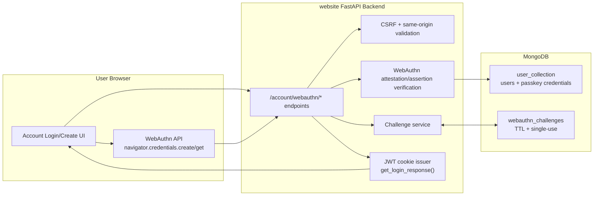
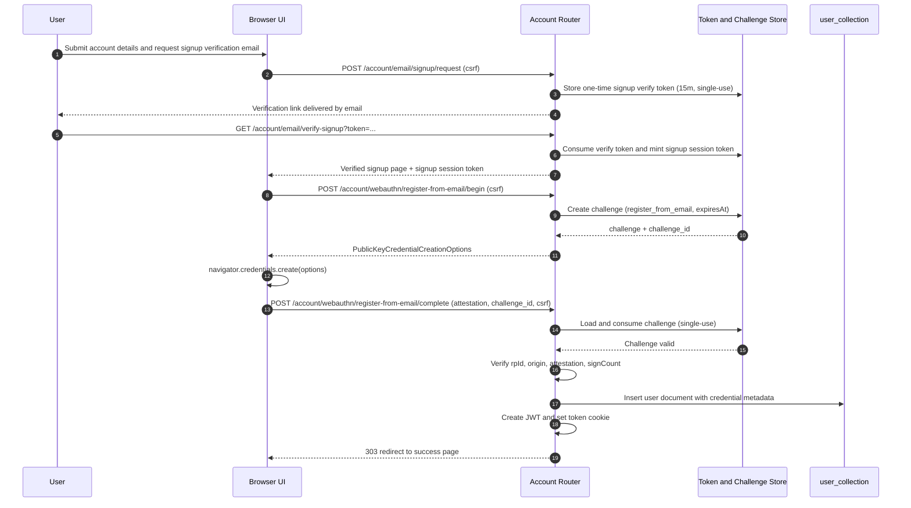
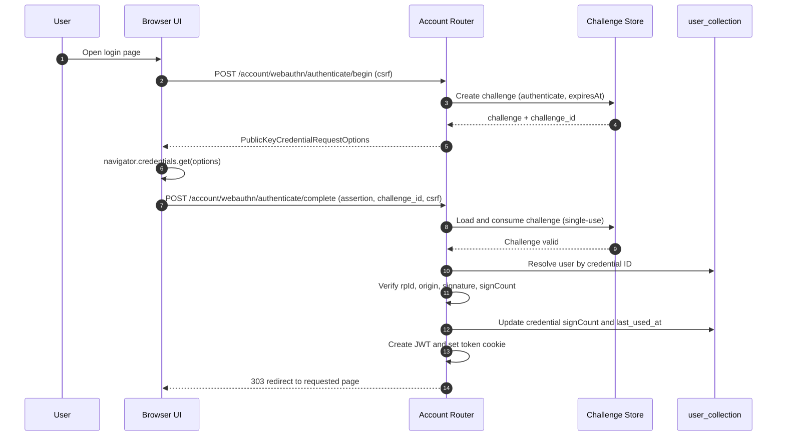

# Passkeys Login Proposal (WebAuthn)

Status: Implemented (current)
Date: 2026-05-08
Scope: Design and implementation reference for current behavior

## 1. Goal

Implement passkey-based authentication for this website using first-party components only.

Primary goals:
- Remove dependence on third-party identity websites for login.
- Keep auth verification on this backend.
- Reuse existing FastAPI, MongoDB, CSRF, and JWT cookie patterns.
- Deliver phase 1 with passkey-only signup/login user flows.

Decisions captured for this proposal:
- Auth mode: passkey-first with mandatory migration for legacy password-only users.
- Enrollment: passkey is required during signup.
- Recovery: self-service email-link recovery with passkey replacement.
- Legacy migration trigger: users are migrated the next time they access the site with a valid token, or when they attempt login.
- Login shape in phase 1: username-less, discoverable passkey login with automatic prompt.
- Credential storage: embedded credentials in `user_collection`.
- `can_use_tools` remains part of the user model, defaults to `false`, and is changed directly in the database only.
- Phase 1 scope now includes email-verified signup and email-link recovery ceremonies.

## 2. Why This Fits The Current Project

Current auth stack already provides:
- FastAPI account routes and template-driven login/signup pages.
- CSRF and same-origin validation for unsafe requests.
- JWT token cookie issuance and shared-domain cookie support.
- MongoDB user storage and async access layer.

This proposal extends those pieces with WebAuthn ceremonies and credential storage.

## 3. High-Level Architecture

## 4. Ceremony Flows

### 4.1 Signup (Email Verified + Passkey Required)

### 4.2 Login (Passkey-Only)

## 5. Proposed Data Model

```mermaid
erDiagram
  USER ||--o{ PASSKEY_CREDENTIAL : owns
  USER ||--o{ WEBAUTHN_CHALLENGE : initiates

  USER {
    string username
    string first_name
    string last_name
    boolean disabled
    boolean can_use_tools
    int token_expiry
    string user_handle_b64url
    datetime created_at
    datetime updated_at
  }

  PASSKEY_CREDENTIAL {
    string credential_id_b64url
    string username
    string public_key_cose_b64url
    int sign_count
    string transports_csv
    datetime created_at
    datetime last_used_at
    boolean revoked
  }

  WEBAUTHN_CHALLENGE {
    string challenge_id
    string username
    string flow
    string challenge_b64url
    datetime created_at
    datetime expires_at
    boolean consumed
  }

  EMAIL_LINK_TOKEN {
    string token_hash
    string username
    string flow
    datetime created_at
    datetime expires_at
    boolean consumed
  }
```

Notes:
- `user_collection` embeds `PASSKEY_CREDENTIAL` records under each user.
- `can_use_tools` defaults to `false` on user creation and is not writable via public web/API routes.
- `WEBAUTHN_CHALLENGE` should be one-time use and short-lived.
- Prefer TTL index on `expires_at` to automatically clean old challenges.
- `EMAIL_LINK_TOKEN` records are server-stored and atomically consumed on successful verification.

## 6. API Surface (Current)

Current endpoints:
- `POST /account/webauthn/register/begin`
- `POST /account/webauthn/register/complete`
- `POST /account/webauthn/authenticate/begin`
- `POST /account/webauthn/authenticate/complete`
- `POST /account/email/signup/request`
- `GET /account/email/verify-signup`
- `POST /account/webauthn/register-from-email/begin`
- `POST /account/webauthn/register-from-email/complete`
- `POST /account/email/recovery/request`
- `GET /account/email/verify-recovery`
- `POST /account/webauthn/recovery/begin`
- `POST /account/webauthn/recovery/complete`

Behavior:
- All POSTs require existing CSRF checks.
- Begin endpoints return publicKey options + `challenge_id`.
- Complete endpoints verify response, consume challenge, and either create user (register) or authenticate user (login).
- On success, complete endpoints issue JWT cookie using existing login response logic.
- No endpoint in this phase allows online mutation of `can_use_tools`.
- `POST /account/webauthn/register/begin` now returns `email_verification_required` and signup proceeds through the verified email flow.
- Email-link verification and recovery callbacks mint short-lived session tokens used by the follow-up passkey begin/complete routes.

## 7. Security Requirements

1. RP ID and origins
- Production RP ID: `schleising.net`.
- Allowed production hostnames: `schleising.net` and any HTTPS hostname matching `*.schleising.net`.
- Origin validation should allow `https` origins where host is exactly `schleising.net` or ends with `.schleising.net`.
- Development RP ID/origin for local testing should be configured separately.

2. Challenge lifecycle
- Minimum entropy random challenge bytes.
- Store challenge server-side with `flow`, `username`, `created_at`, `expires_at`, and `consumed` state.
- Reject replayed or expired challenges.

3. Verification
- Verify RP ID hash, origin, challenge, user presence/verification flags, signature.
- Track and enforce sign counter monotonicity where applicable.

4. Session and CSRF
- Keep existing secure HttpOnly JWT cookie strategy.
- Keep same-origin CSRF policy for all ceremony POST endpoints.

5. Rate limiting and abuse controls
- Reuse existing signup anti-bot and IP rate limiting patterns.
- Add login ceremony throttle per credential attempt and per client IP.

6. Email link token security
- Email verification and recovery links must use high-entropy, one-time, server-stored tokens with strict expiry (15 minutes).
- Tokens must be single-use and atomically consumed.
- Store only token hashes in persistence if feasible.
- Apply request throttling on "send link" endpoints by IP and by email identifier.
- Return neutral responses to avoid account enumeration.
- Enforce HTTPS-only absolute links and same-origin callback handling.
- Require recent anti-automation checks for recovery-link issuance.
- Log issuance and consumption events with timestamp, IP, and user agent for audit.

## 8. Dependency Strategy

To avoid dependency on any other website:
- Use self-hosted WebAuthn verification on this backend.
- No outsourced auth provider or browser redirect to external identity services.

Acceptable software dependency options (local package only):
- `webauthn` (Python package), or
- `fido2` (Python package).

Either option is a code library dependency, not a website dependency.

## 9. UX Proposal (Phase 1)

Login page:
- No username input required.
- Trigger passkey request automatically when the page loads.
- Provide a visible "Try passkey again" action if the first prompt is canceled.
- No password action in the phase 1 user flow.

Create account page:
- Collect profile fields (first/last/email).
- Start and require passkey registration before account creation completes.

Failure handling:
- Clear errors for unsupported browser, cancelled ceremony, expired challenge, and verification failure.
- Keep copy concise and security-neutral (do not reveal account internals).

## 10. Email-Verified Signup And Passkey Recovery (Implemented)

Status: Implemented.

### 10.1 Email-Verified Signup Flow

1. User submits first name, last name, and email address.
2. System sends a one-time verification link valid for 15 minutes.
3. User clicks link; token is validated and consumed.
4. Callback issues a short-lived signup session token.
5. System allows passkey registration only with the valid signup session token.
6. On successful passkey enrollment, account is created and login cookie is issued.

### 10.2 Lost/New Device Passkey Recovery Flow

1. User submits previously verified email address.
2. System sends a one-time recovery link valid for 15 minutes.
3. User clicks link; token is validated and consumed.
4. Callback issues a short-lived recovery session token.
5. System opens restricted recovery enrollment flow and verifies a new passkey.
6. Existing passkeys are auto-revoked when replacement succeeds.
7. User receives completion notification email.

### 10.3 Security Implications (Recovery Link)

Main risks:
- Email account compromise becomes account compromise.
- Inbox forwarding, malware, or leaked mail content can expose links.
- SIM-swap/phone compromise can indirectly compromise email.
- Link prefetch/scanning by email clients may accidentally trigger token use.

Implemented mitigations:
- One-time token with strict 15-minute expiry and immediate consumption.
- Secondary action is required: user must submit the recovery registration form to complete replacement.
- Notifications are sent when recovery is requested and when recovery is completed.
- Distinct anti-phishing copy includes exact host and no credential request.
- Request throttling is applied by IP, email, and per-day cap.

Current known gap:
- Security/audit event retention for one-year policy requires explicit long-term persistence beyond in-memory rate-limit structures.

## 12. Rollout Status And Next Steps

Completed:
- Backend ceremony endpoints and challenge store are implemented.
- Passkey UI on create/login pages is implemented.
- Legacy-user migration path is implemented:
  - If a user has a valid token but no stored passkey credential, require immediate passkey enrollment before allowing normal account flow.
  - If a legacy user attempts login, route through migration and complete passkey enrollment in the same session.

Remaining:
- Add deeper automated tests for email-link flows and abuse conditions.
- Validate all flows in staging HTTPS with real SMTP delivery.

## 13. Test Plan

Core tests:
- Register begin/complete success.
- Authenticate begin/complete success.
- Expired challenge rejection.
- Challenge replay rejection.
- Origin mismatch rejection.
- CSRF missing/mismatch rejection.
- Sign count downgrade rejection (when authenticator provides sign count).

Browser checks:
- Chrome, Safari, Firefox on desktop.
- Mobile Safari and Chrome on supported devices.

## 14. Review Decisions Confirmed

1. Existing password-only users are migrated the next time they access the site with a valid token or attempt login.
2. Phase 1 uses username-less automatic passkey login.
3. Passkey credentials are stored as an embedded list in `user_collection`.
4. Allowed production hostnames are `schleising.net` and `*.schleising.net`.
5. `can_use_tools` remains a user field, default `false`, changed only via direct database update.

## 15. Email-Link Design Decisions (Confirmed And Implemented)

1. Email provider / delivery path
- Use Gmail.
- SMTP authentication uses environment variables, including optional explicit login identity (`WEBSITE_SMTP_LOGIN_USERNAME`) for app-password sign-in.

2. Sender identity
- From address: `website@schleising.net`
- Display name: `Schleising Website`
- Reply-to: none if possible; otherwise `website@schleising.net`
- This mailbox should be treated as do-not-reply.

3. Environments that send real emails
- All environments (production, staging, and development).

4. Canonical link host
- Use `schleising.net`.

5. Token consumption semantics
- Links are single-use and become invalid immediately on first successful click.

6. Passkey revocation behavior after recovery
- Auto-revoke old passkeys after successful replacement enrollment.

7. Additional proof requirements for recovery
- No additional proof beyond the email link.

8. Email send rate limits
- Apply all three dimensions:
- Per IP
- Per email address
- Per day caps

9. User-facing notifications
- Notify users when recovery is requested.
- Notify users when recovery is completed.

10. Audit/security log retention
- Retain token audit logs and security events for 1 year.
- Implementation note: this policy is defined, but full 1-year durable event retention still requires explicit persistence design.
