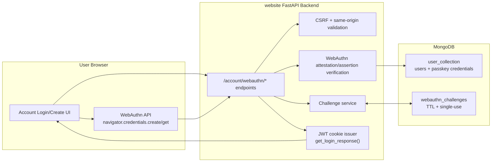
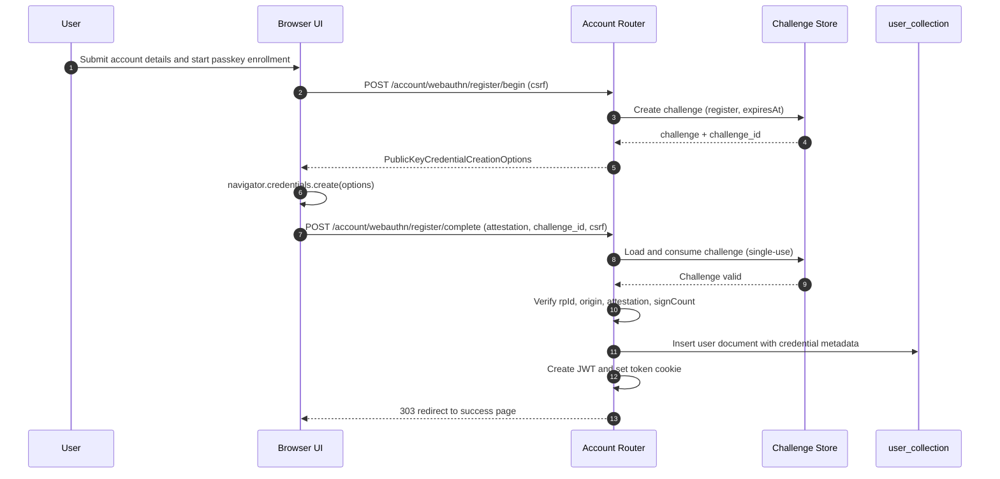
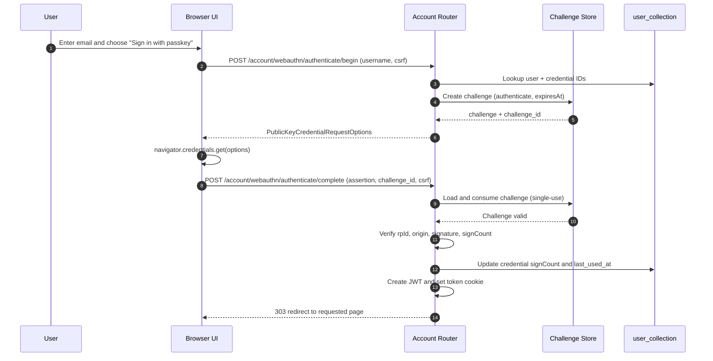
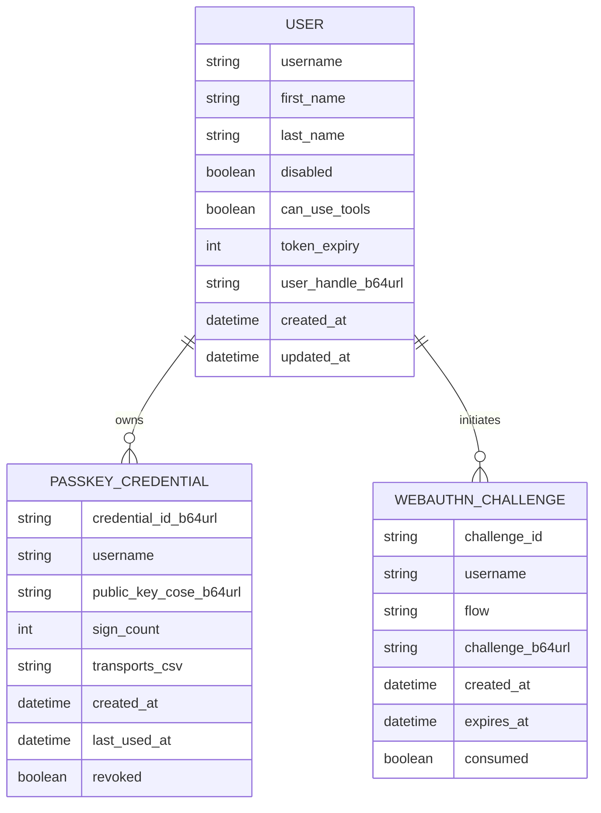

# Passkeys Login Proposal (WebAuthn)

Status: Draft for review
Date: 2026-05-08
Scope: Design only (no code changes)

## 1. Goal

Implement passkey-based authentication for this website using first-party components only.

Primary goals:
- Remove dependence on third-party identity websites for login.
- Keep auth verification on this backend.
- Reuse existing FastAPI, MongoDB, CSRF, and JWT cookie patterns.
- Deliver phase 1 with passkey-only signup/login user flows.

Decisions captured for this proposal:
- Auth mode: passkey-first with mandatory migration for legacy password-only users.
- Enrollment: passkey is required during signup.
- Recovery: admin/manual recovery only.
- Legacy migration trigger: users are migrated the next time they access the site with a valid token, or when they attempt login.
- Login shape in phase 1: username-first.
- Credential storage: embedded credentials in `user_collection`.
- `can_use_tools` remains part of the user model, defaults to `false`, and is changed directly in the database only.
- Phase 1 scope: signup + login ceremonies only (no passkey management page yet).

## 2. Why This Fits The Current Project

Current auth stack already provides:
- FastAPI account routes and template-driven login/signup pages.
- CSRF and same-origin validation for unsafe requests.
- JWT token cookie issuance and shared-domain cookie support.
- MongoDB user storage and async access layer.

This proposal extends those pieces with WebAuthn ceremonies and credential storage.

## 3. High-Level Architecture

## 4. Ceremony Flows

### 4.1 Signup (Passkey Required)

### 4.2 Login (Passkey-Only)

## 5. Proposed Data Model

Notes:
- `user_collection` embeds `PASSKEY_CREDENTIAL` records under each user.
- `can_use_tools` defaults to `false` on user creation and is not writable via public web/API routes.
- `WEBAUTHN_CHALLENGE` should be one-time use and short-lived.
- Prefer TTL index on `expires_at` to automatically clean old challenges.

## 6. API Surface (Phase 1)

Proposed endpoints:
- `POST /account/webauthn/register/begin`
- `POST /account/webauthn/register/complete`
- `POST /account/webauthn/authenticate/begin`
- `POST /account/webauthn/authenticate/complete`

Behavior:
- All POSTs require existing CSRF checks.
- Begin endpoints return publicKey options + `challenge_id`.
- Complete endpoints verify response, consume challenge, and either create user (register) or authenticate user (login).
- On success, complete endpoints issue JWT cookie using existing login response logic.
- No endpoint in this phase allows online mutation of `can_use_tools`.

## 7. Security Requirements

1. RP ID and origins
- Production RP ID: `schleising.net`.
- Allowed production hostnames: `schleising.net` and any HTTPS hostname matching `*.schleising.net`.
- Origin validation should allow `https` origins where host is exactly `schleising.net` or ends with `.schleising.net`.
- Development RP ID/origin for local testing should be configured separately.

2. Challenge lifecycle
- Minimum entropy random challenge bytes.
- Store challenge server-side with `flow`, `username`, `created_at`, `expires_at`, and `consumed` state.
- Reject replayed or expired challenges.

3. Verification
- Verify RP ID hash, origin, challenge, user presence/verification flags, signature.
- Track and enforce sign counter monotonicity where applicable.

4. Session and CSRF
- Keep existing secure HttpOnly JWT cookie strategy.
- Keep same-origin CSRF policy for all ceremony POST endpoints.

5. Rate limiting and abuse controls
- Reuse existing signup anti-bot and IP rate limiting patterns.
- Add login ceremony throttle per username and per client IP.

## 8. Dependency Strategy

To avoid dependency on any other website:
- Use self-hosted WebAuthn verification on this backend.
- No outsourced auth provider or browser redirect to external identity services.

Acceptable software dependency options (local package only):
- `webauthn` (Python package), or
- `fido2` (Python package).

Either option is a code library dependency, not a website dependency.

## 9. UX Proposal (Phase 1)

Login page:
- Email field + "Sign in with passkey" primary action.
- Username-first flow for every phase 1 login ceremony.
- No password action in the phase 1 user flow.

Create account page:
- Collect profile fields (first/last/email).
- Start and require passkey registration before account creation completes.

Failure handling:
- Clear errors for unsupported browser, cancelled ceremony, expired challenge, and verification failure.
- Keep copy concise and security-neutral (do not reveal account internals).

## 10. Manual Recovery Proposal

Because phase 1 recovery is admin/manual only:
- Admin verifies user identity out of band.
- Admin revokes old credential(s).
- Admin issues one-time recovery path (temporary enrollment link or controlled reset procedure).
- User re-enrolls a new passkey.

This runbook should be documented separately for operators before launch.

## 11. Rollout Plan

1. Implement backend ceremony endpoints and challenge store.
2. Implement passkey UI on create/login pages.
3. Implement legacy-user migration path:
  - If a user has a valid token but no stored passkey credential, require immediate passkey enrollment before allowing normal account flow.
  - If a legacy user attempts login, route through migration and complete passkey enrollment in the same session.
4. Add tests for happy path + security failures.
5. Validate in local and staging HTTPS environments.
6. Roll out behind feature flag if needed.

## 12. Test Plan

Core tests:
- Register begin/complete success.
- Authenticate begin/complete success.
- Expired challenge rejection.
- Challenge replay rejection.
- Origin mismatch rejection.
- CSRF missing/mismatch rejection.
- Sign count downgrade rejection (when authenticator provides sign count).

Browser checks:
- Chrome, Safari, Firefox on desktop.
- Mobile Safari and Chrome on supported devices.

## 13. Review Decisions Confirmed

1. Existing password-only users are migrated the next time they access the site with a valid token or attempt login.
2. Phase 1 uses username-first login.
3. Passkey credentials are stored as an embedded list in `user_collection`.
4. Allowed production hostnames are `schleising.net` and `*.schleising.net`.
5. `can_use_tools` remains a user field, default `false`, changed only via direct database update.
