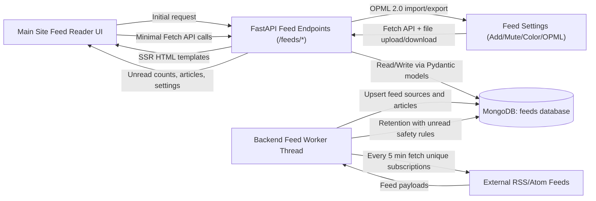
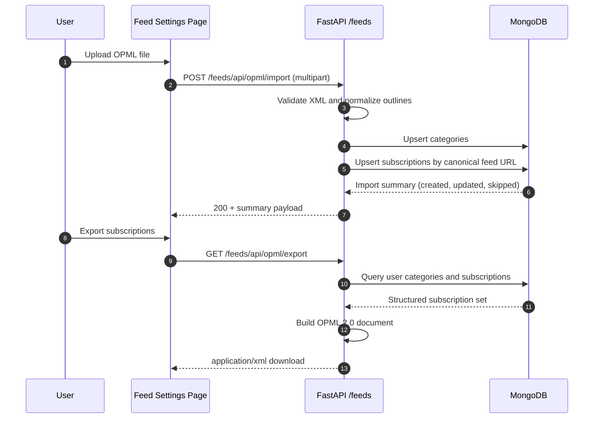
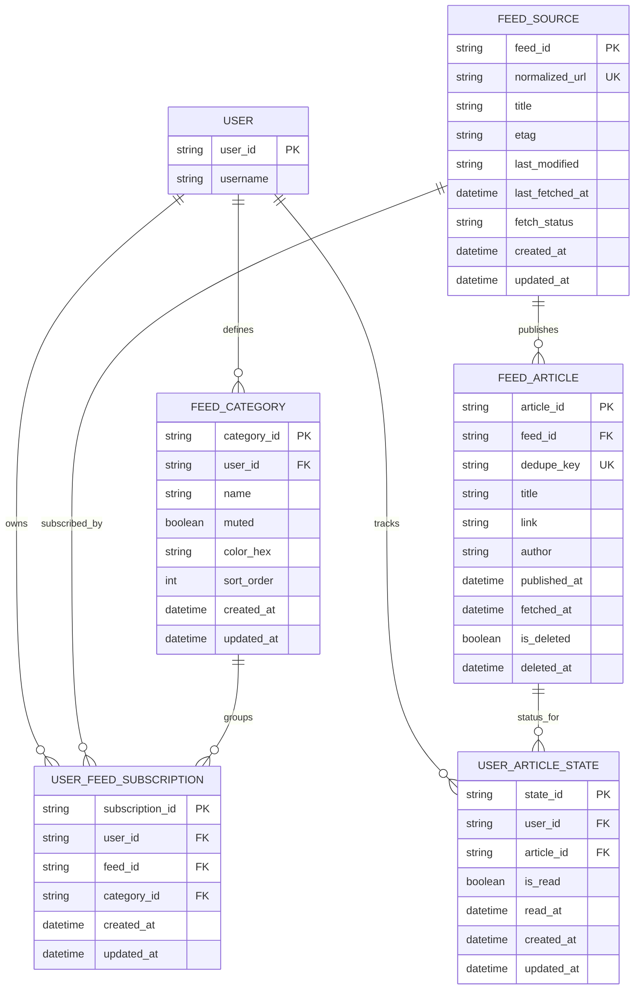
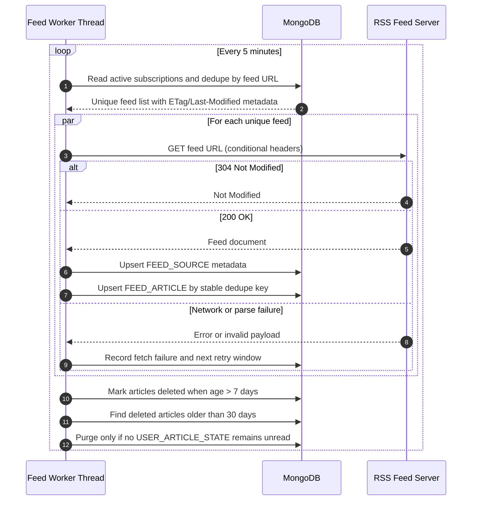
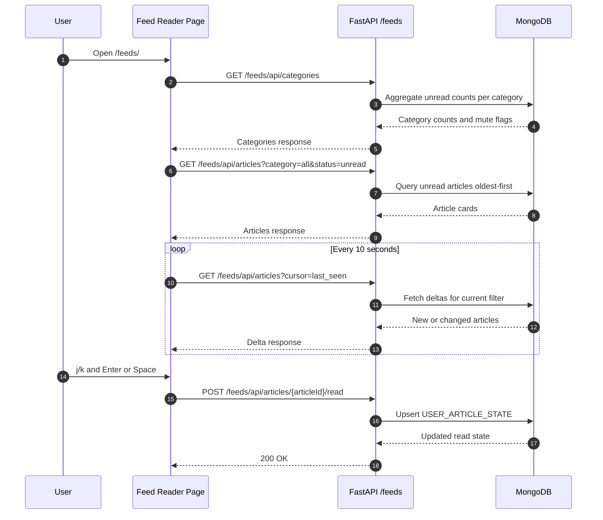

# RSS Feed Reader

## Requirements

### General

1. All reads and writes to the database shall be performed through the FastAPI API, and not directly from the frontend
2. All data sent to or read from the database shall be validated and sanitized to prevent security vulnerabilities
3. All data sent to or read from the database shall be implemented as Pydantic models to ensure data integrity and consistency
4. All data sent to or read from the client shall be validated and sanitized to prevent security vulnerabilities
5. All data sent to or read from the client shall be implemented as Pydantic models to ensure data integrity and consistency
6. The feed reader shall be implemented as a page on the main site and retain the look and feel of the rest of the site, including the left and right menus
7. The feed reader shall be usable on both desktop and mobile devices, with a responsive design that adapts to different screen sizes
8. All client reads shall use the Fetch API to call the FastAPI endpoints, with appropriate error handling and user feedback for failed requests
9. All client writes shall use the Fetch API to call the FastAPI endpoints, with appropriate error handling and user feedback for failed requests
10. Where possible, Javascript code shall be minimised in favour of server-side rendering and FastAPI endpoints to maintain a clear separation of concerns and reduce the attack surface of the frontend, but any necessary Javascript code shall follow best practices for security and maintainability, including proper validation, sanitization, and error handling of user input and API responses
11. Javascript code shall use JSDoc comments for all functions and methods, and include type annotations for all parameters and return values to ensure code clarity and maintainability
12. Python code shall use type annotations for all functions and methods, and include docstrings that describe the purpose, parameters, and return values of each function to ensure code clarity and maintainability
13. All code shall follow the existing style and conventions of the codebase, including naming conventions, file organization, and formatting, to ensure consistency across the project
14. Where possible, new code shall be implemented in a way that allows for easy testing and maintainability, including modular design, separation of concerns, and adherence to SOLID principles
15. Where possible, new code shall be implemented with performance and scalability in mind, including efficient database queries, caching strategies, and asynchronous processing where appropriate
16. A local docker-compose-test.yaml file shall be provided that includes the necessary services and configuration to run the feed reader feature in a local development environment, including nginx with appropriate config file and a MongoDB instance with the appropriate collections and indexes, and any necessary environment variables or configuration files
17. The test environment shall be configured to allow for easy testing and debugging of the feed reader feature, including access to logs, database data, and the ability to simulate different scenarios such as feed fetch failures or large numbers of subscriptions
18. The test environment shall be documented with instructions on how to set up and run the feed reader feature, including any necessary dependencies, configuration steps, and troubleshooting tips
19. The test environment shall be designed to closely mirror the production environment to ensure that tests are representative and reliable, while still allowing for flexibility and ease of use for developers
20. The test environment shall be maintained and updated as needed to ensure that it remains functional and relevant as the feed reader feature evolves and new requirements are added
21. The test environment shall only be accessible from the local machine to prevent unauthorized access and ensure the security of the development environment
22. Automated tests shall be written to be run in the test environment
23. The tests shall ensure coverage of all requirements, including edge cases and error scenarios, to ensure the robustness and reliability of the feed reader feature
24. Requirements that cannot be automatically tested in the test environment shall be documented with justification and a plan for manual testing to ensure that they are still verified and validated as part of the development process
25. Test results shall be documented and a Test -> Requirement and Requirement -> Test traceability matrix shall be maintained to ensure that all requirements are covered by tests and that all tests are linked to specific requirements for easy reference and validation

### UI and Functionality Reqs

26. The feed reader links shall appear between Football and OpenSky Database in the left menu and the home page
27. The feed reader shall only be available to logged in users
28. The feed reader shall be available at the URL path `/feeds/`
29. The feed reader shall display unread articles in full width cards on the feed reader page, with the oldest articles appearing at the top of the list
30. The feed reader shall auto refresh every 10 seconds to check for new feeds
31. The feed reader shall allow the user to move through feeds using j (next) and k (previous) keys, and open the selected feed in a new tab using the spacebar or enter key
32. When an article is selected either by click, tap or j/k the article shall be marked as read and this state shall be persisted in the database so that the article is not shown as unread on the next page load or refresh
33. The feed reader shall allow the user to add new RSS feeds by entering a URL and clicking an "Add" button, all feeds should be added to a category
34. The user added feeds shall be stored in the database for each user and persist across sessions
35. A user shall only be able to view and modify their own feeds, not the feeds of other users
36. The right menu shall display a list of feed categories and an unread article count for each category
37. Clicking on a category shall filter the feed reader to only show articles from that category
38. The right menu shall have an all feeds category that shows all articles regardless of category with an unread article count for all feeds
39. The right menu shall have a Recently Read category that shows all articles that have been marked as read in the last 7 days, sorted by most recently read first 
40. It shall be possible to "mute" and "unmute" categories
41. Articles from a muted category shall not appear in the feed reader, whichever category is currrently selected, but the unread article count for that category shall still be displayed in the right menu
42. Muting and unmuting categories shall be implemented as a user preference stored in the database, and shall persist across sessions
43. The feed reader shall have a settings page where users can manage their feed preferences, including muting and unmuting categories
44. The feed reader shall import OPML files from Feedly and Inoreader, and add the feeds to the user's subscriptions with appropriate category assignments based on the OPML structure
45. The feed reader shall export the user's feed subscriptions and categories as an OPML file that can be imported into other feed readers
46. Imported and newly added feeds shall trigger an immediate backend refresh to fetch the feed data and populate the feed reader without waiting for the next scheduled refresh cycle
47. Actions that modify UI state such as marking an article as read or muting a category shall trigger an immediate UI update to reflect the change without waiting for the next scheduled refresh cycle
48. When data is the main window is refreshed, the current keyboard selection shall be preserved where possible, and the user shall not lose their place in the feed list, the feed list shall only move in response to a user's action.
49. No UI element shall move without a user action, including new articles appearing in the feed list or updates to settings, to prevent disrupting the user's reading position
50. New articles shall be visually indicated with a non-intrusive highlight or badge until they are marked as read
51. Categories shall have colours that are consistent across the feed reader and the right menu, and these colours shall be stored in the database as a user preference for each category

### Backend Reqs

52. Backend code shall be implemented in the backend/src/feeds directory, with appropriate subdirectories for database models, API endpoints, and background tasks
53. The backend code shall be implemented as a new thread that runs alongside the existing backend code, and shall not interfere with the existing functionality of the site
54. The backend code shall be responsible for creating a mongodb feeds database and the necessary collections and indexes to store feed data, user subscriptions, and read/unread status of articles
55. The backend code shall fetch subscribed feeds once every 5 minutes and store the feed data in the database
56. The backend shall only fetch each subscription once, even if multiple users are subscribed to the same feed, to avoid unnecessary network requests and reduce load on the feed servers
57. The feeds shall be fetched and stored in the database in a way that allows for efficient querying and filtering by category, read/unread status, and other relevant criteria
58. The backend shall mark articles as deleted after 7 days
59. The backend shall permanently delete articles that have been marked as deleted for more than 30 days
60. The backend shall not delete or purge articles that are still marked as unread by any user, even if they are older than the retention thresholds, to prevent data loss of unread articles

### FastAPI Reqs

61. FastAPI code shall be implemented in the website/feeds directory, with appropriate subdirectories for API endpoints and database models
62. The FastAPI code shall mark articles as read when the user clicks on them in the feed reader UI, and this information shall be stored in the database
63. The FastAPI code shall provide an API endpoint to retrieve the list of feeds and their associated articles for the logged in user, with support for filtering by category and read/unread status
64. The FastAPI code shall provide an API endpoint to add new feed subscriptions for the logged in user, which shall validate the feed URL and return an appropriate response if the URL is invalid or the feed cannot be fetched
65. The FastAPI code shall provide an API endpoint to mark articles as read for the logged in user, which shall update the database accordingly and return an appropriate response if the article ID is invalid or the user is not authorized to modify the article's read status
66. The FastAPI code shall provide an API endpoint to retrieve the list of feed categories and their associated unread article counts for the logged in user, which shall return an appropriate response if the user is not authorized to access the feed data
67. The right menu shall preserve the currently selected category highlight across polling refreshes, and shall not fall back to All Feeds unless the user explicitly navigates there
68. Unread and recently-read counts in the right menu shall update immediately after a user marks an article as read, without waiting for the next 10-second polling cycle
69. Recently Read membership shall remain stable for seven days from the original read timestamp, and shall not be reduced to a single polling cycle
70. In unread views, articles marked as read shall remain visible in the current session as greyed cards and shall be removed only after the user navigates away and returns to the category
71. The system shall not auto-create a default General category at page load; categories shall be created only through explicit user actions (add/import/category assignment)
72. Updating category colours on the settings page shall not trigger a full page reload or scroll-position jump
73. The feed reader shall not render dedicated "Unread Articles" or card-style empty-state banners; when no articles are present it shall show subtle inline hint text within the content area
74. The Recently Read right-menu entry shall not display an unread-count badge
75. Recently Read shall include all items read within the last seven days (subject to active category mute rules)
76. When a category view first loads, no article shall be pre-selected; pressing `j` shall select the first visible article
77. Category colour changes in settings shall live-update category chips in the current subscriptions list
78. The settings page shall allow editing an existing subscription to change both feed URL and assigned category
79. The settings page shall allow deleting an existing subscription

## Design

This section provides a full implementation design for review only.
No application code is included in this document.

### 1. Design Goals

1. Keep the feed reader fully integrated into the main site layout and auth model.
2. Enforce strict server-side ownership checks and Pydantic validation for every read/write boundary.
3. Centralize feed fetching in backend worker threads so the frontend never touches RSS sources directly.
4. Preserve responsive behavior with clear desktop/mobile parity.
5. Make feed ingestion and querying efficient at scale using deduped fetches, retention policies, and indexes.
6. Support standards-compatible OPML interoperability for import/export with category preservation.
7. Prefer server-side rendering and minimize JavaScript to reduce frontend attack surface.
8. Enforce explicit typing, documentation, and codebase conventions for maintainable implementation.
9. Support category color preferences that are consistent across feed cards and right menu.
10. Protect unread content from retention purges until all users have marked it as read.
11. Provide a local, production-like Docker test environment for reliable development, debugging, and automated verification.
12. Maintain auditable test evidence with bidirectional requirement-test traceability.

### 2. High-Level Architecture

#### 2.1 Component Responsibilities

1. Frontend page (`/feeds/`):
	1. Renders unread article cards full-width, oldest first.
	2. Polls every 10 seconds for updates.
	3. Handles keyboard navigation (`j`, `k`, `Enter`, `Space`).
	4. Uses SSR for initial render and minimal JavaScript for incremental interactions.
	5. Uses only Fetch API calls to FastAPI for all reads/writes.
2. FastAPI layer (`website/feeds`):
	1. Authenticates user context.
	2. Validates request and response models using Pydantic.
	3. Applies authorization rules so users only access their own subscriptions/preferences/read state.
	4. Returns category counts and article lists with filtering.
	5. Serves server-rendered templates for primary page loads.
3. Backend worker (`backend/src/feeds`):
	1. Runs in a dedicated thread alongside existing backend behavior.
	2. Fetches each unique subscribed feed once every 5 minutes.
	3. Upserts source metadata and normalized articles.
	4. Applies retention lifecycle rules while preserving unread articles.
4. MongoDB feeds database:
	1. Stores global feed/article data.
	2. Stores per-user subscriptions, categories, mute and color preferences, and read state.

#### 2.2 OPML Interoperability Flow

#### 2.3 Local Test Environment Architecture

1. Provide a repository-level `docker-compose-test.yaml` for local feed-reader testing.
2. Test stack includes:
	1. `nginx` with test-specific config that mirrors production routing behavior.
	2. Main website/FastAPI application service.
	3. Backend feed worker service.
	4. MongoDB service with initialized collections and indexes.
3. Service ports are bound to localhost-only interfaces for local-machine access.
4. Test environment supports configurable failure simulation and high-volume scenarios through environment flags.

### 3. Data Model Design

#### 3.1 Collection Notes

1. `feed_source`:
	1. One document per canonical feed URL.
	2. Shared by all users to satisfy deduped fetching.
2. `feed_article`:
	1. Global article cache keyed by `feed_id + dedupe_key`.
	2. Includes retention lifecycle markers.
3. `user_feed_subscription`:
	1. Maps users to feeds and categories.
4. `feed_category`:
	1. User-owned categories, mute state, and color preference.
	2. Categories are created only when explicitly requested by user actions (manual add/import).
5. `user_article_state`:
	1. Per-user read/unread lifecycle.
	2. Supports recently read queries for last 7 days.

#### 3.2 Index Plan

1. `feed_source`:
	1. Unique: `normalized_url`.
2. `feed_article`:
	1. Unique: `(feed_id, dedupe_key)`.
	2. Query: `(published_at)`.
	3. Query: `(is_deleted, deleted_at)` for retention scans.
3. `user_feed_subscription`:
	1. Unique: `(user_id, feed_id)`.
	2. Query: `(user_id, category_id)`.
4. `feed_category`:
	1. Unique: `(user_id, name)`.
	2. Query: `(user_id, muted, sort_order)`.
	3. Query: `(user_id, color_hex)` for settings and consistency checks.
5. `user_article_state`:
	1. Unique: `(user_id, article_id)`.
	2. Query: `(user_id, is_read, read_at)`.
	3. Query: `(article_id, is_read)` to support unread-preservation retention checks.

### 4. Backend Worker Design (`backend/src/feeds`)

#### 4.1 Threading and Isolation

1. Worker starts as a dedicated background thread in backend startup.
2. It does not block HTTP request processing.
3. It uses independent DB sessions/clients with retry/backoff.

#### 4.2 Feed Deduplication Strategy

1. Build canonical feed URL (normalize scheme, host case, trailing slash, query ordering where safe).
2. Resolve all user subscriptions to unique canonical URLs.
3. Fetch each unique feed once per cycle.
4. Fan out resulting articles to all subscribed users through query joins (no duplicate network fetch).
5. Support an explicit source-level force-refresh flag so newly added/imported subscriptions trigger near-immediate worker fetches without breaking the regular 5-minute cadence.

#### 4.3 Retention Guard Rules

1. Soft-delete threshold remains 7 days for aging articles.
2. Hard-delete threshold remains 30 days only for soft-deleted articles.
3. Hard delete is blocked if any user still has the article marked unread.
4. Purge and read-state cleanup run in a transaction-like batch to avoid orphaned state.

#### 4.4 Test Scenario Controls

1. Worker scheduling and retry intervals are configurable in test mode to accelerate feedback.
2. Controlled failure injection is supported for timeout, malformed feed, and upstream error scenarios.
3. High-subscription-volume simulation mode is supported to validate scaling behavior and query plans.
4. Scenario controls are isolated to the local test environment and disabled in production configuration.

### 5. FastAPI Design (`website/feeds`)

#### 5.1 Route Structure

1. Page routes:
	1. `GET /feeds/`: main feed reader page.
	2. `GET /feeds/settings/`: feed settings page.
2. API routes:
	1. `GET /feeds/api/articles`: list articles with filters.
	2. `GET /feeds/api/categories`: list categories with unread counts and mute state.
	3. `POST /feeds/api/subscriptions`: add subscription with category assignment.
	4. `POST /feeds/api/subscriptions/{subscription_id}`: update subscription URL/category.
	5. `DELETE /feeds/api/subscriptions/{subscription_id}`: delete subscription.
	6. `POST /feeds/api/articles/{article_id}/read`: mark article as read.
	7. `POST /feeds/api/categories/{category_id}/mute`: mute category.
	8. `POST /feeds/api/categories/{category_id}/unmute`: unmute category.
	9. `POST /feeds/api/categories/{category_id}/color`: update category color preference.
	10. `POST /feeds/api/opml/import`: import subscriptions/categories from OPML.
	11. `GET /feeds/api/opml/export`: export subscriptions/categories as OPML.

#### 5.2 API Query Semantics

1. Category filter values:
	1. `all`: all non-muted categories.
	2. specific category id: only that category, unless muted.
	3. `recently-read`: read items in last 7 days, newest first, excluding muted categories.
	4. recently-read retention uses persisted read timestamps and remains stable for the full 7-day window.
2. Primary article listing for main reader:
	1. unread only by default.
	2. oldest first (ascending publication date).
3. Mute behavior:
	1. muted categories are excluded from article results in all filters.
	2. unread counts remain visible in right menu.
4. Category presentation metadata:
	1. category payloads include `color_hex` so right menu and feed cards stay visually consistent.

#### 5.3 Pydantic Models

1. Request models:
	1. Add subscription payload.
	2. Update subscription payload.
	2. Mark read payload.
	3. Category mute/unmute payload.
	4. Category color update payload.
	5. OPML import options payload (duplicate policy, default category policy).
2. Response models:
	1. Article card model.
	2. Category count model.
	3. Standard operation result model.
	4. Category metadata model with mute state and color.
	5. OPML import summary model (created feeds/categories, skipped duplicates, errors).
	6. Subscription update and delete response models.
3. Validation rules:
	1. Feed URL must be `http/https`, normalized, length-limited.
	2. Category IDs and article IDs must be valid object IDs/UUIDs.
	3. User-scoped resources must enforce owner equality with authenticated user.
	4. OPML documents must be well-formed XML with supported outline attributes and size limits.
	5. Category color must be a normalized hex color string (for example `#1F6FEB`).

#### 5.4 OPML Import and Export Contract

1. Import (`POST /feeds/api/opml/import`):
	1. Accept `multipart/form-data` with an OPML file and optional import settings.
	2. Support Feedly/Inoreader OPML outline conventions:
		1. category/group outlines without `xmlUrl`.
		2. feed outlines with `xmlUrl`, optional `title`/`text`.
	3. Normalize feed URLs to canonical form before dedupe checks.
	4. Create missing categories and map imported feeds to those categories.
	5. Return deterministic summary payload with counts and per-item errors.
2. Export (`GET /feeds/api/opml/export`):
	1. Return `application/xml` OPML 2.0 document.
	2. Emit categories as parent outlines and subscribed feeds as child outlines.
	3. Include all user subscriptions and category associations, including muted categories and category colors where supported by reader extensions.
	4. Sort categories and feeds for stable output so repeated exports are diff-friendly.

### 6. Frontend UX and Interaction Design

#### 6.1 Navigation and Access

1. Add `Feeds` nav entry between Football and OpenSky Database:
	1. Left menu.
	2. Home page links.
2. Only render feeds links and page content for logged-in users.
3. Non-authenticated requests redirect to login with `next=/feeds/`.

#### 6.2 Main Reader Layout

1. Keep existing site shell (header, left menu, right menu, footer).
2. Main content region:
	1. full-width article cards.
	2. oldest unread at top.
	3. when an unread article is marked read, it remains in the current session view with greyed styling.
	4. no dedicated header or card-style empty-state banner; empty views show subtle inline hint text.
3. Right sidebar:
	1. `All Feeds` with unread total.
	2. category list with unread count each.
	3. `Recently Read` bucket (7-day window, no unread-count badge).
	4. muted categories visually indicated.
	5. category color chips/markers consistent with feed cards.
4. New unread articles include a subtle `New` badge and accent until they are marked read.

#### 6.3 Keyboard and Interaction Rules

1. `j`: move selection to next visible article card.
2. `k`: move selection to previous visible article card.
3. `Enter` or `Space`:
	1. open selected article link in new tab.
	2. mark article as read via API.
4. Category click:
	1. apply category filter.
	2. keep muted exclusion logic.
5. Category loads begin with no selected card; the first `j` selects the first card.

#### 6.4 Polling and UI Consistency

1. Poll interval: 10 seconds.
2. Polling request includes current category/filter context.
3. Preserve current keyboard selection where possible after refresh.
4. Show non-blocking error banner/toast if refresh fails.
5. Preserve existing card order during polling updates and append newly arrived articles to avoid disruptive list movement.
6. Keep visual position stable across refreshes unless a user action changes selection or read state.
7. Sidebar unread/recently-read counts refresh immediately after mark-read operations.
8. Sidebar selection highlight remains pinned to the active category across polling updates.

#### 6.5 Settings and OPML Workflows

1. Settings page includes:
	1. Add feed URL with category assignment.
	2. Import OPML action (file picker + submit).
	3. Export OPML action (download current user subscriptions/categories).
	4. Category mute/unmute controls.
	5. Category color picker with reset-to-default option.
	6. Editable subscription table for updating URL/category and deleting subscriptions.
2. Import UX behavior:
	1. Show import preview summary after successful parse.
	2. Display created/updated/skipped counts and actionable error rows.
	3. Refresh category counts and unread views after successful import.
	4. Assign deterministic fallback colors to newly created categories when color is absent.
3. Category colour updates apply in-place without full-page reloads to avoid scroll jumps.
4. Subscription and category updates live-sync the relevant category chips in the settings subscription list and right menu.

#### 6.6 Rendering and JavaScript Strategy

1. Render primary feed list and menus server-side for initial page load.
2. Restrict JavaScript to:
	1. keyboard navigation,
	2. polling refresh,
	3. OPML upload/download interactions,
	4. category color picker interactivity.
3. Keep JavaScript modules small and page-scoped to limit surface area.
4. All JavaScript functions include JSDoc with typed params and return values.
5. All JavaScript user input and API responses are validated and sanitized before use.

### 7. Security and Data Integrity

1. All frontend reads/writes use Fetch -> FastAPI only.
2. Every endpoint:
	1. authenticates session.
	2. validates payload with Pydantic.
	3. sanitizes free-text fields.
	4. enforces user ownership in DB query predicate.
3. Server never trusts category IDs/article IDs from client without owner checks.
4. Output models are Pydantic-serialized to avoid accidental leakage.
5. Add rate limits for subscription creation and read-write bursts.

### 8. Retention and Data Lifecycle

1. Worker marks articles as logically deleted after 7 days (`is_deleted=true`, `deleted_at=now`).
2. Worker evaluates hard-delete candidates with `is_deleted=true` and `deleted_at < now-30d`.
3. Candidates are only purged when no user has an unread state for that article.
4. User read-state records are removed only for safely purged articles.
5. Articles that remain unread for any user are retained regardless of age.

### 9. Error Handling and Resilience

1. Feed fetch failure:
	1. store last failure reason/timestamp in `feed_source`.
	2. continue processing other feeds.
2. Invalid feed URL at subscription time:
	1. return 400 with actionable message.
3. Temporary API failure during polling:
	1. show warning toast.
	2. keep last successful article list.
4. Worker retry/backoff:
	1. exponential backoff per source on repeated failures.
5. OPML import failure:
	1. return 400 for malformed XML or unsupported structure.
	2. return 413 for oversized files.
	3. return per-item validation errors without aborting entire import when possible.
6. Category color update failure:
	1. return 400 for invalid color format.
	2. return 403 for category ownership mismatch.

### 10. Monitoring and Auditability

1. Structured logs:
	1. feed fetch attempts/results.
	2. subscription add/remove actions.
	3. article read mutations.
2. Metrics:
	1. fetch success rate.
	2. fetch duration.
	3. new article ingest count.
	4. API latency/error rate.
	5. OPML import success/failure count and item-level rejection rate.
	6. OPML export count and average generation latency.
	7. retention skip count due to unread-preservation guard.
	8. category color update count and validation failure rate.

### 11. Engineering Standards and Conventions

#### 11.1 JavaScript Standards

1. All functions and methods use JSDoc comments.
2. JSDoc includes explicit parameter and return typing.
3. JavaScript modules follow least-privilege patterns and avoid unnecessary global state.

#### 11.2 Python Standards

1. All functions and methods include Python type annotations.
2. Public and internal functions include docstrings describing purpose, parameters, and return values.
3. Endpoint handlers and service-layer logic keep explicit types across request, domain, and response boundaries.

#### 11.3 Codebase Consistency

1. New code follows existing file layout and naming conventions in website and backend repositories.
2. Formatting and style align with existing project standards.
3. New modules are organized by responsibility to preserve clarity.

### 12. Testability and Maintainability

1. Prefer service-layer abstractions to isolate parsing, validation, persistence, and transport.
2. Keep endpoint handlers thin and delegate business logic to testable modules.
3. Design import/export and retention logic as deterministic units that can be tested with fixtures.
4. Favor composable interfaces and dependency boundaries that support SOLID-style extension.

### 13. Performance and Scalability

1. Preserve deduplicated feed fetch strategy to minimize external requests.
2. Use targeted indexes to support unread/category filters and retention guards.
3. Keep polling deltas narrow and query plans bounded by user scope.
4. Use short-lived caching where appropriate (for example category unread aggregates) with safe invalidation on user mutations.
5. Use asynchronous processing where appropriate for feed ingestion and OPML parsing.
6. Keep SSR-first approach for fast first render and reduced frontend compute cost.

### 14. Local Test Environment and Testing Strategy

#### 14.1 Local `docker-compose-test.yaml` Stack

1. Provide a repository-level `docker-compose-test.yaml` to run feed-reader tests locally.
2. Stack services include:
	1. `nginx` with a test config that mirrors production path routing and proxy behavior.
	2. Website/FastAPI application service.
	3. Backend feed worker service.
	4. MongoDB service with startup initialization for required collections and indexes.
3. Environment and config files are versioned with safe local defaults and optional overrides.
4. Exposed service ports are bound to localhost interfaces only.

#### 14.2 Production Parity and Debugging

1. Test topology mirrors production request flow while remaining lightweight for local iteration.
2. Developers can inspect:
	1. nginx access/error logs,
	2. website and backend application logs,
	3. database data/state for feeds, categories, subscriptions, and read markers.
3. Environment supports controlled simulation for:
	1. feed fetch failures,
	2. malformed feed payloads,
	3. large subscription counts.

#### 14.3 Automated Test Execution

1. Automated tests run inside or against the local test compose stack.
2. Test sets include unit, API integration, and key end-to-end interaction paths.
3. Test cases cover edge conditions and failure handling (network, validation, auth, retention, and OPML parsing).
4. Test runs produce machine-readable and human-readable output for debugging.

#### 14.4 Manual Validation for Non-Automatable Requirements

1. Requirements that cannot be automated are documented with explicit justification.
2. Each non-automated requirement has a manual test procedure and expected outcomes.
3. Manual results are recorded alongside automated results for release validation.

#### 14.5 Test Traceability Artifacts

1. Maintain both matrices:
	1. Requirement -> Test,
	2. Test -> Requirement.
2. Every requirement maps to one or more automated or manual test cases.
3. Every test case references requirement IDs and includes current status.
4. Test evidence (logs/reports/screenshots where needed) is linked to trace entries.

Requirement -> Test Matrix template:

| Requirement ID | Requirement Summary | Automated Test IDs | Manual Test IDs | Coverage Status |
| --- | --- | --- | --- | --- |
| 16 | Local test compose stack | IT-ENV-001 | MT-ENV-001 | Planned |

Test -> Requirement Matrix template:

| Test ID | Test Type | Covered Requirement IDs | Execution Environment | Latest Result |
| --- | --- | --- | --- | --- |
| IT-API-001 | Integration | 57, 60 | docker-compose-test | Not Run |

#### 14.6 Test Environment Lifecycle and Documentation

1. Maintain setup and troubleshooting instructions for the local test environment.
2. Keep the test environment aligned with evolving feature requirements.
3. Periodically review and refresh compose/config artifacts to prevent drift.

### 15. Traceability Table: Requirements -> Design

| Requirement | Requirement Summary | Design References |
| --- | --- | --- |
| 1 | DB access via FastAPI only | 2.1, 5.1, 7 |
| 2 | Validate/sanitize DB data | 5.3, 7 |
| 3 | Pydantic models for DB data | 5.3, 7 |
| 4 | Validate/sanitize client data | 5.3, 6.4, 7 |
| 5 | Pydantic models for client data | 5.3, 7 |
| 6 | Main-site page and menus | 2.1, 6.2 |
| 7 | Responsive desktop/mobile | 6.2, 6.4 |
| 8 | Client reads via Fetch + errors | 2.1, 6.4, 9 |
| 9 | Client writes via Fetch + errors | 2.1, 6.3, 6.5, 9 |
| 10 | Minimize JavaScript, SSR-first, secure JS practices | 2, 6.6, 7, 11.1 |
| 11 | JSDoc with typed params and returns | 6.6, 11.1 |
| 12 | Python type annotations and docstrings | 11.2 |
| 13 | Follow existing codebase style and conventions | 11.3 |
| 14 | Easy testing, maintainability, modularity, SOLID | 12, 14.3 |
| 15 | Performance and scalability focus | 3.2, 4.2, 10, 13 |
| 16 | Local `docker-compose-test.yaml` with nginx and MongoDB | 2.3, 14.1 |
| 17 | Test env supports debugging and scenario simulation | 4.4, 14.2, 14.3 |
| 18 | Test environment setup/run documentation | 14.1, 14.6 |
| 19 | Test environment mirrors production behavior | 2.3, 14.1, 14.2 |
| 20 | Test environment maintained over time | 10, 14.6 |
| 21 | Test environment local-machine access only | 2.3, 7, 14.1 |
| 22 | Automated tests run in test environment | 14.3 |
| 23 | Tests cover all requirements, edge cases, errors | 12, 14.3, 14.5 |
| 24 | Non-automatable requirements documented with manual plan | 14.4, 14.5 |
| 25 | Test results documented with Test<->Requirement traceability | 14.5 |
| 26 | Nav placement between Football/OpenSky | 6.1 |
| 27 | Logged-in users only | 6.1, 7 |
| 28 | Reader URL `/feeds/` | 5.1, 6.1 |
| 29 | Unread cards, oldest first | 2.1, 5.2, 6.2 |
| 30 | 10-second auto refresh | 2.1, 6.4 |
| 31 | j/k + enter/space behavior | 2.1, 6.3 |
| 32 | Mark article read on click/tap/j-k selection | 5.1, 6.3 |
| 33 | Add feed URL + category | 5.1, 5.3, 6.5 |
| 34 | User subscriptions persist | 3.1, 3.2 |
| 35 | User data isolation | 5.3, 7 |
| 36 | Right menu categories + unread count | 2.1, 5.1, 6.2 |
| 37 | Category click filters feeds | 5.2, 6.3 |
| 38 | All Feeds category + unread count | 5.2, 6.2 |
| 39 | Recently Read last 7 days, newest first | 5.2, 6.2 |
| 40 | Mute/unmute categories | 5.1, 6.5 |
| 41 | Muted categories hidden but counts shown | 5.2, 6.2 |
| 42 | Mute persistence in DB | 3.1, 5.1, 6.5 |
| 43 | Settings page for preferences | 5.1, 6.5 |
| 44 | OPML import (Feedly/Inoreader) + categories | 2.2, 5.1, 5.3, 5.4, 6.5 |
| 45 | OPML export of subscriptions/categories | 2.2, 5.1, 5.4, 6.5 |
| 46 | Imported/newly added feeds trigger immediate backend refresh | 4, 4.2, 5.1, 6.5 |
| 47 | UI state mutations update immediately without waiting for poll | 6.3, 6.4, 6.5 |
| 48 | Refresh preserves keyboard selection/place where possible | 6.4 |
| 49 | No UI movement without user action | 6.4 |
| 50 | New articles visually indicated until marked read | 6.2, 6.4 |
| 51 | Category colors consistent and persisted per user | 3.1, 5.1, 5.3, 6.2, 6.5 |
| 52 | Backend code in `backend/src/feeds` | 2.1, 4 |
| 53 | Backend thread parallel to existing site | 4.1 |
| 54 | MongoDB feeds DB + collections/indexes | 3, 3.2 |
| 55 | Fetch subscribed feeds every 5 minutes | 4 |
| 56 | Deduped fetch for shared subscriptions | 4.2 |
| 57 | Efficient query/filter storage | 3.2, 4.2, 5.2, 13 |
| 58 | Mark articles deleted after 7 days | 4, 8 |
| 59 | Permanently delete after 30 days | 4, 8 |
| 60 | Never purge unread articles for any user | 4.3, 8 |
| 61 | FastAPI code in `website/feeds` | 2.1, 5 |
| 62 | FastAPI marks article read on click | 5.1, 6.3 |
| 63 | Endpoint for feeds/articles with filters | 5.1, 5.2 |
| 64 | Endpoint to add subscriptions + URL validation | 5.1, 5.3, 9 |
| 65 | Endpoint to mark read with validation/auth checks | 5.1, 5.3, 7, 9 |
| 66 | Endpoint for categories + unread count + auth | 5.1, 5.2, 7 |
| 67 | Selected category highlight remains stable across polling | 6.3, 6.4 |
| 68 | Sidebar counts update immediately after mark-read | 6.4 |
| 69 | Recently Read remains stable for full 7 days | 5.2, 6.2 |
| 70 | Read items remain grey in-session until navigation reset | 6.2, 6.4 |
| 71 | No automatic General category creation | 3.1, 6.5 |
| 72 | Settings color changes do not reload/jump | 6.5 |
| 73 | No dedicated unread header or card-style empty state | 6.2 |
| 74 | Recently Read shows no unread-count badge | 6.2 |
| 75 | Recently Read includes all reads from last 7 days | 5.2, 6.2 |
| 76 | No preselected article on load; first j selects first item | 6.3 |
| 77 | Settings color change live-updates subscription chips | 6.5 |
| 78 | Settings can edit subscription URL/category | 5.1, 5.3, 6.5 |
| 79 | Settings can delete subscriptions | 5.1, 5.3, 6.5 |

### 16. Traceability Table: Design -> Requirements

| Design Section | Requirement IDs |
| --- | --- |
| 1. Design Goals | 1, 6, 7, 10, 15, 16, 19, 22, 23, 25, 44, 45, 46, 50, 51, 60 |
| 2. High-Level Architecture | 1, 6, 8, 9, 10, 27, 52, 53, 54, 55, 61 |
| 2.1 Component Responsibilities | 1, 6, 8, 9, 10, 27, 29, 36, 51, 52, 53, 61 |
| 2.2 OPML Interoperability Flow | 44, 45 |
| 2.3 Local Test Environment Architecture | 16, 17, 19, 21 |
| 3. Data Model Design | 34, 42, 51, 54, 57, 71 |
| 3.1 Collection Notes | 34, 42, 51, 54, 71 |
| 3.2 Index Plan | 34, 54, 57, 60 |
| 4. Backend Worker Design | 46, 52, 53, 55, 56, 57, 58, 59, 60 |
| 4.1 Threading and Isolation | 53 |
| 4.2 Feed Deduplication Strategy | 46, 56, 57 |
| 4.3 Retention Guard Rules | 58, 59, 60 |
| 4.4 Test Scenario Controls | 17, 22, 23 |
| 5. FastAPI Design | 1, 2, 3, 4, 5, 35, 61, 62, 63, 64, 65, 66, 78, 79 |
| 5.1 Route Structure | 1, 28, 32, 33, 40, 43, 44, 45, 62, 63, 64, 65, 66, 78, 79 |
| 5.2 API Query Semantics | 29, 36, 37, 38, 39, 41, 51, 63, 66, 69, 75 |
| 5.3 Pydantic Models | 2, 3, 4, 5, 35, 44, 51, 64, 65, 78, 79 |
| 5.4 OPML Import and Export Contract | 44, 45 |
| 6. Frontend UX and Interaction Design | 6, 7, 10, 26, 27, 29, 30, 31, 32, 33, 36, 37, 38, 39, 40, 41, 42, 43, 44, 45, 47, 48, 49, 50, 51, 62, 67, 68, 70, 72, 73, 74, 75, 76, 77, 78, 79 |
| 6.1 Navigation and Access | 26, 27, 28 |
| 6.2 Main Reader Layout | 6, 7, 29, 36, 38, 39, 41, 50, 51, 69, 70, 73, 74, 75 |
| 6.3 Keyboard and Interaction Rules | 31, 32, 37, 62, 67, 76 |
| 6.4 Polling and UI Consistency | 8, 9, 30, 47, 48, 49, 50, 67, 68, 70 |
| 6.5 Settings and OPML Workflows | 33, 40, 42, 43, 44, 45, 46, 47, 51, 71, 72, 77, 78, 79 |
| 6.6 Rendering and JavaScript Strategy | 10, 11 |
| 7. Security and Data Integrity | 1, 2, 3, 4, 5, 10, 21, 27, 35, 65, 66, 78, 79 |
| 8. Retention and Data Lifecycle | 58, 59, 60 |
| 9. Error Handling and Resilience | 8, 9, 17, 64, 65 |
| 10. Monitoring and Auditability | 15, 17, 20, 46, 57, 60 |
| 11. Engineering Standards and Conventions | 11, 12, 13 |
| 11.1 JavaScript Standards | 11 |
| 11.2 Python Standards | 12 |
| 11.3 Codebase Consistency | 13 |
| 12. Testability and Maintainability | 14, 23 |
| 13. Performance and Scalability | 15, 57 |
| 14. Local Test Environment and Testing Strategy | 16, 17, 18, 19, 20, 21, 22, 23, 24, 25 |
| 14.1 Local `docker-compose-test.yaml` Stack | 16, 19, 21 |
| 14.2 Production Parity and Debugging | 17, 19 |
| 14.3 Automated Test Execution | 22, 23 |
| 14.4 Manual Validation for Non-Automatable Requirements | 24 |
| 14.5 Test Traceability Artifacts | 25 |
| 14.6 Test Environment Lifecycle and Documentation | 18, 20 |

### 17. Phased Delivery Plan (No Code in This Step)

1. Phase 1: Data schemas, indexes, and feed worker thread skeleton.
2. Phase 2: FastAPI endpoints and ownership validation.
3. Phase 3: Feed reader page, right-menu filters, category colors, and polling.
4. Phase 4: Keyboard navigation, settings page, mute/unmute UX, and OPML import/export UX.
5. Phase 5: Local `docker-compose-test.yaml` stack, scenario controls, and automated test harness.
6. Phase 6: Retention guard implementation for unread preservation and cleanup safety.
7. Phase 7: Monitoring, documented test evidence, bidirectional test traceability, and final requirement acceptance checklist.

