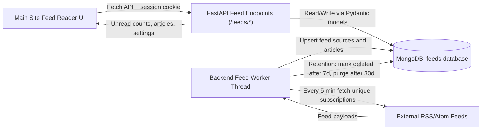
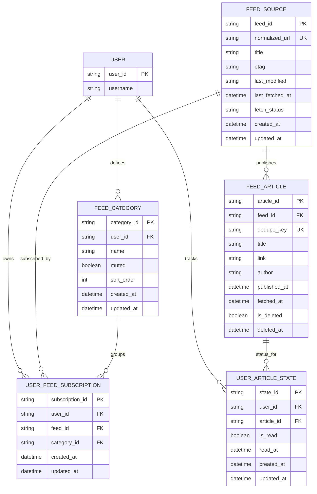
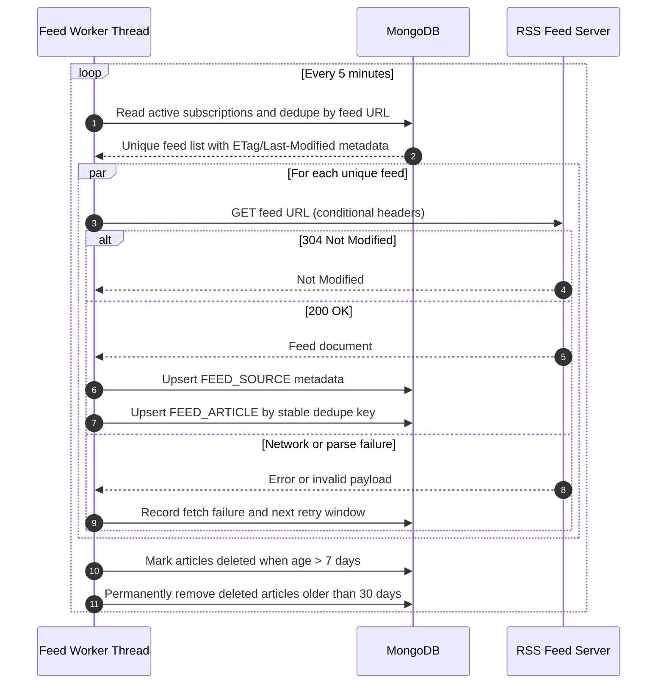
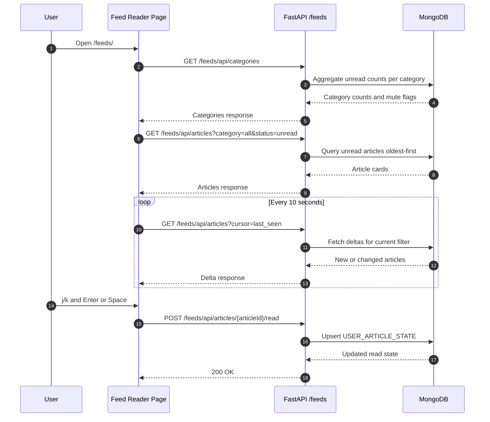

# RSS Feed Reader

## Requirements

### General

1. All reads and writes to the database shall be performed through the FastAPI API, and not directly from the frontend
2. All data sent to or read from the database shall be validated and sanitized to prevent security vulnerabilities
3. All data sent to or read from the database shall be implemented as Pydantic models to ensure data integrity and consistency
4. All data sent to or read from the client shall be validated and sanitized to prevent security vulnerabilities
5. All data sent to or read from the client shall be implemented as Pydantic models to ensure data integrity and consistency
6. The feed reader shall be implemented as a page on the main site and retain the look and feel of the rest of the site, including the left and right menus
7. The feed reader shall be usable on both desktop and mobile devices, with a responsive design that adapts to different screen sizes
8. All client reads shall use the Fetch API to call the FastAPI endpoints, with appropriate error handling and user feedback for failed requests
9. All client writes shall use the Fetch API to call the FastAPI endpoints, with appropriate error handling and user feedback for failed requests

### UI and Functionality Reqs

10. The feed reader links shall appear between Football and OpenSky Database in the left menu and the home page
11. The feed reader shall only be available to logged in users
12. The feed reader shall be available at the URL path `/feeds/`
13. The feed reader shall display unread articles in full width cards on the feed reader page, with the oldest articles appearing at the top of the list
14. The feed reader shall auto refresh every 10 seconds to check for new feeds
15. The feed reader shall allow the user to move through feeds using j (next) and k (previous) keys, and open the selected feed in a new tab using the spacebar or enter key
16. The feed reader shall allow the user to add new RSS feeds by entering a URL and clicking an "Add" button, all feeds should be added to a category
17. The user added feeds shall be stored in the database for each user and persist across sessions
18. A user shall only be able to view and modify their own feeds, not the feeds of other users
19. The right menu shall display a list of feed categories and an unread article count for each category
20. clicking on a category shall filter the feed reader to only show articles from that category
21. The right menu shall have an all feeds category that shows all articles regardless of category with an unread article count for all feeds
22. The right menu shall have a Recently Read category that shows all articles that have been marked as read in the last 7 days, sorted by most recently read first 
23. It shall be possible to "mute" and "unmute" categories
24. Articles from a muted category shall not appear in the feed reader, whichever category is currrently selected, but the unread article count for that category shall still be displayed in the right menu
25. Muting and unmuting categories shall be implemented as a user preference stored in the database, and shall persist across sessions
26. The feed reader shall have a settings page where users can manage their feed preferences, including muting and unmuting categories

### Backend Reqs

23. Backend code shall be implemented in the backend/src/feeds directory, with appropriate subdirectories for database models, API endpoints, and background tasks
24. The backend code shall be implemented as a new thread that runs alongside the existing backend code, and shall not interfere with the existing functionality of the site
25. The backend code shall be responsible for creating a mongodb feeds database and the necessary collections and indexes to store feed data, user subscriptions, and read/unread status of articles
26. The backend code shall fetch subscribed feeds once every 5 minutes and store the feed data in the database
27. The backend shall only fetch each subscription once, even if multiple users are subscribed to the same feed, to avoid unnecessary network requests and reduce load on the feed servers
28. The feeds shall be fetched and stored in the database in a way that allows for efficient querying and filtering by category, read/unread status, and other relevant criteria
29. The backend shall mark articles as deleted after 7 days
30. The backend shall permanently delete articles that have been marked as deleted for more than 30 days

### FastAPI Reqs

31. FastAPI code shall be implemented in the website/feeds directory, with appropriate subdirectories for API endpoints and database models
32. The FastAPI code shall mark articles as read when the user clicks on them in the feed reader UI, and this information shall be stored in the database
33. The FastAPI code shall provide an API endpoint to retrieve the list of feeds and their associated articles for the logged in user, with support for filtering by category and read/unread status
34. The FastAPI code shall provide an API endpoint to add new feed subscriptions for the logged in user, which shall validate the feed URL and return an appropriate response if the URL is invalid or the feed cannot be fetched
35. The FastAPI code shall provide an API endpoint to mark articles as read for the logged in user, which shall update the database accordingly and return an appropriate response if the article ID is invalid or the user is not authorized to modify the article's read status
36. The FastAPI code shall provide an API endpoint to retrieve the list of feed categories and their associated unread article counts for the logged in user, which shall return an appropriate response if the user is not authorized to access the feed data

## Design

This section provides a full implementation design for review only.
No application code is included in this document.

### 1. Design Goals

1. Keep the feed reader fully integrated into the main site layout and auth model.
2. Enforce strict server-side ownership checks and Pydantic validation for every read/write boundary.
3. Centralize feed fetching in backend worker threads so the frontend never touches RSS sources directly.
4. Preserve responsive behavior with clear desktop/mobile parity.
5. Make feed ingestion and querying efficient at scale using deduped fetches, retention policies, and indexes.

### 2. High-Level Architecture

#### 2.1 Component Responsibilities

1. Frontend page (`/feeds/`):
	1. Renders unread article cards full-width, oldest first.
	2. Polls every 10 seconds for updates.
	3. Handles keyboard navigation (`j`, `k`, `Enter`, `Space`).
	4. Uses only Fetch API calls to FastAPI.
2. FastAPI layer (`website/feeds`):
	1. Authenticates user context.
	2. Validates request and response models using Pydantic.
	3. Applies authorization rules so users only access their own subscriptions/preferences/read state.
	4. Returns category counts and article lists with filtering.
3. Backend worker (`backend/src/feeds`):
	1. Runs in a dedicated thread alongside existing backend behavior.
	2. Fetches each unique subscribed feed once every 5 minutes.
	3. Upserts source metadata and normalized articles.
	4. Applies retention lifecycle rules.
4. MongoDB feeds database:
	1. Stores global feed/article data.
	2. Stores per-user subscriptions, categories, mute preferences, and read state.

### 3. Data Model Design

#### 3.1 Collection Notes

1. `feed_source`:
	1. One document per canonical feed URL.
	2. Shared by all users to satisfy deduped fetching.
2. `feed_article`:
	1. Global article cache keyed by `feed_id + dedupe_key`.
	2. Includes retention lifecycle markers.
3. `user_feed_subscription`:
	1. Maps users to feeds and categories.
4. `feed_category`:
	1. User-owned categories and mute state.
5. `user_article_state`:
	1. Per-user read/unread lifecycle.
	2. Supports recently read queries for last 7 days.

#### 3.2 Index Plan

1. `feed_source`:
	1. Unique: `normalized_url`.
2. `feed_article`:
	1. Unique: `(feed_id, dedupe_key)`.
	2. Query: `(published_at)`.
	3. Query: `(is_deleted, deleted_at)` for retention scans.
3. `user_feed_subscription`:
	1. Unique: `(user_id, feed_id)`.
	2. Query: `(user_id, category_id)`.
4. `feed_category`:
	1. Unique: `(user_id, name)`.
	2. Query: `(user_id, muted, sort_order)`.
5. `user_article_state`:
	1. Unique: `(user_id, article_id)`.
	2. Query: `(user_id, is_read, read_at)`.

### 4. Backend Worker Design (`backend/src/feeds`)

#### 4.1 Threading and Isolation

1. Worker starts as a dedicated background thread in backend startup.
2. It does not block HTTP request processing.
3. It uses independent DB sessions/clients with retry/backoff.

#### 4.2 Feed Deduplication Strategy

1. Build canonical feed URL (normalize scheme, host case, trailing slash, query ordering where safe).
2. Resolve all user subscriptions to unique canonical URLs.
3. Fetch each unique feed once per cycle.
4. Fan out resulting articles to all subscribed users through query joins (no duplicate network fetch).

### 5. FastAPI Design (`website/feeds`)

#### 5.1 Route Structure

1. Page routes:
	1. `GET /feeds/`: main feed reader page.
	2. `GET /feeds/settings/`: feed settings page.
2. API routes:
	1. `GET /feeds/api/articles`: list articles with filters.
	2. `GET /feeds/api/categories`: list categories with unread counts and mute state.
	3. `POST /feeds/api/subscriptions`: add subscription with category assignment.
	4. `POST /feeds/api/articles/{article_id}/read`: mark article as read.
	5. `POST /feeds/api/categories/{category_id}/mute`: mute category.
	6. `POST /feeds/api/categories/{category_id}/unmute`: unmute category.

#### 5.2 API Query Semantics

1. Category filter values:
	1. `all`: all non-muted categories.
	2. specific category id: only that category, unless muted.
	3. `recently-read`: read items in last 7 days, newest first, excluding muted categories.
2. Primary article listing for main reader:
	1. unread only by default.
	2. oldest first (ascending publication date).
3. Mute behavior:
	1. muted categories are excluded from article results in all filters.
	2. unread counts remain visible in right menu.

#### 5.3 Pydantic Models

1. Request models:
	1. Add subscription payload.
	2. Mark read payload.
	3. Category mute/unmute payload.
2. Response models:
	1. Article card model.
	2. Category count model.
	3. Standard operation result model.
3. Validation rules:
	1. Feed URL must be `http/https`, normalized, length-limited.
	2. Category IDs and article IDs must be valid object IDs/UUIDs.
	3. User-scoped resources must enforce owner equality with authenticated user.

### 6. Frontend UX and Interaction Design

#### 6.1 Navigation and Access

1. Add `Feeds` nav entry between Football and OpenSky Database:
	1. Left menu.
	2. Home page links.
2. Only render feeds links and page content for logged-in users.
3. Non-authenticated requests redirect to login with `next=/feeds/`.

#### 6.2 Main Reader Layout

1. Keep existing site shell (header, left menu, right menu, footer).
2. Main content region:
	1. full-width article cards.
	2. oldest unread at top.
3. Right sidebar:
	1. `All Feeds` with unread total.
	2. category list with unread count each.
	3. `Recently Read` bucket (7-day window).
	4. muted categories visually indicated.

#### 6.3 Keyboard and Interaction Rules

1. `j`: move selection to next visible article card.
2. `k`: move selection to previous visible article card.
3. `Enter` or `Space`:
	1. open selected article link in new tab.
	2. mark article as read via API.
4. Category click:
	1. apply category filter.
	2. keep muted exclusion logic.

#### 6.4 Polling and UI Consistency

1. Poll interval: 10 seconds.
2. Polling request includes current category/filter context.
3. Preserve current keyboard selection where possible after refresh.
4. Show non-blocking error banner/toast if refresh fails.

### 7. Security and Data Integrity

1. All frontend reads/writes use Fetch -> FastAPI only.
2. Every endpoint:
	1. authenticates session.
	2. validates payload with Pydantic.
	3. sanitizes free-text fields.
	4. enforces user ownership in DB query predicate.
3. Server never trusts category IDs/article IDs from client without owner checks.
4. Output models are Pydantic-serialized to avoid accidental leakage.
5. Add rate limits for subscription creation and read-write bursts.

### 8. Retention and Data Lifecycle

1. Worker marks articles as logically deleted after 7 days (`is_deleted=true`, `deleted_at=now`).
2. Worker hard deletes records with `is_deleted=true` and `deleted_at < now-30d`.
3. User read-state records for purged articles are removed in same retention pass.

### 9. Error Handling and Resilience

1. Feed fetch failure:
	1. store last failure reason/timestamp in `feed_source`.
	2. continue processing other feeds.
2. Invalid feed URL at subscription time:
	1. return 400 with actionable message.
3. Temporary API failure during polling:
	1. show warning toast.
	2. keep last successful article list.
4. Worker retry/backoff:
	1. exponential backoff per source on repeated failures.

### 10. Monitoring and Auditability

1. Structured logs:
	1. feed fetch attempts/results.
	2. subscription add/remove actions.
	3. article read mutations.
2. Metrics:
	1. fetch success rate.
	2. fetch duration.
	3. new article ingest count.
	4. API latency/error rate.

### 11. Requirement Coverage Summary

1. UI, nav placement, auth-only access, routing, keyboard controls, category filtering, muting, settings, and 10-second refresh are covered in Sections 6 and 5.
2. Backend worker threading, 5-minute feed fetching, deduped subscription fetch, retention lifecycle, and DB structure are covered in Sections 4, 3, and 8.
3. FastAPI ownership, Pydantic validation, read/write endpoints, and category unread counts are covered in Sections 5 and 7.
4. Security and data sanitization requirements are covered in Section 7.

### 12. Phased Delivery Plan (No Code in This Step)

1. Phase 1: Data schemas, indexes, and feed worker thread skeleton.
2. Phase 2: FastAPI endpoints and ownership validation.
3. Phase 3: Feed reader page, right-menu filters, and polling.
4. Phase 4: Keyboard navigation, settings page, mute/unmute UX.
5. Phase 5: Retention jobs, monitoring, and requirement acceptance checklist.

